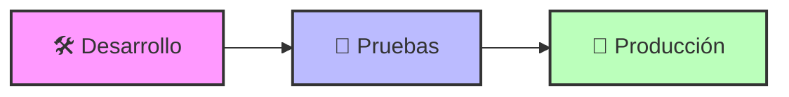

# 🌍 Ambientes de Desarrollo

## 🎯 Visión General



## 🔄 Ambientes Disponibles

### 1️⃣ Desarrollo (DEV)

??? info "🛠️ Ambiente de Desarrollo"
    | Aspecto | Detalle |
    |---------|----------|
    | 🌐 URL | [dev.azurewebsites.net](https://elaltodev.azurewebsites.net) |
    | 🔑 KeyVault | elalto |
    | 📊 Base de Datos | Sandbox |

    ```mermaid
    graph LR
        subgraph "Desarrollo"
            D[🛠️ DEV] --> DS[💾 SAP Sandbox]
            D --> DF[📋 Febos Test]
            D --> DG[🔄 Graph Test]
        end
    ```

### 2️⃣ Pruebas (QA)

??? info "🧪 Ambiente de Pruebas"
    | Aspecto | Detalle |
    |---------|----------|
    | 🌐 URL | [qa.azurewebsites.net](https://elalto.azurewebsites.net) |
    | 🔑 KeyVault | elalto |
    | 📊 Base de Datos | Sandbox |

    ```mermaid
    graph LR
        subgraph "Pruebas"
            Q[🧪 QA] --> QS[💾 SAP Sandbox]
            Q --> QF[📋 Febos Test]
            Q --> QG[🔄 Graph Test]
        end
    ```

### 3️⃣ Producción (PROD)

??? info "🚀 Ambiente de Producción"
    | Aspecto | Detalle |
    |---------|----------|
    | 🌐 URL | [prod.azurewebsites.net](https://elaltofunctions.azurewebsites.net) |
    | 🔑 KeyVault | elalto |
    | 📊 Base de Datos | HANA |

    ```mermaid
    graph LR
        subgraph "Producción"
            P[🚀 PROD] --> PS[💾 SAP HANA]
            P --> PF[📋 Febos Prod]
            P --> PG[🔄 Graph Prod]
        end
    ```

## 🔧 Servicios Azure

??? example "Servicios por Ambiente"
    ```mermaid
    graph TB
        subgraph "Azure Services"
            DEV["🛠️ DEV"] --> |Test|AZ1["
                📦 Blob Storage
                📝 Form Recognizer
                🔄 Web PubSub
                🔑 Key Vault
            "]
            
            QA["🧪 QA"] --> |Test|AZ2["
                📦 Blob Storage
                📝 Form Recognizer
                🔄 Web PubSub
                🔑 Key Vault
            "]
            
            PROD["🚀 PROD"] --> |Production|AZ3["
                📦 Blob Storage
                📝 Form Recognizer
                🔄 Web PubSub
                🔑 Key Vault
            "]
        end
    ```

## 🔗 Arquitectura SAP

??? tip "Conexión SAP"
    ```mermaid
    graph LR
        PROD[🚀 Producción] --> GW[🔄 SAP Gateway]
        GW --> HANA[💾 SAP HANA]
        
        style GW fill:#ff9,stroke:#333,stroke-width:2px
    ```

## ⚙️ Configuraciones

??? warning "Consideraciones por Ambiente"
    | Ambiente | Uso | Consideraciones |
    |----------|-----|----------------|
    | DEV | Desarrollo | Testing local, debugging |
    | QA | Pruebas | Validación, UAT |
    | PROD | Producción | Monitoreo, respaldos |

## 🔒 Seguridad

??? danger "Accesos y Permisos"
    | Ambiente | Nivel Acceso | Autenticación |
    |----------|--------------|---------------|
    | DEV | Desarrollo | Azure AD |
    | QA | Restringido | Azure AD |
    | PROD | Estricto | Azure AD + MFA |

## 📊 Monitoreo

??? success "Herramientas de Monitoreo"
    | Herramienta | DEV | QA | PROD |
    |-------------|-----|-----|------|
    | Application Insights | ✅ | ✅ | ✅ |
    | Log Analytics | ✅ | ✅ | ✅ |
    | Azure Monitor | ❌ | ✅ | ✅ |

## 📚 Recursos

??? info "Enlaces Útiles"
    - [Azure Portal](https://portal.azure.com)
    - [SAP Portal](https://sap.com)
    - [Documentación Azure](https://docs.microsoft.com/azure)