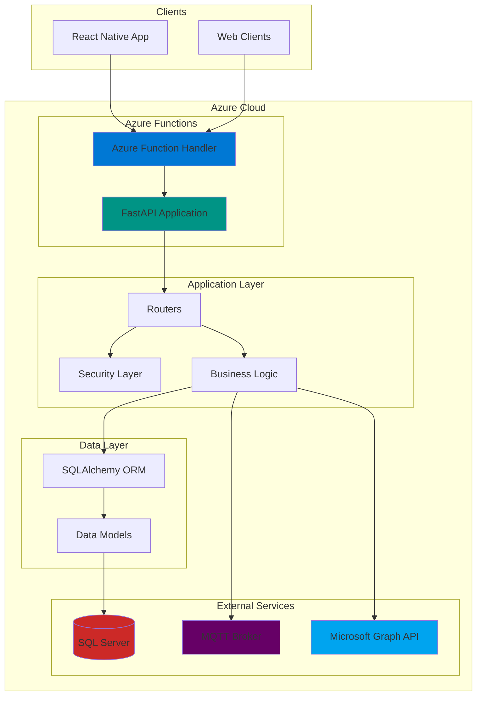
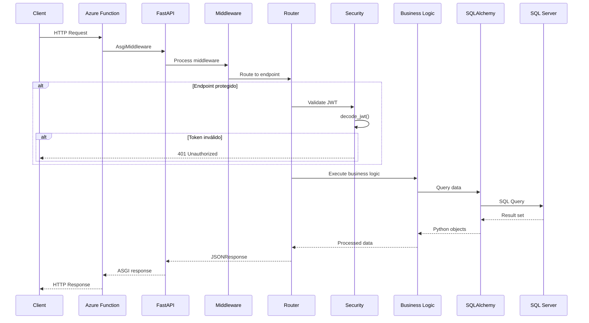
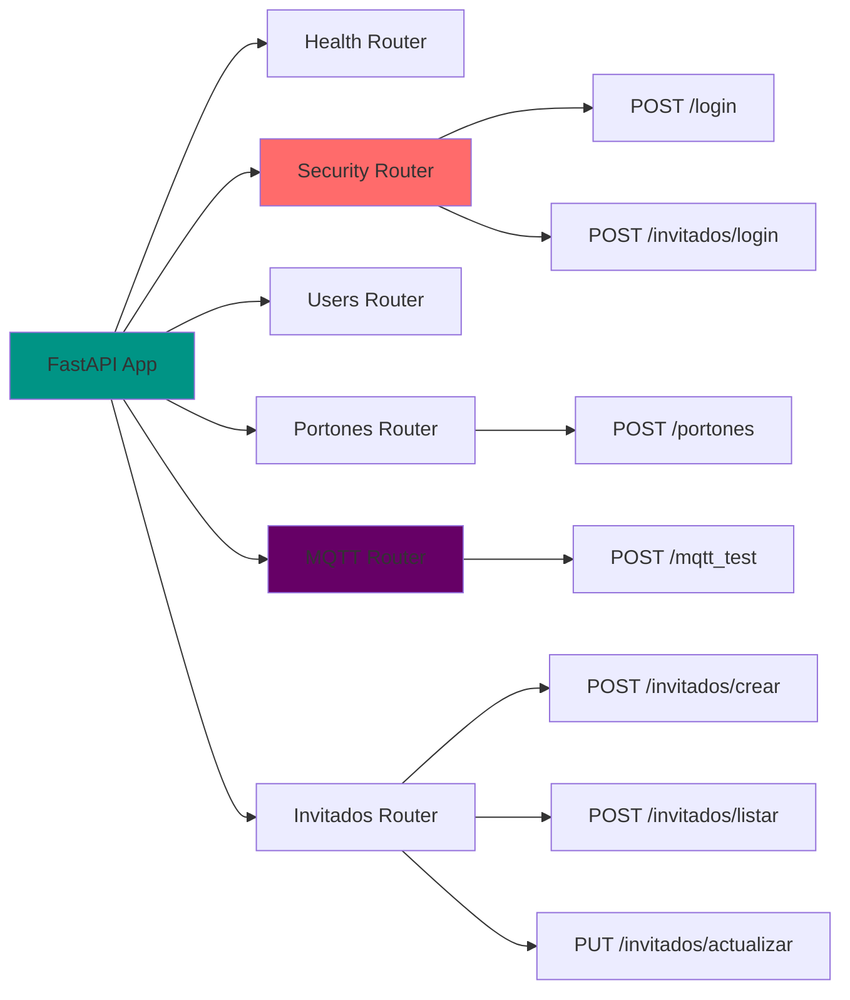
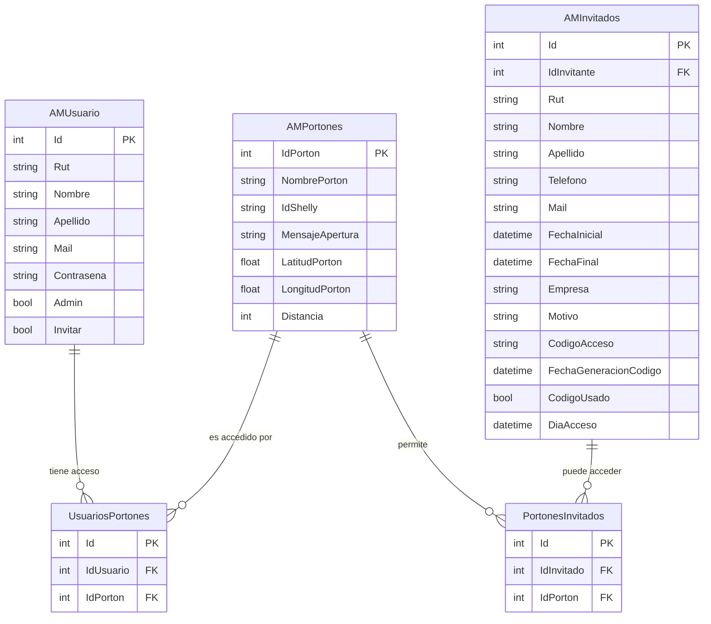
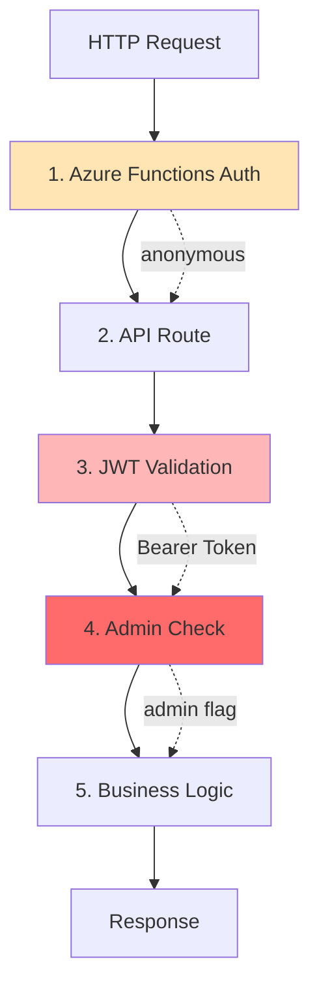
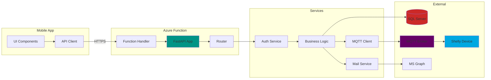
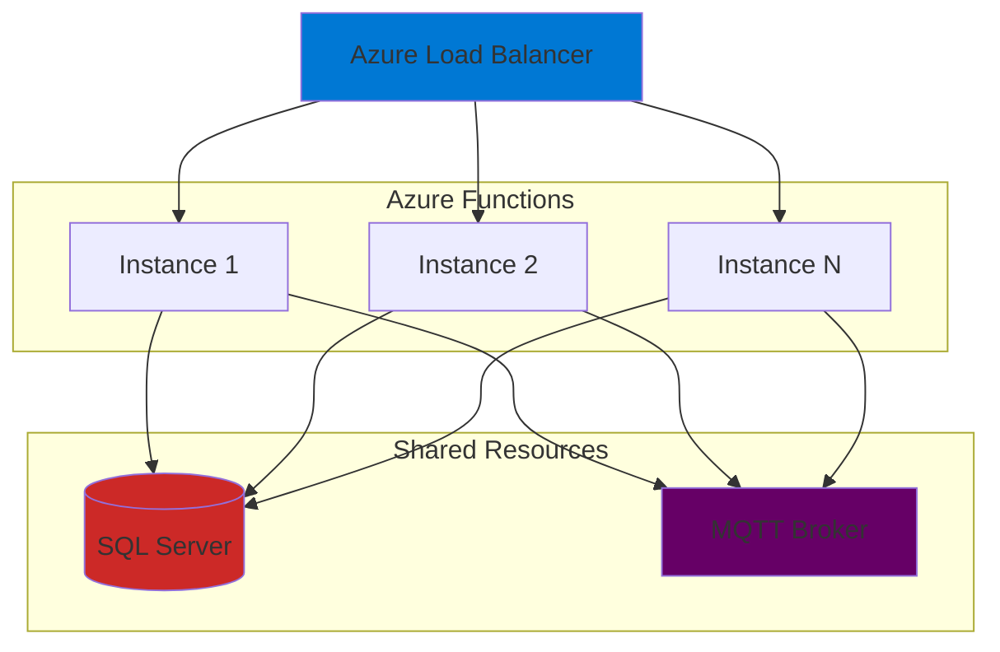

# 🏗️ Arquitectura del Backend

## 📋 Descripción General

Backend desarrollado como **Azure Function** con **FastAPI** que gestiona el control de acceso a portones mediante dispositivos IoT Shelly. Proporciona APIs REST para autenticación, gestión de usuarios, control MQTT y sistema de invitados temporales.



## 🎯 Stack Tecnológico

### Backend Framework

| Tecnología | Versión | Propósito |
|------------|---------|-----------|
| **Python** | 3.9+ | Lenguaje de programación |
| **FastAPI** | 0.104+ | Framework web async |
| **Azure Functions** | v4 | Serverless hosting |
| **Uvicorn** | Latest | ASGI server |
| **Pydantic** | 2.0+ | Validación de datos |

### Persistencia y ORM

| Tecnología | Versión | Propósito |
|------------|---------|-----------|
| **SQLAlchemy** | 2.0+ | ORM para bases de datos |
| **pyodbc** | 4.0+ | Driver ODBC para SQL Server |
| **SQL Server** | 2019+ | Base de datos principal |

### Seguridad y Autenticación

| Tecnología | Versión | Propósito |
|------------|---------|-----------|
| **python-jose** | 3.3+ | Manejo de JWT |
| **passlib** | 1.7+ | Hash de contraseñas (bcrypt) |
| **python-multipart** | 0.0.6+ | Manejo de forms |

### Comunicación IoT

| Tecnología | Versión | Propósito |
|------------|---------|-----------|
| **paho-mqtt** | 1.6+ | Cliente MQTT |
| **requests** | 2.31+ | HTTP client |

### Servicios Externos

| Servicio | Propósito |
|----------|-----------|
| **Microsoft Graph API** | Envío de correos |
| **MQTT Broker** | Comunicación con dispositivos Shelly |

## 📂 Estructura del Proyecto

```
AppControlAcceso/
├── __init__.py                    # FastAPI app + Azure Function handler
├── function.json                  # Configuración Azure Functions
│
├── config/                        # Configuración
│   ├── __init__.py
│   ├── config.py                 # Variables de entorno
│   ├── security.py               # JWT, autenticación, login
│   ├── users.py                  # Gestión de usuarios
│   └── health.py                 # Health check endpoint
│
├── routes/                        # Routers de FastAPI
│   ├── __init__.py
│   ├── portones.py               # CRUD de portones
│   ├── mqtt.py                   # Control MQTT de dispositivos
│   └── invitados.py              # CRUD de invitados
│
├── functions/                     # Lógica de negocio
│   ├── __init__.py
│   ├── invitados.py              # Generación de códigos
│   └── mails.py                  # Envío de correos
│
├── schemas/                       # Pydantic schemas
│   ├── __init__.py
│   ├── login_schema.py           # Request/Response de login
│   ├── invitados_schema.py       # Request/Response de invitados
│   ├── mqtt_schema.py            # Request/Response de MQTT
│   └── security_schema.py        # Token models
│
├── sql/                           # Scripts SQL
│   └── *.sql
│
└── tests/                         # Tests unitarios
    └── *.py
```

## 🔄 Flujo de Request



## 🚀 Inicialización de la Aplicación

### main handler (__init__.py)

```python
from fastapi import FastAPI
from .config.health import router as health_router
from .config.security import router as security_router
from .config.users import router as users_router
from .routes.portones import router as portones_router
from .routes.mqtt import router as mqtt_router
from .routes.invitados import router as invitados_router
from .config import config
import azure.functions as func
import logging

# Crear aplicación FastAPI
app = FastAPI(
    title=config.PROJECT_NAME,
    description=config.PROJECT_DESCRIPTION,
    version=config.PROJECT_VERSION,
    docs_url=f"{config.APP_PATH}/docs",
    redoc_url=f"{config.APP_PATH}/redoc",
    openapi_url=f'{config.APP_PATH}/openapi.json',
)

# Incluir routers
app.include_router(health_router)      # /health
app.include_router(security_router)    # /login
app.include_router(users_router)       # /users/*
app.include_router(portones_router)    # /portones
app.include_router(mqtt_router)        # /mqtt_test
app.include_router(invitados_router)   # /invitados/*

# Azure Function handler
async def main(req: func.HttpRequest, context: func.Context) -> func.HttpResponse:
    """
    Handler principal de Azure Functions.
    Delega todas las peticiones a FastAPI mediante AsgiMiddleware.
    """
    logging.info("Python HTTP trigger function processed a request.")
    return await func.AsgiMiddleware(app).handle_async(req, context)
```

### Configuration (function.json)

```json
{
  "scriptFile": "__init__.py",
  "bindings": [
    {
      "authLevel": "anonymous",
      "type": "httpTrigger",
      "direction": "in",
      "name": "req",
      "methods": ["get", "post"],
      "route": "/appaccesocontrol/{*route}"
    },
    {
      "type": "http",
      "direction": "out",
      "name": "$return"
    }
  ]
}
```

## ⚙️ Variables de Entorno

### config/config.py

```python
import os

# Información del proyecto
PROJECT_NAME = "AppControlAcceso"
PROJECT_DESCRIPTION = "API para control de acceso"
PROJECT_VERSION = "3.5.3"
PROJECT_AUTHOR = "Tracmin"

# Configuración de la aplicación
APP_PATH = "/appaccesocontrol"
USERS_KEY = os.environ["USERS_KEY"]

# Documentación API
DOCS_URL = "/docs"
REDOC_URL = "/redoc"
OPENAPI_URL = "/openapi.json"

# Seguridad
SECRET_KEY = os.environ["HASH_KEY"]
ALGORITHM = "HS256"
ACCESS_TOKEN_EXPIRE_MINUTES = 1440  # 24 horas

# MQTT
MQTT_BROKER = os.environ["MQTT_BROKER"]
MQTT_PORT = int(os.environ.get("MQTT_PORT", "8883"))
MQTT_USER_ACCESO = os.environ["MQTT_USER_ACCESO"]
MQTT_PASS_ACCESO = os.environ["MQTT_PASS_ACCESO"]
MQTT_API_KEY = os.environ["MQTT_API_KEY"]

# Microsoft Graph (para envío de correos)
GRAPH_CLIENT_ID = os.environ["GRAPH_CLIENT_ID"]
GRAPH_CLIENT_SECRET = os.environ["GRAPH_CLIENT_SECRET"]
GRAPH_TENANT_ID = os.environ["GRAPH_TENANT_ID"]
```

### Variables requeridas en Azure

```bash
# Seguridad
HASH_KEY="tu-secret-key-para-jwt"
USERS_KEY="api-key-para-endpoints-protegidos"

# Base de datos
SQL_SERVER="tu-servidor.database.windows.net"
SQL_DATABASE="ElAltoDB"
SQL_USERNAME="usuario"
SQL_PASSWORD="contraseña"

# MQTT
MQTT_BROKER="mqtt.broker.com"
MQTT_PORT="8883"
MQTT_USER_ACCESO="usuario-mqtt"
MQTT_PASS_ACCESO="password-mqtt"
MQTT_API_KEY="key-para-endpoint-mqtt"

# Microsoft Graph
GRAPH_CLIENT_ID="client-id"
GRAPH_CLIENT_SECRET="client-secret"
GRAPH_TENANT_ID="tenant-id"
```

## 🔌 Routers de FastAPI

### Estructura de Routers



### Detalle de Routers

#### 1. Health Router
```python
@router.get("/health")
async def health_check():
    return {"status": "healthy", "version": "3.5.3"}
```

#### 2. Security Router
- `POST /login` - Autenticación de usuario normal
- `POST /invitados/login` - Autenticación de invitado con código

#### 3. Portones Router
- `POST /portones` - Obtener lista de portones del usuario

#### 4. MQTT Router
- `POST /mqtt_test` - Enviar comando MQTT a dispositivo Shelly

#### 5. Invitados Router
- `POST /invitados/crear` - Crear nuevo invitado
- `POST /invitados/listar` - Listar todos los invitados
- `PUT /invitados/actualizar` - Actualizar invitado existente

## 🗄️ Capa de Datos

### Modelos SQLAlchemy



### Database Engine

```python
# utils/db_engine_sql.py
from sqlalchemy import create_engine
from sqlalchemy.orm import sessionmaker
import os

def get_el_alto():
    """Obtiene el engine de la base de datos ElAltoDB"""
    connection_string = (
        f"mssql+pyodbc://{os.environ['SQL_USERNAME']}:"
        f"{os.environ['SQL_PASSWORD']}@"
        f"{os.environ['SQL_SERVER']}/"
        f"{os.environ['SQL_DATABASE']}?"
        f"driver=ODBC+Driver+18+for+SQL+Server"
    )
    return create_engine(connection_string)
```

## 🔒 Capas de Seguridad



### Niveles de Seguridad

1. **Azure Functions**: `authLevel: "anonymous"` (permite acceso directo)
2. **FastAPI Routes**: Rutas públicas vs protegidas
3. **JWT Validation**: `Depends(security_scheme)` valida token
4. **Admin Check**: `decode_jwt(token, admin=1)` verifica permisos
5. **Business Logic**: Validación de datos y reglas de negocio

## 📊 Flujo de Datos Completo



## 🚦 Estados de la Aplicación

### Estado de Servidor

```python
from enum import Enum

class ServerStatus(str, Enum):
    HEALTHY = "healthy"
    DEGRADED = "degraded"
    UNHEALTHY = "unhealthy"

class DatabaseStatus(str, Enum):
    CONNECTED = "connected"
    DISCONNECTED = "disconnected"
    ERROR = "error"

class MqttStatus(str, Enum):
    CONNECTED = "connected"
    DISCONNECTED = "disconnected"
    PUBLISHING = "publishing"
    ERROR = "error"
```

## 📈 Escalabilidad

### Características de Escalabilidad



### Consideraciones

- ✅ **Stateless**: Sin estado en memoria, todo en DB
- ✅ **Auto-scaling**: Azure Functions escala automáticamente
- ✅ **Connection Pooling**: SQLAlchemy maneja pool de conexiones
- ✅ **MQTT Async**: Conexiones MQTT son rápidas y desconectan inmediatamente
- ⚠️ **Rate Limiting**: No implementado (considerar para producción)
- ⚠️ **Caching**: No implementado (considerar Redis para queries frecuentes)

## 🛠️ Deployment

### Requisitos

```bash
# requirements.txt
fastapi==0.104.1
uvicorn[standard]==0.24.0
azure-functions==1.17.0
sqlalchemy==2.0.23
pyodbc==5.0.1
python-jose[cryptography]==3.3.0
passlib[bcrypt]==1.7.4
paho-mqtt==1.6.1
pydantic==2.5.0
python-multipart==0.0.6
requests==2.31.0
```

### Azure Functions Deployment

```bash
# Publicar a Azure
func azure functionapp publish <nombre-function-app>

# Con configuración específica
func azure functionapp publish <nombre-function-app> \
  --python \
  --build remote
```

### Variables de Entorno

Configurar en Azure Portal > Function App > Configuration:

```
Application Settings:
- HASH_KEY
- USERS_KEY
- SQL_SERVER
- SQL_DATABASE
- SQL_USERNAME
- SQL_PASSWORD
- MQTT_BROKER
- MQTT_PORT
- MQTT_USER_ACCESO
- MQTT_PASS_ACCESO
- MQTT_API_KEY
- GRAPH_CLIENT_ID
- GRAPH_CLIENT_SECRET
- GRAPH_TENANT_ID
```

## 📚 Próximos Pasos

- [Autenticación y Seguridad](./autenticacion.md)
- [API Endpoints](./api-endpoints.md)
- [Integración MQTT](./mqtt-dispositivos.md)
- [Base de Datos](./base-datos.md)
- [Sistema de Invitados](./invitados.md)


