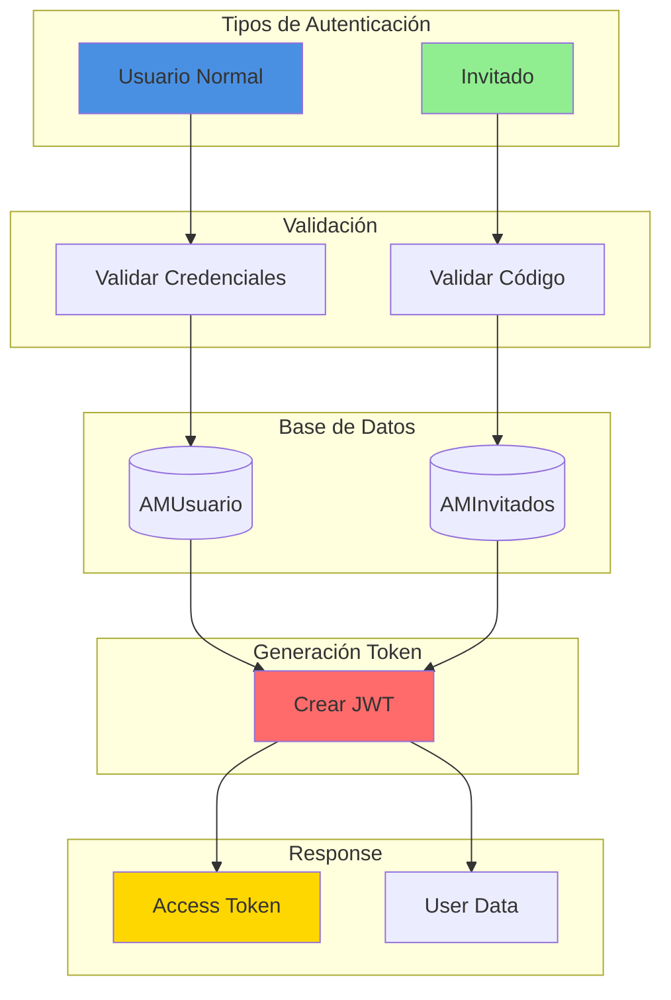
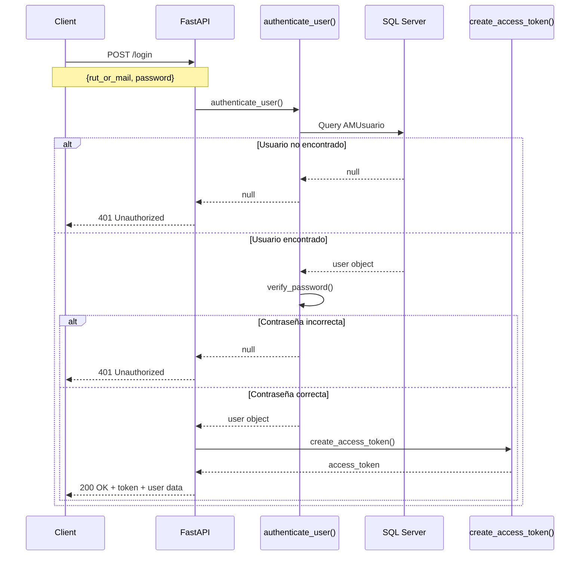
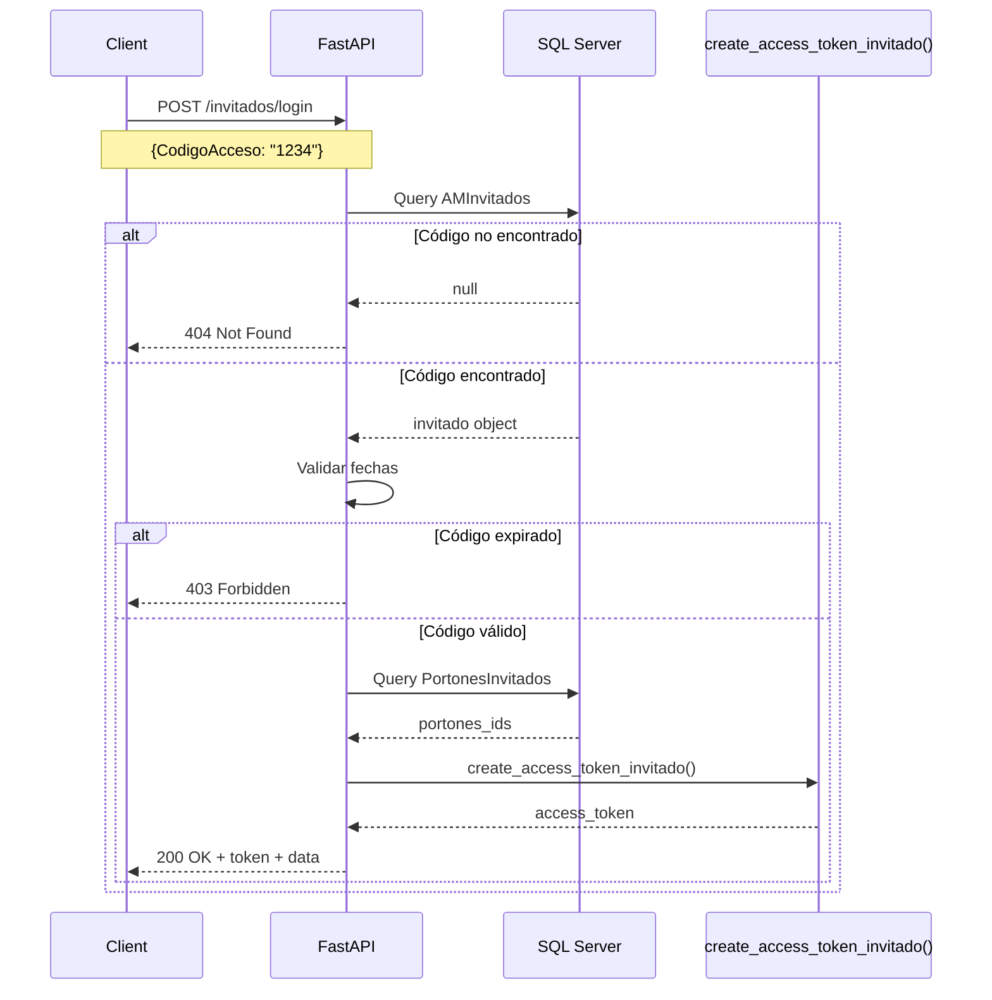
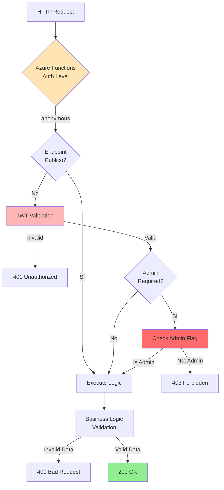

# 🔐 Autenticación y Seguridad

## 📋 Descripción General

Sistema de autenticación basado en **JWT (JSON Web Tokens)** con soporte para dos tipos de usuarios:
- **Usuarios normales**: Autenticación con RUT/Email + contraseña
- **Invitados**: Autenticación con código temporal de 4 dígitos



## 🔑 JWT (JSON Web Tokens)

### Configuración JWT

```python
# config/config.py
SECRET_KEY = os.environ["HASH_KEY"]
ALGORITHM = "HS256"
ACCESS_TOKEN_EXPIRE_MINUTES = 1440  # 24 horas
```

### Estructura del Token

```json
{
  "header": {
    "alg": "HS256",
    "typ": "JWT"
  },
  "payload": {
    "nombre": "Juan Pérez",
    "admin": 1,
    "invitar": 1,
    "exp": 1735430400,
    "iat": 1735344000
  },
  "signature": "..."
}
```

### Payload para Usuario Normal

```python
payload = {
    "nombre": "Juan Pérez",      # Nombre completo
    "admin": 1,                   # 1 = Admin, 0 = User normal
    "invitar": 1,                 # 1 = Puede invitar, 0 = No puede
    "exp": 1735430400,            # Timestamp de expiración
    "iat": 1735344000             # Timestamp de emisión
}
```

### Payload para Invitado

```python
payload = {
    "codigo": "1234",             # Código de acceso
    "tipo": "invitado",           # Tipo de usuario
    "exp": 1735430400,            # Timestamp de expiración
    "iat": 1735344000             # Timestamp de emisión
}
```

## 🔐 Hash de Contraseñas

### Configuración de Bcrypt

```python
from passlib.context import CryptContext

pwd_context = CryptContext(schemes=["bcrypt"], deprecated="auto")
```

### Funciones de Hash

```python
def get_password_hash(password: str) -> str:
    """
    Genera un hash bcrypt de la contraseña.
    
    Args:
        password: Contraseña en texto plano
    
    Returns:
        Hash bcrypt de la contraseña
    """
    return pwd_context.hash(password)

def verify_password(plain_password: str, hashed_password: str) -> bool:
    """
    Verifica si una contraseña coincide con su hash.
    
    Args:
        plain_password: Contraseña en texto plano
        hashed_password: Hash almacenado en DB
    
    Returns:
        True si coinciden, False si no
    """
    return pwd_context.verify(plain_password, hashed_password)
```

### Ejemplo de Uso

```python
# Registrar usuario (crear hash)
password = "MiContraseña123!"
hashed = get_password_hash(password)
# Resultado: "$2b$12$abcd1234..."

# Login (verificar hash)
is_valid = verify_password("MiContraseña123!", hashed)
# Resultado: True

is_valid = verify_password("ContraseñaIncorrecta", hashed)
# Resultado: False
```

## 🔒 Security Scheme

### OAuth2 Password Bearer

```python
from fastapi.security import OAuth2PasswordBearer

security_scheme = OAuth2PasswordBearer(tokenUrl="/login")
```

### Uso en Endpoints

```python
@router.post("/portones")
async def get_portones(sec: str = Depends(security_scheme)):
    # sec contiene el token JWT
    decode_jwt(sec, 0)  # Validar token
    # ... lógica del endpoint
```

## 🚪 Login de Usuario Normal

### Flujo de Autenticación



### Schema de Request

```python
# schemas/login_schema.py
from pydantic import BaseModel

class LoginRequest(BaseModel):
    rut_or_mail: str  # RUT o Email
    password: str     # Contraseña
```

### Schema de Response

```python
class LoginResponse(BaseModel):
    id: int
    nombre: str
    apellido: str
    mail: str
    rut: str
    admin: bool
    invitar: bool
    access_token: str
    token_type: str = "bearer"
```

### Implementación del Endpoint

```python
@router.post("/login", response_model=None)
async def login_for_access_token(request: LoginRequest):
    """
    Autentica un usuario y devuelve un JWT.
    
    - Busca usuario por RUT o Email
    - Valida contraseña con bcrypt
    - Genera JWT con datos del usuario
    """
    SessionLocal = sessionmaker(bind=db_engine.get_el_alto())
    db = SessionLocal()
    
    try:
        user = authenticate_user(request.rut_or_mail, request.password, db)
        
        if not user:
            raise HTTPException(
                status_code=status.HTTP_401_UNAUTHORIZED,
                detail="Credenciales incorrectas",
                headers={"WWW-Authenticate": "Bearer"},
            )
        
        # Crear token JWT
        access_token_expires = timedelta(minutes=ACCESS_TOKEN_EXPIRE_MINUTES)
        access_token = create_access_token(
            data={
                "nombre": f"{user.Nombre} {user.Apellido}",
                "admin": 1 if user.Admin else 0,
                "invitar": 1 if user.Invitar else 0
            },
            expires_delta=access_token_expires
        )
        
        return JSONResponse(
            status_code=200,
            content={
                "id": user.Id,
                "nombre": user.Nombre,
                "apellido": user.Apellido,
                "mail": user.Mail,
                "rut": user.Rut,
                "admin": user.Admin,
                "invitar": user.Invitar,
                "access_token": access_token,
                "token_type": "bearer"
            }
        )
    
    finally:
        db.close()
```

### Función authenticate_user

```python
def authenticate_user(rut_or_mail: str, password: str, db: Session):
    """
    Autentica un usuario por RUT o Email.
    
    Args:
        rut_or_mail: RUT (12345678-9) o Email
        password: Contraseña en texto plano
        db: Sesión de base de datos
    
    Returns:
        User object si es válido, None si no
    """
    # Buscar en AMUsuario (ElAltoDB)
    user_am = db.query(AMUsuario).filter(
        (AMUsuario.Rut == rut_or_mail) | (AMUsuario.Mail == rut_or_mail)
    ).first()
    
    if user_am:
        if verify_password(password, user_am.Contrasena):
            return user_am
        else:
            return None
    
    # Si no se encuentra, buscar en LogiPath (TransmineralDB)
    from models.LogiPath import User as LPUser
    with Session(db_engine.get()) as session:
        user_lp = session.query(LPUser).filter(
            (LPUser.Rut == rut_or_mail) | (LPUser.Email == rut_or_mail)
        ).first()
        
        if user_lp:
            if verify_password(password, user_lp.Contrasena):
                return user_lp
            else:
                return None
    
    return None
```

### Función create_access_token

```python
from jose import jwt
from datetime import datetime, timedelta

def create_access_token(data: dict, expires_delta: timedelta | None = None):
    """
    Crea un JWT firmado.
    
    Args:
        data: Datos a incluir en el payload
        expires_delta: Tiempo de expiración
    
    Returns:
        Token JWT firmado
    """
    to_encode = data.copy()
    
    if expires_delta:
        expire = datetime.utcnow() + expires_delta
    else:
        expire = datetime.utcnow() + timedelta(minutes=15)
    
    to_encode.update({
        "exp": expire,
        "iat": datetime.utcnow()
    })
    
    encoded_jwt = jwt.encode(to_encode, SECRET_KEY, algorithm=ALGORITHM)
    return encoded_jwt
```

## 👤 Login de Invitado

### Flujo de Autenticación de Invitado



### Schema de Request

```python
class InvitadoLoginRequest(BaseModel):
    CodigoAcceso: str  # Código de 4 dígitos
```

### Schema de Response

```python
class InvitadoLoginResponse(BaseModel):
    IdInvitante: int
    Nombre: str
    Apellido: str
    Mail: str
    FechaInicial: datetime
    FechaFinal: datetime
    Empresa: str | None
    Portones: list[int]  # IDs de portones permitidos
    access_token: str
    token_type: str = "bearer"
```

### Implementación del Endpoint

```python
@router.post("/invitados/login")
async def login_invitado(request: InvitadoLoginRequest):
    """
    Autentica un invitado con código de 4 dígitos.
    
    - Valida existencia del código
    - Valida fechas de vigencia
    - Obtiene portones permitidos
    - Genera JWT para invitado
    """
    SessionLocal = sessionmaker(bind=db_engine.get_el_alto())
    db = SessionLocal()
    
    try:
        # Buscar invitado por código
        invitado = db.query(AMInvitados).filter(
            AMInvitados.CodigoAcceso == request.CodigoAcceso
        ).first()
        
        if not invitado:
            raise HTTPException(
                status_code=404,
                detail="Código de acceso no encontrado"
            )
        
        # Validar fechas
        ahora = datetime.now(timezone.utc)
        
        if ahora < invitado.FechaInicial:
            raise HTTPException(
                status_code=403,
                detail="El código aún no está activo"
            )
        
        if ahora > invitado.FechaFinal:
            raise HTTPException(
                status_code=403,
                detail="El código ha expirado"
            )
        
        # Obtener portones permitidos
        portones_rel = db.query(PortonesInvitados).filter(
            PortonesInvitados.IdInvitado == invitado.Id
        ).all()
        
        portones_ids = [p.IdPorton for p in portones_rel]
        
        # Crear token JWT para invitado
        access_token = create_access_token_invitado(
            data={
                "codigo": request.CodigoAcceso,
                "tipo": "invitado",
                "nombre": f"{invitado.Nombre} {invitado.Apellido}"
            }
        )
        
        return JSONResponse(
            status_code=200,
            content={
                "IdInvitante": invitado.IdInvitante,
                "Nombre": invitado.Nombre,
                "Apellido": invitado.Apellido,
                "Mail": invitado.Mail,
                "Empresa": invitado.Empresa,
                "FechaInicial": invitado.FechaInicial.isoformat(),
                "FechaFinal": invitado.FechaFinal.isoformat(),
                "Portones": portones_ids,
                "access_token": access_token,
                "token_type": "bearer"
            }
        )
    
    finally:
        db.close()
```

### Función create_access_token_invitado

```python
def create_access_token_invitado(data: dict, expires_delta: timedelta | None = None):
    """
    Crea un JWT para invitados.
    Similar a create_access_token pero con payload diferente.
    """
    to_encode = data.copy()
    
    if expires_delta:
        expire = datetime.utcnow() + expires_delta
    else:
        # Invitados: token válido por 12 horas
        expire = datetime.utcnow() + timedelta(hours=12)
    
    to_encode.update({
        "exp": expire,
        "iat": datetime.utcnow()
    })
    
    encoded_jwt = jwt.encode(to_encode, SECRET_KEY, algorithm=ALGORITHM)
    return encoded_jwt
```

## ✅ Validación de JWT

### Función decode_jwt

```python
from jose import jwt, JWTError
from fastapi import HTTPException, status

def decode_jwt(token: str, admin: int = 0) -> str:
    """
    Decodifica y valida un JWT.
    
    Args:
        token: Token JWT a validar
        admin: Nivel de admin requerido (0=cualquiera, 1=admin, 2=super admin)
    
    Returns:
        Nombre del usuario del token
    
    Raises:
        HTTPException: Si el token es inválido o no tiene permisos
    """
    CREDENTIALS_EXCEPTION = HTTPException(
        status_code=status.HTTP_401_UNAUTHORIZED,
        detail="Could not validate credentials",
        headers={"WWW-Authenticate": "Bearer"},
    )
    
    try:
        # Decodificar JWT
        payload = jwt.decode(token, SECRET_KEY, algorithms=[ALGORITHM])
        
        # Obtener nombre del payload
        nombre: str = payload.get("nombre")
        if nombre is None:
            raise CREDENTIALS_EXCEPTION
        
        # Validar nivel de admin si es requerido
        if admin in [1, 2]:
            admin_status: int = payload.get("admin")
            if admin_status not in [1, 2]:
                raise HTTPException(
                    status_code=status.HTTP_403_FORBIDDEN,
                    detail="Insufficient permissions"
                )
        
        return nombre
    
    except JWTError:
        raise CREDENTIALS_EXCEPTION
```

### Uso en Endpoints Protegidos

```python
@router.post("/portones")
async def get_portones(sec: str = Depends(security_scheme)):
    """
    Endpoint protegido: Requiere JWT válido.
    """
    # Validar JWT (cualquier usuario autenticado)
    decode_jwt(sec, 0)
    
    # ... lógica del endpoint

@router.post("/invitados/crear")
async def crear_invitado(
    invitado: InvitadoCreate,
    sec: str = Depends(security_scheme)
):
    """
    Endpoint protegido: Requiere JWT de admin.
    """
    # Validar JWT y verificar que sea admin
    decode_jwt(sec, 1)
    
    # ... lógica del endpoint
```

## 🛡️ Capas de Seguridad



### Endpoints Públicos

- `GET /health` - No requiere autenticación

### Endpoints con JWT (cualquier usuario)

- `POST /portones` - Requiere JWT válido
- `POST /mqtt_test` - Requiere API key en header

### Endpoints con JWT (solo admins)

- `POST /invitados/crear` - Crear invitados
- `POST /invitados/listar` - Listar invitados
- `PUT /invitados/actualizar` - Actualizar invitados

### Endpoints sin JWT (autenticación específica)

- `POST /login` - Login de usuario normal
- `POST /invitados/login` - Login de invitado

## 🔐 Mejores Prácticas de Seguridad

### 1. Contraseñas

✅ **Implementado:**
- Hash con bcrypt (rounds=12)
- Nunca almacenar contraseñas en texto plano
- Verificación segura con timing attack protection

⚠️ **Recomendado adicional:**
- Validación de complejidad de contraseña
- Política de renovación de contraseñas
- Límite de intentos de login

### 2. JWT

✅ **Implementado:**
- Algoritmo HS256
- Expiración de 24 horas
- Firma con SECRET_KEY

⚠️ **Recomendado adicional:**
- Rotación de SECRET_KEY periódica
- Blacklist de tokens revocados
- Refresh tokens para renovación

### 3. API Keys

✅ **Implementado:**
- API key para endpoint MQTT
- Validación en cada request

⚠️ **Recomendado adicional:**
- Rotación periódica de keys
- Rate limiting por API key
- Logging de uso de API keys

### 4. HTTPS

✅ **Implementado:**
- Azure Functions usa HTTPS por defecto

### 5. Headers de Seguridad

⚠️ **Recomendado implementar:**

```python
from fastapi.middleware.cors import CORSMiddleware

app.add_middleware(
    CORSMiddleware,
    allow_origins=["https://tu-app.com"],
    allow_credentials=True,
    allow_methods=["*"],
    allow_headers=["*"],
)

# Headers de seguridad
@app.middleware("http")
async def add_security_headers(request, call_next):
    response = await call_next(request)
    response.headers["X-Content-Type-Options"] = "nosniff"
    response.headers["X-Frame-Options"] = "DENY"
    response.headers["X-XSS-Protection"] = "1; mode=block"
    return response
```

## 📚 Próximos Pasos

- [API Endpoints](./api-endpoints.md)
- [Integración MQTT](./mqtt-dispositivos.md)
- [Sistema de Invitados](./invitados.md)
- [Base de Datos](./base-datos.md)
