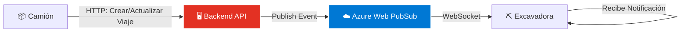
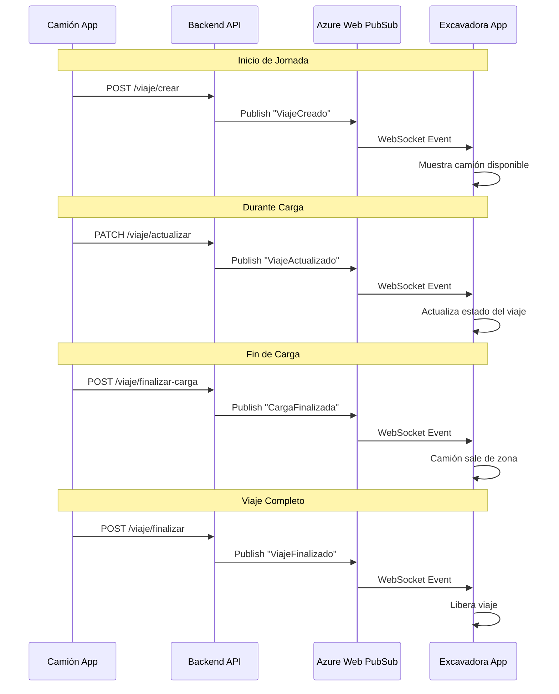

# 🔄 WebSocket Camión-Excavadora (Backend)

## 📡 Descripción General

Sistema de comunicación en tiempo real entre camiones y excavadoras usando Azure Web PubSub Service. Permite coordinar operaciones de carga sincronizando estados de viajes entre equipos.



## ⚙️ Configuración Azure

### Conexión Web PubSub

??? info "Setup Backend"
    ```python
    from azure.messaging.webpubsubservice import WebPubSubServiceClient
    
    # Configuración
    connection_string = os.getenv("AZURE_WEBPUBSUB_CONNECTION_STRING")
    hub_name = "extraccion"
    
    # Cliente
    service = WebPubSubServiceClient.from_connection_string(
        connection_string, 
        hub=hub_name
    )
    ```

### Endpoint de Negociación

??? example "GET /ws/negotiate"
    ```python
    @app.get("/ws/negotiate")
    async def negotiate(user_id: str):
        """
        Genera URL de conexión WebSocket para un equipo.
        
        Args:
            user_id (str): Identificador del equipo (ej: "EXC-001")
            
        Returns:
            dict: {"url": "wss://..."}
        """
        token = service.get_client_access_token(
            user_id=user_id,
            roles=["webpubsub.joinLeaveGroup", "webpubsub.sendToGroup"]
        )
        
        return {"url": token['url']}
    ```

## 📨 Eventos del Sistema

### Tipos de Eventos

??? tip "Eventos Emitidos por Backend"
    | Evento | Emisor | Receptor | Descripción |
    |--------|--------|----------|-------------|
    | `ViajeCreado` | Camión API | Excavadora | Nuevo viaje iniciado |
    | `ViajeActualizado` | Camión API | Excavadora | Cambios en viaje existente |
    | `CargaFinalizada` | Camión API | Excavadora | Camión terminó de ser cargado |
    | `ViajeEnDescarga` | Camión API | Excavadora | Camión llegó a descarga |
    | `ViajeFinalizado` | Camión API | Excavadora | Viaje completado |
    | `ViajeCancelado` | Camión API | Excavadora | Viaje cancelado |

### Estructura de Mensajes

=== "ViajeCreado"
    ```json
    {
      "type": "message",
      "data": {
        "data": "ViajeCreado",
        "trip_data": {
          "IdMovimiento": 12345,
          "IdJornada": 789,
          "Usuario": "conductor@empresa.cl",
          "Equipo": "CAM-101",
          "Patente": "ABCD12",
          "IdProducto": 5,
          "DescripcionProducto": "Mineral Cu",
          "Conductor": "Juan Pérez",
          "HoraInicio": "2026-01-21T10:30:00",
          "HoraCarga": null,
          "LatitudCarga": "-23.456",
          "LongitudCarga": "-68.789"
        },
        "equipo": "CAM-101",
        "timestamp": "2026-01-21T10:30:00.123Z"
      }
    }
    ```

=== "ViajeActualizado"
    ```json
    {
      "type": "message",
      "data": {
        "data": "ViajeActualizado",
        "IdMovimiento": 12345,
        "HoraFinCarga": "2026-01-21T10:45:00",
        "Patente": "ABCD12",
        "equipo": "CAM-101",
        "timestamp": "2026-01-21T10:45:00.456Z"
      }
    }
    ```

=== "CargaFinalizada"
    ```json
    {
      "type": "message",
      "data": {
        "data": "CargaFinalizada",
        "IdMovimiento": 12345,
        "Patente": "ABCD12",
        "HoraFinCarga": "2026-01-21T10:45:00",
        "equipo": "CAM-101",
        "timestamp": "2026-01-21T10:45:00.789Z"
      }
    }
    ```

=== "ViajeFinalizado"
    ```json
    {
      "type": "message",
      "data": {
        "data": "ViajeFinalizado",
        "IdMovimiento": 12345,
        "Patente": "ABCD12",
        "equipo": "CAM-101",
        "timestamp": "2026-01-21T11:30:00.123Z"
      }
    }
    ```

## 🔄 Flujo de Operación



## 🎯 Publicación de Eventos

### Método Principal

??? example "Publicar a Grupo"
    ```python
    async def publish_trip_event(
        event_type: str,
        data: dict,
        equipo: str
    ):
        """
        Publica evento a todos los equipos suscritos.
        
        Args:
            event_type: Tipo de evento (ViajeCreado, etc.)
            data: Datos del evento
            equipo: Identificador del camión emisor
        """
        message = {
            "data": event_type,
            "timestamp": datetime.utcnow().isoformat(),
            "equipo": equipo,
            **data
        }
        
        # Publicar a grupo de excavadoras
        await service.send_to_group(
            hub=hub_name,
            group="excavadoras",
            message=message
        )
    ```

### Integración en Endpoints

??? example "Ejemplo: Crear Viaje"
    ```python
    @router.post("/viaje/crear")
    async def crear_viaje(viaje: ViajeCreate):
        """Crea viaje y notifica a excavadoras"""
        
        # 1. Guardar en base de datos
        nuevo_viaje = await db.viajes.insert(viaje)
        
        # 2. Publicar evento WebSocket
        await publish_trip_event(
            event_type="ViajeCreado",
            data={
                "trip_data": {
                    "IdMovimiento": nuevo_viaje.id,
                    "IdJornada": viaje.id_jornada,
                    "Patente": viaje.patente,
                    "Equipo": viaje.equipo,
                    # ... resto de datos
                }
            },
            equipo=viaje.equipo
        )
        
        return {"id": nuevo_viaje.id}
    ```

## 🔒 Seguridad

??? warning "Consideraciones de Seguridad"
    - ✅ Tokens de conexión temporales (1 hora)
    - ✅ Validación de `user_id` contra base de datos
    - ✅ Grupos separados por rol (excavadoras, camiones)
    - ✅ Rate limiting en endpoints
    - ✅ Validación de permisos por equipo
    - ❌ NO enviar datos sensibles sin encriptar

### Validación de Usuario

??? example "Middleware de Validación"
    ```python
    async def validate_equipment(user_id: str) -> bool:
        """Valida que el equipo existe y está activo"""
        equipo = await db.equipos.find_one({
            "Codigo": user_id,
            "Activo": True
        })
        return equipo is not None
    ```

## 📊 Monitoreo

??? tip "Métricas Clave"
    | Métrica | Descripción | Alerta |
    |---------|-------------|---------|
    | Conexiones Activas | Equipos conectados | < 80% flota |
    | Latencia Promedio | Tiempo de entrega | > 500ms |
    | Eventos Publicados | Total eventos/hora | Anomalías |
    | Errores de Conexión | Fallos de WebSocket | > 5% |
    | Mensajes Perdidos | Eventos no entregados | > 1% |

### Logging

??? example "Estructura de Logs"
    ```python
    logger.info(
        "WebSocket Event Published",
        extra={
            "event_type": "ViajeCreado",
            "equipment": "CAM-101",
            "trip_id": 12345,
            "timestamp": datetime.utcnow()
        }
    )
    ```

## ⚠️ Manejo de Errores

??? warning "Errores Comunes"
    | Error | Causa | Solución |
    |-------|-------|----------|
    | Connection Failed | Azure service down | Retry con backoff |
    | Invalid User ID | Equipo no existe | Validar contra DB |
    | Message Too Large | Payload > 1MB | Comprimir o paginar |
    | Rate Limit Exceeded | Demasiados eventos | Implementar queue |
    | Token Expired | Sesión > 1 hora | Renovar conexión |

## 🧪 Testing

??? example "Pruebas de Integración"
    ```python
    import pytest
    from unittest.mock import Mock, patch
    
    @pytest.mark.asyncio
    async def test_publish_trip_created():
        """Test publicación de evento ViajeCreado"""
        
        with patch('azure.messaging.webpubsubservice') as mock_wps:
            mock_service = Mock()
            mock_wps.WebPubSubServiceClient.return_value = mock_service
            
            await publish_trip_event(
                event_type="ViajeCreado",
                data={"trip_data": {...}},
                equipo="CAM-101"
            )
            
            mock_service.send_to_group.assert_called_once()
    ```

## 📝 Ejemplos de Uso

??? example "Script de Publicación Manual"
    ```python
    # publish_event.py
    import asyncio
    from azure.messaging.webpubsubservice import WebPubSubServiceClient
    
    async def main():
        service = WebPubSubServiceClient.from_connection_string(
            connection_string,
            hub="extraccion"
        )
        
        await service.send_to_group(
            group="excavadoras",
            message={
                "data": "ViajeCreado",
                "trip_data": {
                    "IdMovimiento": 99999,
                    "Patente": "TEST01"
                }
            }
        )
        
    asyncio.run(main())
    ```

## 🔗 Referencias

??? info "Enlaces Útiles"
    - [Azure Web PubSub SDK Python](https://learn.microsoft.com/en-us/python/api/overview/azure/messaging-webpubsubservice-readme)
    - [Web PubSub Protocol](https://learn.microsoft.com/en-us/azure/azure-web-pubsub/reference-json-webpubsub-subprotocol)
    - [Documentación WebSocket General](websocket.md)
    - [Frontend: Implementación Cliente](../../frontend/extraccion/websocket-comunicacion.md)
