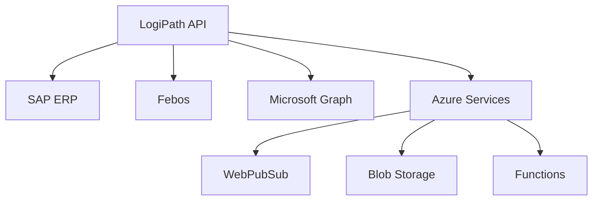
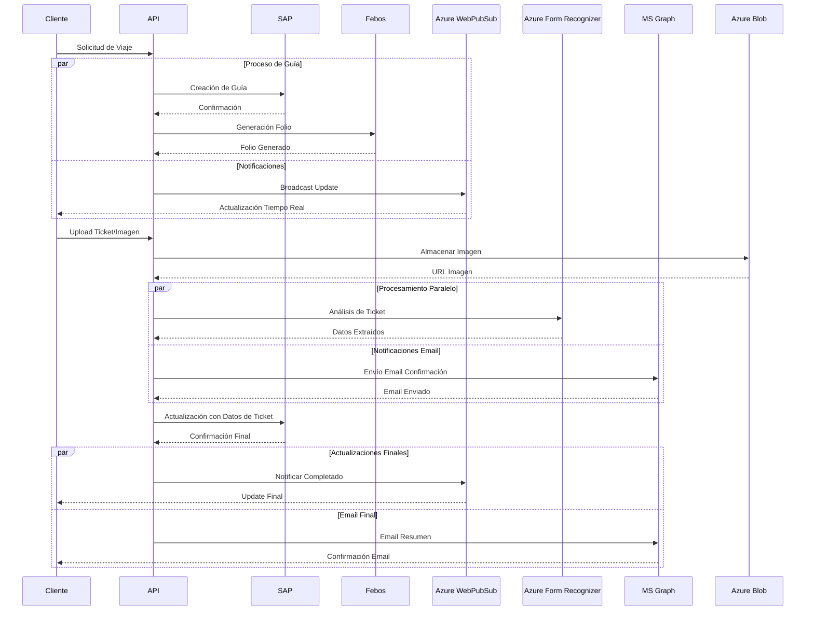

# Arquitectura Tracmin Backend - Documentación

## Arquitectura del Sistema

??? info "Tecnologías Core"
    - Framework Principal: FastAPI (Python)
    - Base de Datos: SQL Server
    - Base de Datos: SQL Server

??? tip "Seguridad"
    - Autenticación JWT
    - Control de roles y permisos
    - Encriptación de datos sensibles
    - Logs de auditoría

??? tip "Escalabilidad"
    - Arquitectura modular
    - Servicios independientes
    - Cache distribuido
    - Balanceo de carga
    - Monitorización
    - Logging centralizado
    - Métricas de rendimiento
    

## Módulos Principales

### 1. Gestión de Viajes
- `Programación y seguimiento de viajes`
- `Control de estados y ubicaciones`
- `Gestión de conductores y vehículos`

### 2. Documentación Electrónica
- `Integración con SAP para guías de despacho`
- `Validación y control de documentos`
- `Seguimiento de estados documentales`

### 3. Comunicaciones
- `Notificaciones en tiempo real (WebPubSub)`
- `Correos automáticos (Microsoft Graph)`
- `Comunicación bidireccional con conductores`

### 4. Almacenamiento y Multimedia
- `Gestión de imágenes y documentos`
- `Almacenamiento en Azure Blob`
- `Respaldos y versionamiento`



``` bash title="Dependencias" linenums="1"
fastapi = "^0.68.0"
sqlalchemy = "^1.4.23"
pyjwt = "^2.1.0"
azure-storage-blob = "^12.8.1"
azure-messaging-webpubsub = "^1.0.0"
```