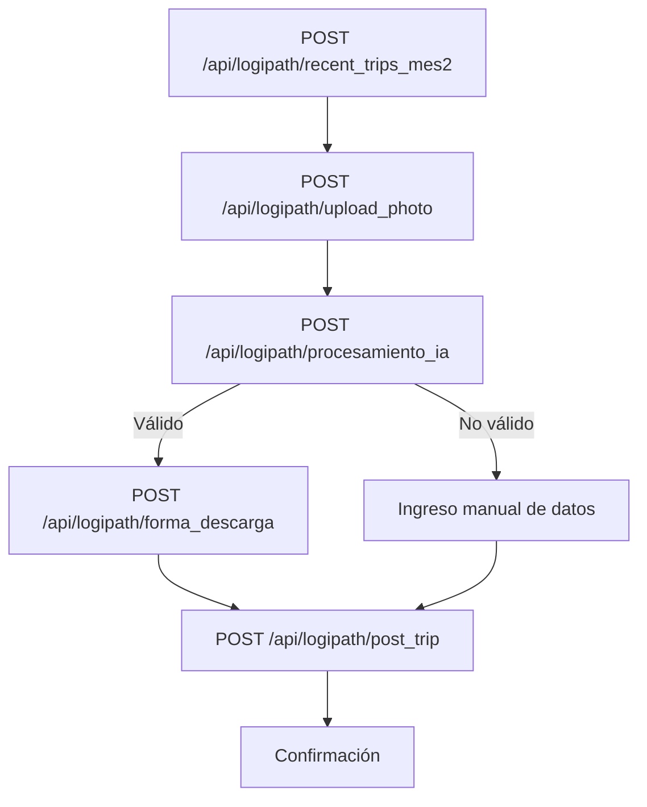
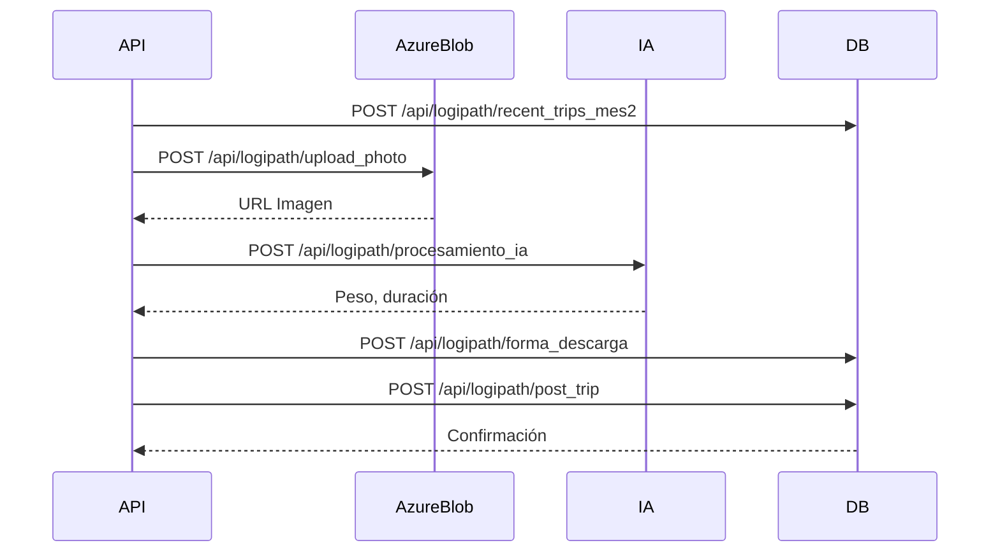

# API Cerrar Viaje

## Descripción General
Endpoint para finalizar (cerrar) un viaje, registrando el peso, duración, forma de descarga y otros datos relevantes. Permite subir foto del ticket, procesarla con IA, ingresar datos manualmente y actualizar el estado del viaje.

??? info "Notas Importantes"
	- Permite finalizar viajes pendientes, asegurando el registro correcto de datos.
	- Soporta procesamiento automático de tickets mediante IA (foto).
	- Permite ingreso manual de datos si la foto no es válida.
	- Actualiza la forma de descarga (silo/acopio).
	- Utiliza múltiples endpoints para completar el flujo.

??? warning "Consideraciones Importantes"
	- Todos los endpoints requieren autenticación JWT
	- El viaje debe existir en la base de datos
	- Validar formatos y datos antes de enviar

??? tip "Mejores Prácticas"
	- Validar el formato de la imagen antes del envío
	- Comprimir imágenes grandes
	- Implementar retry logic para fallos de red
	- Mantener logs detallados

## Endpoints Utilizados

### 1. Obtener viajes pendientes
`POST /api/logipath/recent_trips_mes2`

Permite obtener la lista de viajes recientes o pendientes de cierre, filtrados según el transportista y reglas de negocio.

#### Ejemplo de request
```json title="Request"
{
	"CodigoTransportista": "TM"
}
```

#### Ejemplo de respuesta
```json title="Response"
{
	"results": [
		{
			"Id": 123,
			"IdProgramado": 456,
			"PlantaOrigen": "PLANTA1",
			"Cliente": "CLIENTE1",
			"RutConductor": "12345678-9",
			"Patente": "ABCD12",
			"HoraInicioJornada": "2024-01-01T08:00:00",
			"Folio": 789,
			"IdTicket": null,
			...
		}
	]
}
```

### 2. Subir foto del ticket
`POST /api/logipath/upload_photo`

Permite subir la foto del ticket de pesaje asociada al viaje.

#### Ejemplo de request
```json title="Request"
{
	"IdProgramado": 456,
	"RutConductor": "12345678-9",
	"HoraInicioJornada": "2024-01-01T08:00:00",
	"folio": "789",
	"data": "<base64 de la imagen>"
}
```

#### Ejemplo de respuesta
```json title="Response"
{
	"blob_name": "TKT1234-789",
	"link": "https://.../TKT1234-789",
	"status_code": 200
}
```

### 3. Procesar ticket con IA
`POST /api/logipath/procesamiento_ia`

Procesa la imagen del ticket para extraer peso, duración y otros datos automáticamente.

#### Ejemplo de request
```json title="Request"
{
	"Cliente": "CLIENTE1",
	"LinkBlob": "https://.../TKT1234-789",
	"BlobName": "TKT1234-789",
	"Folio": "789",
	"NombreConductor": "Juan Perez",
	"RutConductor": "12345678-9",
	"Patente": "ABCD12"
}
```

#### Ejemplo de respuesta
```json title="Response"
{
	"IdTicket": "TKT1234-789",
	"status_code": 200,
	"PesoConfirmado": "28070",
	"Duracion": 90
}
```

### 4. Actualizar forma de descarga
`POST /api/logipath/forma_descarga`

Permite registrar si la descarga fue en silo o acopio, y actualizar el estado del ticket.

#### Ejemplo de request
```json title="Request"
{
	"IdTicket": "TKT1234-789",
	"FormaDescarga": "SILO",
	"Romana": true
}
```

#### Ejemplo de respuesta
```json title="Response"
{
	"message": "forma descarga actualizada",
	"status_code": 200
}
```

### 5. Finalizar viaje
`POST /api/logipath/post_trip`

Actualiza el viaje con todos los datos finales (peso, duración, ticket, forma de descarga, comentarios, etc).

#### Ejemplo de request
```json title="Request"
{
	"IdProgramado": 456,
	"Cliente": "CLIENTE1",
	"RutConductor": "12345678-9",
	"Patente": "ABCD12",
	"HoraInicioJornada": "2024-01-01T08:00:00",
	"Folio": "789",
	"IdTicket": "TKT1234-789",
	"PesoConfirmadoManual": 28070,
	"Recepcionista": "Viaje Terminado Por Admin",
	"Comentario": "Todo OK",
	"Version": "1.0.0",
	...
}
```

#### Ejemplo de respuesta
```json title="Response"
{
	"message": "trip updated correctly",
	"id": 123,
	"romana": true
}
```

## Flujo Explicado

1. Se obtiene la lista de viajes pendientes (`POST /api/logipath/recent_trips_mes2`).
2. Se sube la foto del ticket (`POST /api/logipath/upload_photo`).
3. Se procesa la foto con IA (`POST /api/logipath/procesamiento_ia`) para extraer peso y duración.
4. Si la foto no es válida, se permite ingresar los datos manualmente.
5. Se actualiza la forma de descarga (`POST /api/logipath/forma_descarga`).
6. Se finaliza el viaje enviando todos los datos (`POST /api/logipath/post_trip`).
7. El sistema responde con confirmación o error.

## Diagrama de Flujo


## Sequence Diagram


## Estados y Respuestas

### Éxito
```json title="Viaje cerrado correctamente"
{
	"message": "trip updated correctly",
	"id": 123,
	"romana": true
}
```

### Error
```json title="Error al cerrar viaje"
{
	"message": "trip not found",
	"id": null
}

{
	"message": "No se encontró el viaje"
}
```
