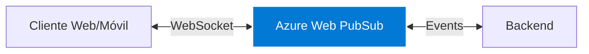

# 🔄 WebSocket con Azure Web PubSub

## 📡 Descripción General

Azure Web PubSub Service proporciona comunicación en tiempo real para la aplicación Tracmin Extracción y Logística.



## ⚙️ Configuración

### 1️⃣ Azure Setup

??? info "Configuración Azure"
    ```typescript
    const connection_string = "Endpoint=https://{hub}.webpubsub.azure.com;AccessKey={key};Version=1.0;"
    const hub_name = "tracmin"
    ```

### 2️⃣ Cliente WebSocket

??? example "Configuración Cliente"
    ```typescript
    // websocket.service.ts
    export class WebSocketService {
      private client: WebSocket;
      private url: string;
      
      constructor() {
        this.url = await this.getNegotiateUrl();
      }
    
      private async getNegotiateUrl(): Promise<string> {
        const response = await fetch('/api/negotiate', {
          method: 'GET',
          headers: {
            'user-id': getCurrentUserId()
          }
        });
        const data = await response.json();
        return data.url;
      }
    
      connect() {
        this.client = new WebSocket(this.url);
        this.setupEventHandlers();
      }
    }
    ```

## 🔌 Eventos

### Tipos de Eventos

??? tip "Eventos Principales"
    ```typescript
    enum WSEvents {
      // Viajes
      TRIP_STARTED = 'trip:started',
      TRIP_UPDATED = 'trip:updated',
      TRIP_COMPLETED = 'trip:completed',
      
      // Ubicación
      LOCATION_UPDATE = 'location:update',
      
      // Sistema
      CONNECTION_STATE = 'connection:state',
      ERROR = 'error'
    }
    ```

### Manejo de Eventos

??? example "Event Handlers"
    ```typescript
    setupEventHandlers() {
      this.client.onopen = () => {
        console.log('WebSocket Connected');
        this.connectionState$.next('connected');
      };
    
      this.client.onmessage = (event) => {
        const data = JSON.parse(event.data);
        this.handleMessage(data);
      };
    
      this.client.onclose = () => {
        console.log('WebSocket Disconnected');
        this.connectionState$.next('disconnected');
        this.reconnect();
      };
    }
    ```

## 🔄 Reconexión Automática

??? example "Lógica de Reconexión"
    ```typescript
    class WebSocketManager {
      private reconnectAttempts = 0;
      private maxReconnectAttempts = 5;
      private baseDelay = 1000; // 1 segundo
    
      async reconnect() {
        if (this.reconnectAttempts >= this.maxReconnectAttempts) {
          this.handleReconnectFailure();
          return;
        }
    
        const delay = this.calculateBackoff();
        await this.wait(delay);
        
        this.reconnectAttempts++;
        this.connect();
      }
    
      private calculateBackoff(): number {
        return this.baseDelay * Math.pow(2, this.reconnectAttempts);
      }
    }
    ```

## 📨 Envío de Mensajes

??? example "Métodos de Envío"
    ```typescript
    // Envío de ubicación
    sendLocation(coords: Coordinates) {
      this.send({
        type: WSEvents.LOCATION_UPDATE,
        payload: coords
      });
    }
    
    // Actualización de estado de viaje
    updateTripStatus(tripId: string, status: TripStatus) {
      this.send({
        type: WSEvents.TRIP_UPDATED,
        payload: { tripId, status }
      });
    }
    ```

## 🔒 Seguridad

??? warning "Consideraciones de Seguridad"
    - Tokens de conexión temporales
    - Validación de usuario por conexión
    - Encriptación de datos sensibles
    - Rate limiting
    - Monitoreo de conexiones

## 📊 Monitoreo

??? tip "Métricas Importantes"
    | Métrica | Descripción | Alerta |
    |---------|-------------|---------|
    | Conexiones Activas | Número de clientes conectados | >1000 |
    | Latencia | Tiempo de respuesta | >500ms |
    | Errores | Tasa de errores | >1% |
    | Reconexiones | Intentos de reconexión | >5/min |

## ⚠️ Manejo de Errores

??? warning "Errores Comunes"
    | Error | Causa | Solución |
    |-------|-------|----------|
    | Token Expirado | Sesión caducada | Renovar token |
    | Conexión Perdida | Red inestable | Reconexión automática |
    | Rate Limit | Demasiadas peticiones | Implementar backoff |

## 📝 Ejemplos de Uso

??? example "Implementación Básica"
    ```typescript
    // Inicializar WebSocket
    const ws = new WebSocketService();
    
    // Suscribirse a eventos
    ws.on(WSEvents.TRIP_UPDATED, (data) => {
      updateTripUI(data);
    });
    
    // Enviar actualización
    ws.sendLocation({
      lat: -33.4569,
      lng: -70.6483
    });
    ```

## 🔍 Debugging

??? tip "Herramientas de Debug"
    - Azure Portal Metrics
    - Browser DevTools (Network tab)
    - Custom logging
    - WebSocket Inspector

## 📚 Recursos

??? info "Enlaces Útiles"
    - [Azure Web PubSub Docs](https://azure.microsoft.com/es-es/products/web-pubsub)
    - [WebSocket API](https://developer.mozilla.org/docs/Web/API/WebSocket)