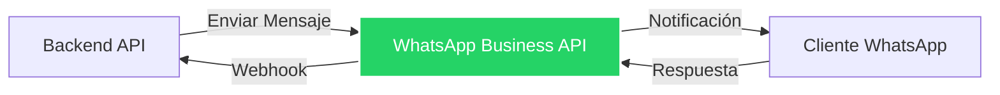

# 💬 WhatsApp Business API - Documentación

## 📱 Descripción General

Integración con WhatsApp Business API para envío de notificaciones y mensajes automatizados a clientes, conductores y administradores del sistema Tracmin.



## 🤖 Webhook WhatsApp con IA

Sistema de chatbot inteligente basado en agentes de IA que permite a los usuarios interactuar con la plataforma Tracmin a través de WhatsApp.

### Documentación Completa del Webhook

- **[Arquitectura General](whatsapp/arquitectura.md)** - Vista general del sistema, stack tecnológico y componentes
- **[Flujo de Mensajes](whatsapp/flujo-mensajes.md)** - Procesamiento detallado de mensajes y casos especiales
- **[Sistema de Agentes](whatsapp/sistema-agentes.md)** - Agentes especializados y factory pattern
- **[Seguridad y Validación](whatsapp/seguridad.md)** - Content filter, guardrails y autenticación
- **[MCP y Base de Datos](whatsapp/mcp-database.md)** - Model Context Protocol y acceso a datos

### Características Principales

✅ **Agentes Especializados** - Factory pattern con agentes para documentos, combustible, operaciones, vehículos y transportistas  
✅ **Seguridad Multi-Capa** - Content filter, AI guardrails, validación RUT y restricciones por usuario  
✅ **Model Context Protocol** - Acceso seguro a SQL Server mediante MCP  
✅ **Conversación Natural** - Respuestas en lenguaje natural con formato Toon  
✅ **Autenticación Robusta** - Vinculación de cuentas con validación de RUT chileno  
✅ **Roles y Permisos** - Diferenciación entre usuarios normales y administradores

## ⚙️ Configuración

### 1️⃣ Requisitos Previos

??? info "Credenciales Necesarias"
    ```python
    # Variables de entorno
    WHATSAPP_API_TOKEN = "tu_token_de_acceso"
    WHATSAPP_PHONE_NUMBER_ID = "tu_phone_number_id"
    WHATSAPP_BUSINESS_ACCOUNT_ID = "tu_business_account_id"
    WHATSAPP_WEBHOOK_VERIFY_TOKEN = "tu_verify_token"
    ```

??? warning "Requisitos Meta"
    - Cuenta de Meta Business
    - Aplicación de WhatsApp Business
    - Número de teléfono verificado
    - Token de acceso permanente

### 2️⃣ Configuración del Cliente

??? example "Cliente WhatsApp"
    ```python
    # whatsapp_service.py
    import requests
    from typing import Optional, Dict, List
    
    class WhatsAppService:
        BASE_URL = "https://graph.facebook.com/v18.0"
        
        def __init__(self, token: str, phone_number_id: str):
            self.token = token
            self.phone_number_id = phone_number_id
            self.headers = {
                "Authorization": f"Bearer {token}",
                "Content-Type": "application/json"
            }
        
        def send_message(
            self, 
            to: str, 
            message: str,
            message_type: str = "text"
        ) -> Dict:
            """
            Envía un mensaje de texto por WhatsApp
            
            Args:
                to: Número de teléfono (con código de país)
                message: Contenido del mensaje
                message_type: Tipo de mensaje (text, template, etc.)
            
            Returns:
                Dict con respuesta de la API
            """
            url = f"{self.BASE_URL}/{self.phone_number_id}/messages"
            
            payload = {
                "messaging_product": "whatsapp",
                "to": to,
                "type": message_type,
                "text": {"body": message}
            }
            
            response = requests.post(url, json=payload, headers=self.headers)
            return response.json()
    ```

## 📤 Envío de Mensajes

### 📝 Mensaje de Texto Simple

??? example "Envío Básico"
    ```python
    @router.post("/api/whatsapp/send_text")
    async def send_whatsapp_text(
        sec: Annotated[str, Depends(security_scheme)],
        phone: str,
        message: str
    ):
        """
        Envía un mensaje de texto simple por WhatsApp
        
        Args:
            sec: Token JWT de autenticación
            phone: Número de teléfono destino (formato: +56912345678)
            message: Contenido del mensaje
        
        Returns:
            dict: {
                "status": "success",
                "message_id": "wamid.xxx",
                "phone": "+56912345678"
            }
        
        Raises:
            HTTPException:
                - 401: Token inválido
                - 400: Número de teléfono inválido
                - 500: Error al enviar mensaje
        """
        try:
            # Validar formato de teléfono
            if not phone.startswith("+"):
                raise HTTPException(
                    status_code=400,
                    detail="Número debe incluir código de país (ej: +56912345678)"
                )
            
            # Enviar mensaje
            whatsapp = WhatsAppService(
                token=WHATSAPP_API_TOKEN,
                phone_number_id=WHATSAPP_PHONE_NUMBER_ID
            )
            
            result = whatsapp.send_message(to=phone, message=message)
            
            if "messages" in result:
                return {
                    "status": "success",
                    "message_id": result["messages"][0]["id"],
                    "phone": phone
                }
            else:
                raise HTTPException(
                    status_code=500,
                    detail=f"Error de WhatsApp: {result.get('error', {}).get('message')}"
                )
                
        except Exception as e:
            raise HTTPException(status_code=500, detail=str(e))
    ```

### 📋 Mensaje con Plantilla (Template)

??? example "Envío con Template"
    ```python
    @router.post("/api/whatsapp/send_template")
    async def send_whatsapp_template(
        sec: Annotated[str, Depends(security_scheme)],
        phone: str,
        template_name: str,
        parameters: Optional[List[str]] = None
    ):
        """
        Envía un mensaje usando plantilla pre-aprobada
        
        Args:
            sec: Token JWT
            phone: Número destino
            template_name: Nombre de la plantilla
            parameters: Lista de parámetros para la plantilla
        
        Returns:
            dict: Resultado del envío
        """
        url = f"{WhatsAppService.BASE_URL}/{WHATSAPP_PHONE_NUMBER_ID}/messages"
        
        # Construir componentes de la plantilla
        components = []
        if parameters:
            components.append({
                "type": "body",
                "parameters": [
                    {"type": "text", "text": param} 
                    for param in parameters
                ]
            })
        
        payload = {
            "messaging_product": "whatsapp",
            "to": phone,
            "type": "template",
            "template": {
                "name": template_name,
                "language": {"code": "es"},
                "components": components
            }
        }
        
        headers = {
            "Authorization": f"Bearer {WHATSAPP_API_TOKEN}",
            "Content-Type": "application/json"
        }
        
        response = requests.post(url, json=payload, headers=headers)
        return response.json()
    ```

## 🔔 Casos de Uso en Tracmin

### 1️⃣ Notificación de Guía Creada

??? example "Guía Generada"
    ```python
    async def notificar_guia_creada(
        phone: str,
        folio: str,
        cliente: str,
        conductor: str
    ):
        """
        Notifica al conductor cuando se crea una guía
        """
        message = f"""
✅ *Guía Generada Exitosamente*

📄 Folio: {folio}
👤 Cliente: {cliente}
🚚 Conductor: {conductor}

La guía ha sido generada y está lista para el despacho.
        """
        
        whatsapp = WhatsAppService(
            token=WHATSAPP_API_TOKEN,
            phone_number_id=WHATSAPP_PHONE_NUMBER_ID
        )
        
        return whatsapp.send_message(to=phone, message=message.strip())
    ```

### 2️⃣ Actualización de Estado de Viaje

??? example "Estado de Viaje"
    ```python
    async def notificar_estado_viaje(
        phone: str,
        patente: str,
        estado: str,
        ubicacion: Optional[str] = None
    ):
        """
        Notifica cambios en el estado del viaje
        """
        estados_emoji = {
            "Inicio Jornada": "🚀",
            "En Carga": "⏳",
            "Con Folio": "📄",
            "En Tránsito": "🚛",
            "Llegada Cliente": "📍",
            "Fin Entrega": "✅",
            "Cancelado": "❌"
        }
        
        emoji = estados_emoji.get(estado, "📢")
        
        message = f"""
{emoji} *Actualización de Viaje*

🚛 Patente: {patente}
📊 Estado: {estado}
"""
        
        if ubicacion:
            message += f"📍 Ubicación: {ubicacion}\n"
        
        message += "\nTracmin - Extracción y Logística"
        
        whatsapp = WhatsAppService(
            token=WHATSAPP_API_TOKEN,
            phone_number_id=WHATSAPP_PHONE_NUMBER_ID
        )
        
        return whatsapp.send_message(to=phone, message=message.strip())
    ```

### 3️⃣ Alertas de Sistema

??? example "Alertas Críticas"
    ```python
    async def enviar_alerta_sistema(
        phones: List[str],
        tipo_alerta: str,
        descripcion: str,
        severidad: str = "medium"
    ):
        """
        Envía alertas del sistema a administradores
        
        Args:
            phones: Lista de números de teléfono
            tipo_alerta: Tipo de alerta (SAP, Database, WebSocket, etc.)
            descripcion: Descripción del problema
            severidad: low, medium, high, critical
        """
        severidad_emoji = {
            "low": "ℹ️",
            "medium": "⚠️",
            "high": "🚨",
            "critical": "🔴"
        }
        
        emoji = severidad_emoji.get(severidad, "⚠️")
        
        message = f"""
{emoji} *ALERTA DEL SISTEMA*

🔧 Tipo: {tipo_alerta}
📝 Descripción: {descripcion}
⏰ Hora: {datetime.now().strftime('%d/%m/%Y %H:%M:%S')}

Revise el sistema inmediatamente.
        """
        
        whatsapp = WhatsAppService(
            token=WHATSAPP_API_TOKEN,
            phone_number_id=WHATSAPP_PHONE_NUMBER_ID
        )
        
        resultados = []
        for phone in phones:
            try:
                result = whatsapp.send_message(to=phone, message=message.strip())
                resultados.append({
                    "phone": phone,
                    "status": "sent",
                    "message_id": result.get("messages", [{}])[0].get("id")
                })
            except Exception as e:
                resultados.append({
                    "phone": phone,
                    "status": "failed",
                    "error": str(e)
                })
        
        return resultados
    ```

## 🔄 Webhook - Recepción de Mensajes

### Configuración del Webhook

??? example "Endpoint Webhook"
    ```python
    @router.get("/api/whatsapp/webhook")
    async def verify_webhook(
        request: Request,
        mode: str = Query(..., alias="hub.mode"),
        token: str = Query(..., alias="hub.verify_token"),
        challenge: str = Query(..., alias="hub.challenge")
    ):
        """
        Verificación del webhook de WhatsApp
        
        Meta enviará este request para verificar el endpoint
        """
        if mode == "subscribe" and token == WHATSAPP_WEBHOOK_VERIFY_TOKEN:
            return Response(content=challenge, media_type="text/plain")
        else:
            raise HTTPException(status_code=403, detail="Verification failed")
    
    
    @router.post("/api/whatsapp/webhook")
    async def receive_webhook(request: Request):
        """
        Recibe webhooks de WhatsApp (mensajes entrantes, estados, etc.)
        """
        try:
            body = await request.json()
            
            # Procesar mensajes entrantes
            if "messages" in body.get("entry", [{}])[0].get("changes", [{}])[0].get("value", {}):
                messages = body["entry"][0]["changes"][0]["value"]["messages"]
                
                for message in messages:
                    from_number = message["from"]
                    message_type = message["type"]
                    
                    if message_type == "text":
                        text = message["text"]["body"]
                        
                        # Procesar el mensaje
                        await process_incoming_message(from_number, text)
            
            # Procesar estados de mensajes
            if "statuses" in body.get("entry", [{}])[0].get("changes", [{}])[0].get("value", {}):
                statuses = body["entry"][0]["changes"][0]["value"]["statuses"]
                
                for status in statuses:
                    message_id = status["id"]
                    status_value = status["status"]  # sent, delivered, read, failed
                    
                    # Actualizar estado del mensaje en DB
                    await update_message_status(message_id, status_value)
            
            return {"status": "ok"}
            
        except Exception as e:
            print(f"Error processing webhook: {str(e)}")
            return {"status": "error", "message": str(e)}
    ```

### Procesamiento de Mensajes Entrantes

??? example "Respuestas Automáticas"
    ```python
    async def process_incoming_message(phone: str, message: str):
        """
        Procesa mensajes entrantes y genera respuestas automáticas
        """
        message_lower = message.lower().strip()
        
        whatsapp = WhatsAppService(
            token=WHATSAPP_API_TOKEN,
            phone_number_id=WHATSAPP_PHONE_NUMBER_ID
        )
        
        # Comando: ESTADO
        if message_lower == "estado":
            # Buscar viajes activos del conductor
            trips = await get_active_trips_by_phone(phone)
            
            if trips:
                response = "🚛 *Tus Viajes Activos:*\n\n"
                for trip in trips:
                    response += f"• Patente: {trip['patente']}\n"
                    response += f"  Estado: {trip['estado']}\n"
                    response += f"  Cliente: {trip['cliente']}\n\n"
            else:
                response = "No tienes viajes activos en este momento."
            
            whatsapp.send_message(to=phone, message=response)
        
        # Comando: AYUDA
        elif message_lower == "ayuda":
            response = """
📱 *Comandos Disponibles:*

• ESTADO - Ver tus viajes activos
• GUIA - Información de tu última guía
• UBICACION - Compartir tu ubicación
• AYUDA - Ver este mensaje

Para soporte, contacta a: soporte@tracmin.cl
            """
            whatsapp.send_message(to=phone, message=response.strip())
        
        # Comando: GUIA
        elif message_lower == "guia":
            guia = await get_last_guide_by_phone(phone)
            
            if guia:
                response = f"""
📄 *Tu Última Guía:*

Folio: {guia['folio']}
Cliente: {guia['cliente']}
Estado: {guia['estado']}
Fecha: {guia['fecha']}

Link: {guia['datalink']}
                """
            else:
                response = "No se encontraron guías recientes."
            
            whatsapp.send_message(to=phone, message=response.strip())
        
        # Mensaje no reconocido
        else:
            response = """
Hola 👋

No entendí tu mensaje. Escribe *AYUDA* para ver los comandos disponibles.
            """
            whatsapp.send_message(to=phone, message=response.strip())
    ```

## 📊 Tracking y Logs

### Registro de Mensajes

??? example "Base de Datos - Modelo"
    ```python
    # models.py
    class WhatsAppMessage(Base):
        __tablename__ = "whatsapp_messages"
        
        id = Column(Integer, primary_key=True)
        message_id = Column(String, unique=True, nullable=False)
        phone = Column(String, nullable=False)
        direction = Column(String, nullable=False)  # outgoing, incoming
        message_type = Column(String, nullable=False)  # text, template, image
        content = Column(Text)
        status = Column(String)  # sent, delivered, read, failed
        error_message = Column(Text)
        created_at = Column(DateTime, default=datetime.utcnow)
        updated_at = Column(DateTime, onupdate=datetime.utcnow)
        
        # Relaciones opcionales
        user_id = Column(Integer, ForeignKey("users.id"))
        trip_id = Column(Integer, ForeignKey("actual_trip.id"))
    ```

### Consulta de Historial

??? example "Endpoint Historial"
    ```python
    @router.get("/api/whatsapp/history/{phone}")
    async def get_whatsapp_history(
        phone: str,
        sec: Annotated[str, Depends(security_scheme)],
        limit: int = 50,
        offset: int = 0
    ):
        """
        Obtiene historial de mensajes de WhatsApp
        
        Args:
            phone: Número de teléfono
            sec: Token JWT (solo admin)
            limit: Cantidad de mensajes
            offset: Paginación
        
        Returns:
            Lista de mensajes con su estado
        """
        # Validar permisos de admin
        validate_admin_permissions(sec)
        
        messages = db.query(WhatsAppMessage)\
            .filter(WhatsAppMessage.phone == phone)\
            .order_by(WhatsAppMessage.created_at.desc())\
            .limit(limit)\
            .offset(offset)\
            .all()
        
        return {
            "phone": phone,
            "total": db.query(WhatsAppMessage).filter_by(phone=phone).count(),
            "messages": [
                {
                    "id": msg.id,
                    "message_id": msg.message_id,
                    "direction": msg.direction,
                    "type": msg.message_type,
                    "content": msg.content,
                    "status": msg.status,
                    "created_at": msg.created_at.isoformat()
                }
                for msg in messages
            ]
        }
    ```

## 🎯 Mejores Prácticas

??? tip "Recomendaciones"
    ### Límites de Rate
    - Máximo 1000 mensajes/día por número (API estándar)
    - 80 mensajes/segundo para cuentas verificadas
    - Implementar retry logic con backoff exponencial
    
    ### Formato de Números
    - Incluir código de país: `+56912345678`
    - Sin espacios ni caracteres especiales
    - Validar formato antes de enviar
    
    ### Contenido de Mensajes
    - Máximo 4096 caracteres por mensaje
    - Usar emojis para mejor engagement
    - Incluir información clara y concisa
    - Agregar llamados a la acción (CTA)
    
    ### Templates
    - Crear templates pre-aprobados para notificaciones frecuentes
    - Los templates requieren aprobación de Meta (24-48 horas)
    - Usar variables dinámicas: `{{1}}`, `{{2}}`, etc.
    
    ### Seguridad
    - Nunca compartir tokens en código
    - Usar variables de entorno
    - Validar webhook verify token
    - Registrar todos los eventos en logs

## 📈 Monitoreo

??? info "Métricas Importantes"
    ```python
    @router.get("/api/whatsapp/metrics")
    async def get_whatsapp_metrics(
        sec: Annotated[str, Depends(security_scheme)],
        start_date: Optional[datetime] = None,
        end_date: Optional[datetime] = None
    ):
        """
        Obtiene métricas de uso de WhatsApp
        """
        validate_admin_permissions(sec)
        
        if not start_date:
            start_date = datetime.utcnow() - timedelta(days=30)
        if not end_date:
            end_date = datetime.utcnow()
        
        # Mensajes enviados
        sent_count = db.query(WhatsAppMessage)\
            .filter(
                WhatsAppMessage.direction == "outgoing",
                WhatsAppMessage.created_at.between(start_date, end_date)
            )\
            .count()
        
        # Mensajes entregados
        delivered_count = db.query(WhatsAppMessage)\
            .filter(
                WhatsAppMessage.direction == "outgoing",
                WhatsAppMessage.status == "delivered",
                WhatsAppMessage.created_at.between(start_date, end_date)
            )\
            .count()
        
        # Mensajes leídos
        read_count = db.query(WhatsAppMessage)\
            .filter(
                WhatsAppMessage.direction == "outgoing",
                WhatsAppMessage.status == "read",
                WhatsAppMessage.created_at.between(start_date, end_date)
            )\
            .count()
        
        # Mensajes fallidos
        failed_count = db.query(WhatsAppMessage)\
            .filter(
                WhatsAppMessage.direction == "outgoing",
                WhatsAppMessage.status == "failed",
                WhatsAppMessage.created_at.between(start_date, end_date)
            )\
            .count()
        
        # Tasa de entrega
        delivery_rate = (delivered_count / sent_count * 100) if sent_count > 0 else 0
        
        # Tasa de lectura
        read_rate = (read_count / delivered_count * 100) if delivered_count > 0 else 0
        
        return {
            "period": {
                "start": start_date.isoformat(),
                "end": end_date.isoformat()
            },
            "metrics": {
                "sent": sent_count,
                "delivered": delivered_count,
                "read": read_count,
                "failed": failed_count,
                "delivery_rate": round(delivery_rate, 2),
                "read_rate": round(read_rate, 2)
            }
        }
    ```

## 🔗 Integración con Otros Módulos

### Con Viajes

??? example "Notificaciones Automáticas"
    ```python
    # En post_trip endpoint
    async def post_trip_with_whatsapp(trip_data, conductor_phone):
        # Actualizar viaje
        trip = await update_trip(trip_data)
        
        # Enviar notificación por WhatsApp
        if conductor_phone:
            await notificar_estado_viaje(
                phone=conductor_phone,
                patente=trip.patente,
                estado=trip.estado,
                ubicacion=f"{trip.latitud}, {trip.longitud}"
            )
        
        # Enviar por WebSocket también
        await webpubsub.send_to_all({
            "type": "trip_updated",
            "data": trip.dict()
        })
        
        return trip
    ```

### Con Guías SAP

??? example "Notificación de Guía"
    ```python
    # En sap_guides endpoint
    async def create_guide_with_notification(guide_data, conductor_phone):
        # Crear guía
        guide = await create_sap_guide(guide_data)
        
        # Notificar por WhatsApp
        if conductor_phone and guide.folio:
            await notificar_guia_creada(
                phone=conductor_phone,
                folio=guide.folio,
                cliente=guide.cliente,
                conductor=guide.conductor
            )
        
        return guide
    ```

## 🛠️ Troubleshooting

??? warning "Errores Comunes"
    ### Error 401: Unauthorized
    - Verificar token de acceso
    - Token puede haber expirado
    - Regenerar token en Meta Business
    
    ### Error 400: Invalid Phone Number
    - Verificar formato: `+[código_país][número]`
    - Ejemplo válido: `+56912345678`
    - Sin espacios ni guiones
    
    ### Error 131026: Message Undeliverable
    - Número no tiene WhatsApp activo
    - Usuario bloqueó el número empresarial
    - Número inválido
    
    ### Error 131047: Re-engagement Message
    - Han pasado más de 24h desde último mensaje del usuario
    - Usar templates pre-aprobados para reiniciar conversación
    
    ### Error 133016: Service Temporarily Unavailable
    - Servidor de WhatsApp saturado
    - Implementar retry con backoff exponencial
    - Esperar 30-60 segundos antes de reintentar

## 📚 Recursos Adicionales

??? info "Enlaces Útiles"
    - [WhatsApp Business API Docs](https://developers.facebook.com/docs/whatsapp)
    - [Cloud API Reference](https://developers.facebook.com/docs/whatsapp/cloud-api)
    - [Message Templates](https://developers.facebook.com/docs/whatsapp/message-templates)
    - [Webhook Guide](https://developers.facebook.com/docs/whatsapp/webhooks)
    - [Error Codes](https://developers.facebook.com/docs/whatsapp/cloud-api/support/error-codes)

## 📝 Ejemplo Completo

??? example "Implementación Completa"
    ```python
    # whatsapp_router.py
    from fastapi import APIRouter, Depends, HTTPException, Query, Request, Response
    from typing import Annotated, Optional, List
    from datetime import datetime, timedelta
    import requests
    
    router = APIRouter(prefix="/api/whatsapp", tags=["WhatsApp"])
    
    class WhatsAppService:
        BASE_URL = "https://graph.facebook.com/v18.0"
        
        def __init__(self):
            self.token = WHATSAPP_API_TOKEN
            self.phone_number_id = WHATSAPP_PHONE_NUMBER_ID
            self.headers = {
                "Authorization": f"Bearer {self.token}",
                "Content-Type": "application/json"
            }
        
        def send_text(self, to: str, message: str) -> dict:
            url = f"{self.BASE_URL}/{self.phone_number_id}/messages"
            payload = {
                "messaging_product": "whatsapp",
                "to": to,
                "type": "text",
                "text": {"body": message}
            }
            response = requests.post(url, json=payload, headers=self.headers)
            response.raise_for_status()
            return response.json()
        
        def send_template(
            self, 
            to: str, 
            template_name: str, 
            params: List[str]
        ) -> dict:
            url = f"{self.BASE_URL}/{self.phone_number_id}/messages"
            payload = {
                "messaging_product": "whatsapp",
                "to": to,
                "type": "template",
                "template": {
                    "name": template_name,
                    "language": {"code": "es"},
                    "components": [{
                        "type": "body",
                        "parameters": [
                            {"type": "text", "text": p} for p in params
                        ]
                    }]
                }
            }
            response = requests.post(url, json=payload, headers=self.headers)
            response.raise_for_status()
            return response.json()
    
    # Usar el servicio
    whatsapp = WhatsAppService()
    
    @router.post("/send")
    async def send_message(
        sec: Annotated[str, Depends(security_scheme)],
        phone: str,
        message: str
    ):
        try:
            result = whatsapp.send_text(to=phone, message=message)
            
            # Guardar en DB
            db_message = WhatsAppMessage(
                message_id=result["messages"][0]["id"],
                phone=phone,
                direction="outgoing",
                message_type="text",
                content=message,
                status="sent"
            )
            db.add(db_message)
            db.commit()
            
            return {"status": "success", "result": result}
        except Exception as e:
            raise HTTPException(status_code=500, detail=str(e))
    ```
