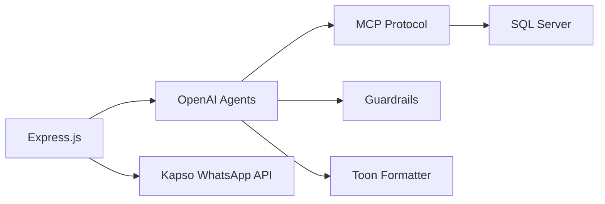
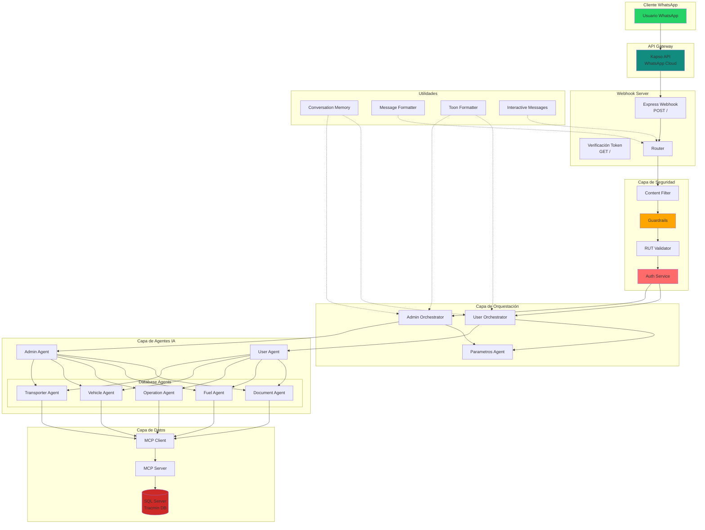
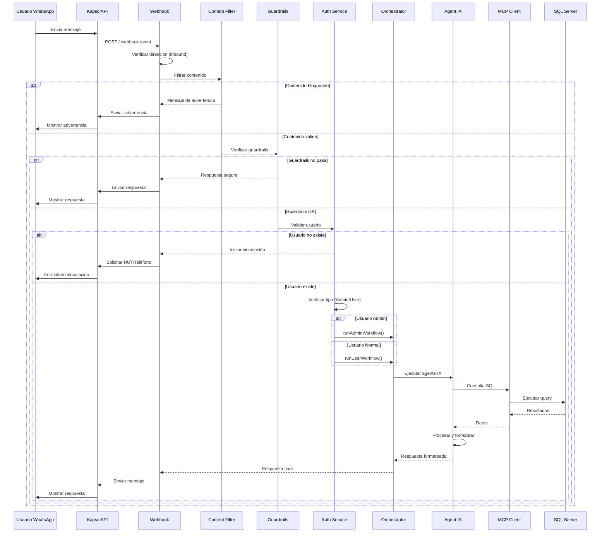

# Arquitectura del Webhook WhatsApp

## Descripción General

El webhook de WhatsApp es un sistema de mensajería inteligente basado en agentes de IA que permite a los usuarios interactuar con la plataforma Tracmin a través de WhatsApp. El sistema implementa arquitectura de agentes orquestados con acceso a base de datos mediante Model Context Protocol (MCP).

## Stack Tecnológico



### Tecnologías Principales

- **Runtime**: Node.js
- **Framework Web**: Express.js 4.21.2
- **API WhatsApp**: @kapso/whatsapp-cloud-api 0.1.1
- **IA/Agentes**: @openai/agents latest
- **Seguridad**: @openai/guardrails latest
- **Database Protocol**: @modelcontextprotocol/sdk 1.0.4
- **Database**: mssql 11.0.1 (SQL Server)
- **Formato de respuestas**: @toon-format/toon 0.9.0
- **HTTP Client**: node-fetch 3.3.2
- **Config**: dotenv 16.4.7

## Arquitectura General del Sistema



## Flujo de Procesamiento de Mensajes



## Componentes Principales

### 1. Express Webhook (`app.js`, `webhook.js`)

Punto de entrada del sistema que recibe eventos de WhatsApp.

**Endpoints:**

- `GET /` - Verificación de webhook (handshake con Kapso)
- `POST /` - Recepción de mensajes y eventos

### 2. Capa de Seguridad

#### Content Filter (`contentFilter.js`)

Bloquea solicitudes relacionadas con trabajo o código malicioso.

#### Guardrails (`guardrails.js`)

Valida entrada/salida usando OpenAI Moderation API y filtros personalizados.

#### RUT Validator (`rutValidator.js`)

Valida identidad chilena (RUT) y vinculación de cuentas.

#### Auth Service (`authService.js`)

Gestiona autenticación y permisos de usuarios.

### 3. Orquestadores

#### User Orchestrator (`userOrchestrator.js`)

- Coordina flujo para usuarios normales
- Aplica restricciones de seguridad por RUT/Transportista
- Selecciona agente especializado según la consulta

#### Admin Orchestrator (`adminOrchestrator.js`)

- Maneja consultas administrativas
- Acceso sin restricciones a toda la base de datos
- Proporciona análisis y reportes avanzados

### 4. Agentes de IA

#### Agentes de Usuario

**User Agent** (`userAgent.js`): Agente conversacional para usuarios finales con restricciones de seguridad.

**Admin Agent** (`adminAgent.js`): Agente con privilegios administrativos completos.

#### Agentes de Base de Datos (Factory Pattern)

**Document Agent** (`documentAgent.js`): Especializado en guías, documentos y trazabilidad.

**Fuel Agent** (`fuelAgent.js`): Gestiona consultas de combustible y consumos.

**Operation Agent** (`operationAgent.js`): Maneja operaciones y viajes.

**Vehicle Agent** (`vehicleAgent.js`): Consultas sobre vehículos y flotas.

**Transporter Agent** (`transporterAgent.js`): Información de transportistas.

### 5. Model Context Protocol (MCP)

#### MCP Client (`dbClient.js`)

Cliente que comunica con el servidor MCP para ejecutar operaciones de base de datos.

**Métodos principales:**

- `executeSQL(query)` - Ejecuta consultas SQL
- `getUserByPhone(phone)` - Busca usuario por teléfono
- `getUserByConversationId(conversationId)` - Busca usuario por ID de conversación
- `updateConversationId(rut, conversationId)` - Actualiza vinculación
- `listTables()` - Lista tablas disponibles
- `getTableSchema(tableName)` - Obtiene esquema de tabla

#### MCP Server (`dbServer.js`)

Servidor que abstrae el acceso a SQL Server mediante el protocolo MCP.

### 6. Utilidades

#### Conversation Memory (`conversationMemory.js`)

Mantiene contexto y estado de conversaciones en memoria.

#### Message Formatter (`messageFormatter.js`)

Formatea respuestas para WhatsApp.

#### Toon Formatter (`toonFormatter.js`)

Convierte resultados SQL a formato estructurado legible.

#### Interactive Messages (`interactiveMessages.js`)

Genera botones y menús interactivos de WhatsApp.

## Variables de Entorno

```env
# Server
PORT=3000

# Webhook Verification
VERIFY_TOKEN=your_verify_token

# Kapso WhatsApp API
KAPSO_API_KEY=your_kapso_api_key
KAPSO_API_URL=https://api.kapso.com

# OpenAI
OPENAI_API_KEY=your_openai_api_key

# Database Connection (para MCP Server)
DB_SERVER=your_server.database.windows.net
DB_DATABASE=TracminDB
DB_USER=your_username
DB_PASSWORD=your_password
DB_ENCRYPT=true
```

## Próximos Pasos

- [Flujo de Mensajes](./flujo-mensajes.md)
- [Sistema de Agentes](./sistema-agentes.md)
- [Seguridad y Validación](./seguridad.md)
- [MCP y Base de Datos](./mcp-database.md)
