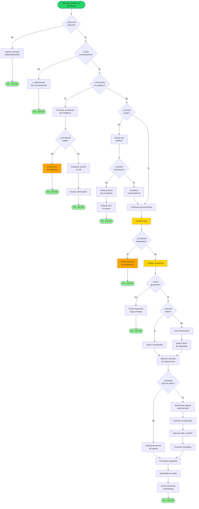
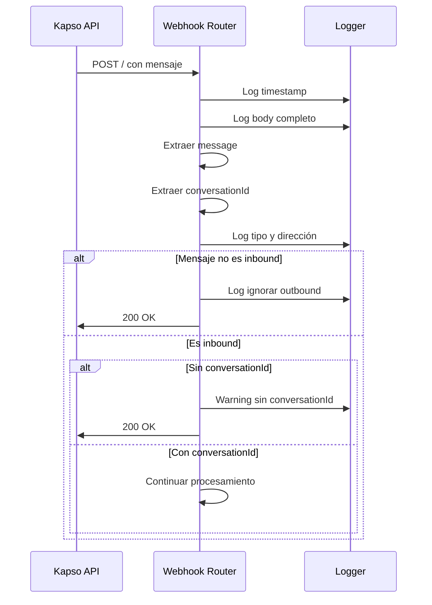
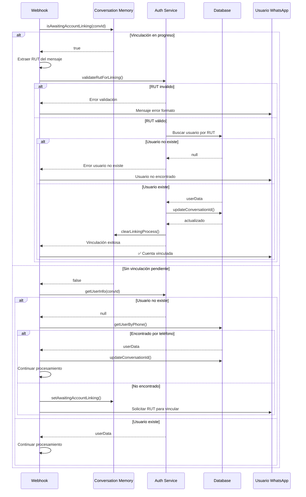
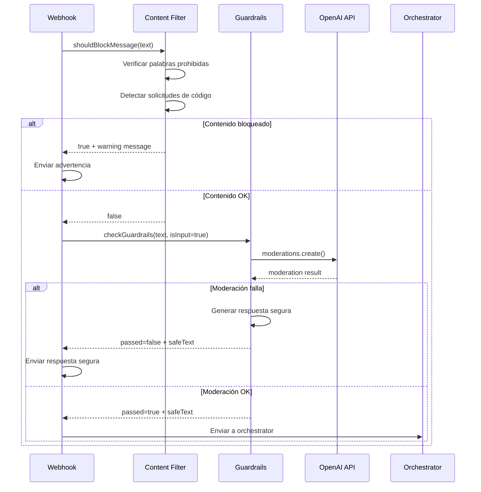
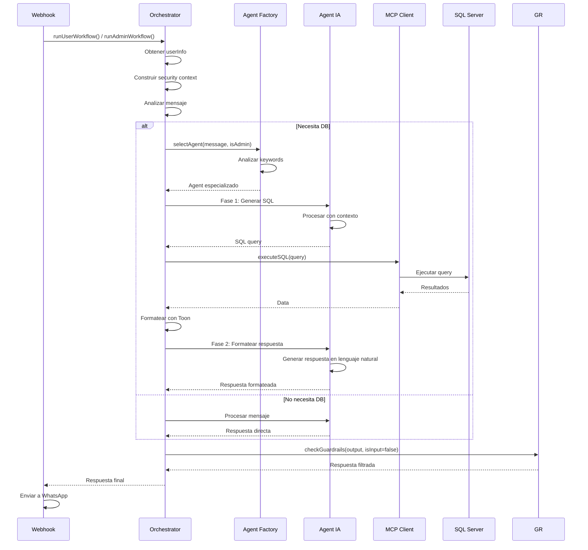
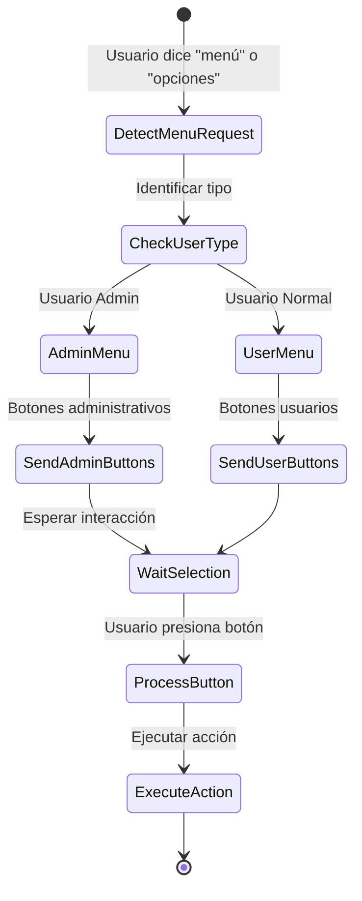
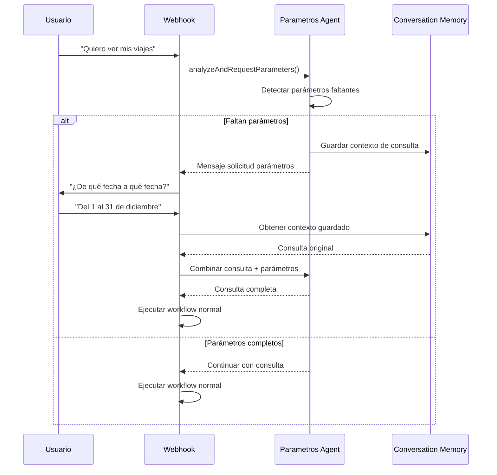

# Flujo de Procesamiento de Mensajes

## Diagrama de Flujo General



## Fases del Procesamiento

### Fase 1: Recepción y Validación Inicial



### Fase 2: Autenticación y Vinculación



### Fase 3: Filtrado y Seguridad



### Fase 4: Orquestación y Ejecución



## Manejo de Casos Especiales

### Menú Interactivo



### Solicitud de Parámetros



## Respuestas Asíncronas

El webhook siempre responde inmediatamente con 200 OK a Kapso, luego procesa el mensaje de forma asíncrona:

```javascript
// Respuesta inmediata
res.status(200).end();

// Procesamiento asíncrono
(async () => {
  try {
    const response = await processMessage();
    await sendWhatsAppMessage(conversationId, response);
  } catch (error) {
    console.error('Error:', error);
    await sendWhatsAppMessage(conversationId, '❌ Error procesando mensaje');
  }
})();
```

## Logs y Debugging

Cada fase del procesamiento genera logs estructurados:

```
[DEPURACIÓN] Webhook recibido 2025-12-26 10:30:00
[DEPURACIÓN] 📦 Body completo: {...}
[DEPURACIÓN] 📨 Tipo de mensaje: text
[DEPURACIÓN] 📨 Dirección: inbound
[User Orchestrator] 🔍 Iniciando flujo de usuario...
[User Orchestrator] 🤖 AGENTE SELECCIONADO: Document Agent
[MCP Client] Ejecutando SQL query...
[DEPURACIÓN] ✅ Respuesta enviada
```

## Próximos Pasos

- [Sistema de Agentes](./sistema-agentes.md)
- [Seguridad y Validación](./seguridad.md)
- [MCP y Base de Datos](./mcp-database.md)
