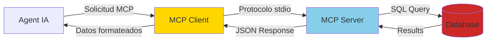
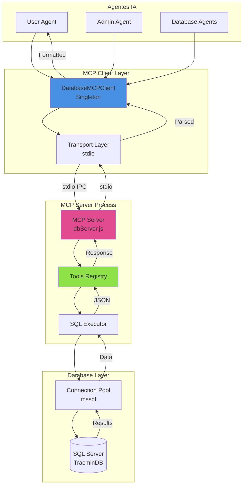
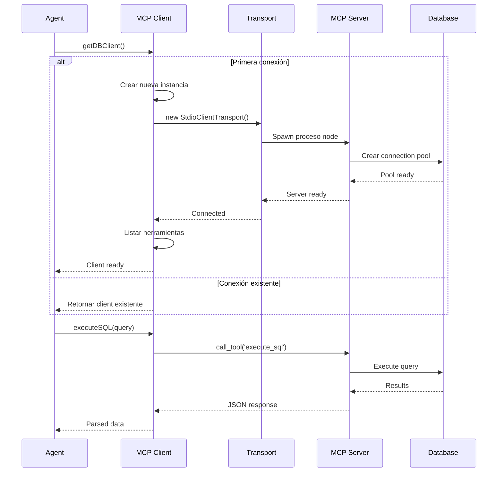
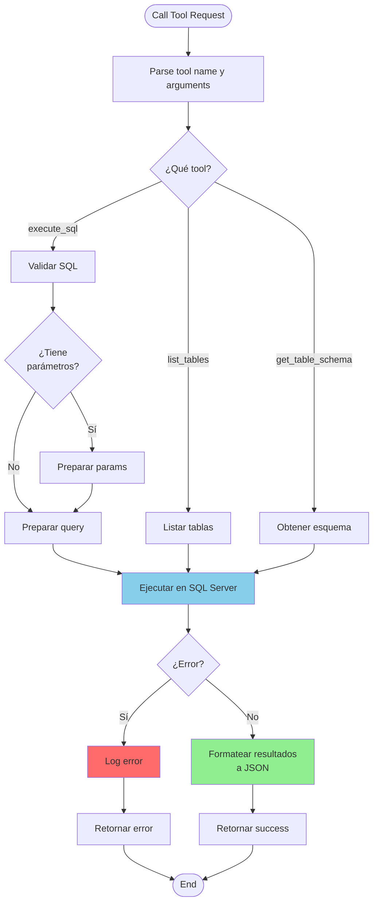
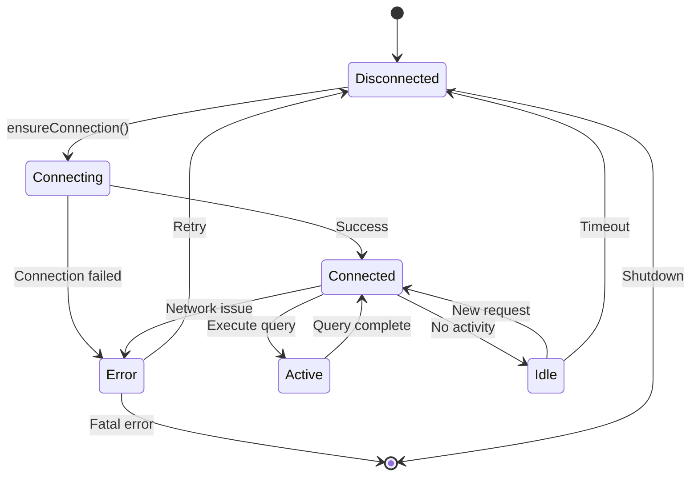
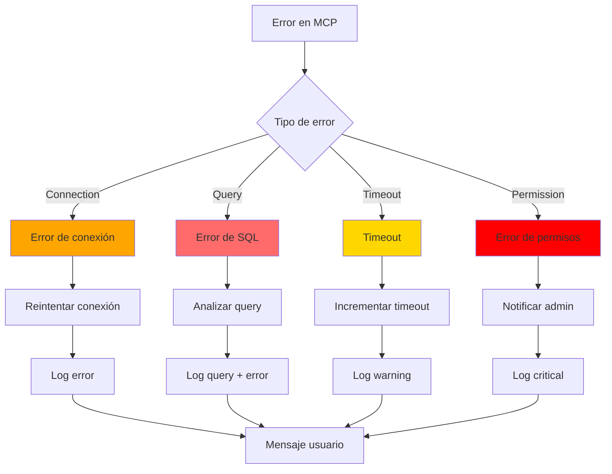

# Model Context Protocol (MCP) y Base de Datos

## ¿Qué es MCP?

El **Model Context Protocol** es un protocolo estándar para la comunicación entre agentes de IA y fuentes de datos. Permite que los modelos de lenguaje accedan a información estructurada de manera segura y eficiente.



## Arquitectura MCP en el Webhook



## MCP Client

### Singleton Pattern

El cliente MCP usa patrón Singleton para reutilizar la conexión:

```javascript
class DatabaseMCPClient {
  constructor() {
    this.client = null;
    this.transport = null;
    this.isConnecting = false;
    this.connectionPromise = null;
  }

  async connect() {
    // Si ya existe conexión, retornarla
    if (this.client) {
      return this.client;
    }

    // Si está conectando, esperar la promesa existente
    if (this.isConnecting) {
      return this.connectionPromise;
    }

    // Iniciar nueva conexión
    this.isConnecting = true;
    this.connectionPromise = this._connect();

    try {
      await this.connectionPromise;
      return this.client;
    } finally {
      this.isConnecting = false;
    }
  }
}

// Exportar instancia única
let clientInstance = null;

function getDBClient() {
  if (!clientInstance) {
    clientInstance = new DatabaseMCPClient();
  }
  return clientInstance;
}
```

### Flujo de Conexión



### Métodos del Cliente

```javascript
class DatabaseMCPClient {
  // Ejecutar SQL personalizado
  async executeSQL(query, params = {}) {
    await this.connect();
    return await this.client.callTool('execute_sql', {
      query,
      parameters: params
    });
  }

  // Listar todas las tablas
  async listTables() {
    await this.connect();
    return await this.client.callTool('list_tables', {});
  }

  // Obtener esquema de una tabla
  async getTableSchema(tableName) {
    await this.connect();
    return await this.client.callTool('get_table_schema', {
      table_name: tableName
    });
  }

  // Buscar usuario por teléfono
  async getUserByPhone(phoneNumber) {
    const query = `
      SELECT 
        Rut,
        Nombre,
        Email,
        CodigoTransportista,
        IdConversacion,
        Admin,
        Activo
      FROM Usuarios
      WHERE Telefono = @phone
      AND Activo = 1
    `;
    
    const result = await this.executeSQL(query, { phone: phoneNumber });
    return result.length > 0 ? result[0] : null;
  }

  // Actualizar conversationId
  async updateConversationId(rut, conversationId) {
    const query = `
      UPDATE Usuarios
      SET IdConversacion = @conversationId,
          FechaActualizacion = GETDATE()
      WHERE Rut = @rut
    `;
    
    return await this.executeSQL(query, { rut, conversationId });
  }
}
```

## MCP Server

### Registro de Tools

```javascript
const server = new Server(
  {
    name: 'tracmin-database-server',
    version: '1.0.0',
  },
  {
    capabilities: {
      tools: {},
    },
  }
);

// Registrar herramientas disponibles
server.setRequestHandler(ListToolsRequestSchema, async () => {
  return {
    tools: [
      {
        name: 'execute_sql',
        description: 'Execute a SQL query and return results',
        inputSchema: {
          type: 'object',
          properties: {
            query: {
              type: 'string',
              description: 'SQL query to execute'
            },
            parameters: {
              type: 'object',
              description: 'Query parameters'
            }
          },
          required: ['query']
        }
      },
      {
        name: 'list_tables',
        description: 'List all available tables in the database',
        inputSchema: {
          type: 'object',
          properties: {}
        }
      },
      {
        name: 'get_table_schema',
        description: 'Get the schema of a specific table',
        inputSchema: {
          type: 'object',
          properties: {
            table_name: {
              type: 'string',
              description: 'Name of the table'
            }
          },
          required: ['table_name']
        }
      }
    ]
  };
});
```

### Handler de Herramientas



### Implementación de execute_sql

```javascript
server.setRequestHandler(CallToolRequestSchema, async (request) => {
  const { name, arguments: args } = request.params;

  if (name === 'execute_sql') {
    try {
      const { query, parameters = {} } = args;
      
      console.log('[MCP Server] Ejecutando SQL:', query);
      console.log('[MCP Server] Parámetros:', parameters);

      // Conectar al pool
      await ensureConnection();

      // Crear request
      const sqlRequest = pool.request();

      // Agregar parámetros
      for (const [key, value] of Object.entries(parameters)) {
        sqlRequest.input(key, value);
      }

      // Ejecutar query
      const result = await sqlRequest.query(query);

      console.log(`[MCP Server] ✅ Query exitosa: ${result.recordset.length} filas`);

      return {
        content: [
          {
            type: 'text',
            text: JSON.stringify(result.recordset, null, 2)
          }
        ]
      };

    } catch (error) {
      console.error('[MCP Server] ❌ Error ejecutando SQL:', error);
      
      return {
        content: [
          {
            type: 'text',
            text: JSON.stringify({
              error: error.message,
              code: error.code
            })
          }
        ],
        isError: true
      };
    }
  }

  if (name === 'list_tables') {
    const query = `
      SELECT 
        TABLE_SCHEMA,
        TABLE_NAME,
        TABLE_TYPE
      FROM INFORMATION_SCHEMA.TABLES
      WHERE TABLE_TYPE = 'BASE TABLE'
      ORDER BY TABLE_SCHEMA, TABLE_NAME
    `;
    
    // Ejecutar y retornar...
  }

  if (name === 'get_table_schema') {
    const query = `
      SELECT 
        COLUMN_NAME,
        DATA_TYPE,
        IS_NULLABLE,
        CHARACTER_MAXIMUM_LENGTH,
        COLUMN_DEFAULT
      FROM INFORMATION_SCHEMA.COLUMNS
      WHERE TABLE_NAME = @tableName
      ORDER BY ORDINAL_POSITION
    `;
    
    // Ejecutar y retornar...
  }
});
```

## Connection Pooling

### Configuración del Pool

```javascript
const config = {
  server: process.env.DB_SERVER,
  database: process.env.DB_DATABASE,
  user: process.env.DB_USER,
  password: process.env.DB_PASSWORD,
  options: {
    encrypt: true,
    trustServerCertificate: false,
    enableArithAbort: true,
    connectTimeout: 30000,
    requestTimeout: 30000
  },
  pool: {
    max: 10,
    min: 2,
    idleTimeoutMillis: 30000,
    acquireTimeoutMillis: 30000
  }
};

let pool = null;

async function ensureConnection() {
  if (!pool || !pool.connected) {
    console.log('[MCP Server] Conectando a SQL Server...');
    pool = await sql.connect(config);
    console.log('[MCP Server] ✅ Conectado a SQL Server');
  }
  return pool;
}
```

### Lifecycle del Pool



## Schema del Proyecto

### Archivo dbSchema.json

El esquema de base de datos está documentado en formato JSON para que los agentes lo entiendan:

```json
{
  "database": "TracminDB",
  "tables": {
    "Usuarios": {
      "description": "Usuarios del sistema con información de autenticación",
      "columns": {
        "Rut": "VARCHAR(12) - RUT del usuario (PK)",
        "Nombre": "VARCHAR(200) - Nombre completo",
        "Email": "VARCHAR(200) - Correo electrónico",
        "Telefono": "VARCHAR(20) - Número telefónico",
        "IdConversacion": "VARCHAR(100) - ID de conversación WhatsApp",
        "CodigoTransportista": "VARCHAR(20) - Código del transportista",
        "Admin": "BIT - Es administrador",
        "Activo": "BIT - Usuario activo"
      },
      "indexes": ["Rut", "IdConversacion", "Telefono"]
    },
    "GuiasDespacho": {
      "description": "Guías de despacho de mercancías",
      "columns": {
        "IdGuia": "INT IDENTITY - ID único (PK)",
        "NumeroFolio": "VARCHAR(50) - Número de folio",
        "RutTransportista": "VARCHAR(12) - RUT del transportista",
        "FechaEmision": "DATETIME - Fecha de emisión",
        "Estado": "VARCHAR(50) - Estado actual",
        "TipoDocumento": "VARCHAR(50) - Tipo de documento"
      },
      "security": {
        "user_filter": "RutTransportista = @userRut",
        "admin_filter": "none"
      }
    },
    "Operaciones": {
      "description": "Operaciones de transporte y viajes",
      "columns": {
        "IdOperacion": "INT IDENTITY - ID único (PK)",
        "RutTransportista": "VARCHAR(12) - RUT del transportista",
        "Patente": "VARCHAR(10) - Patente del vehículo",
        "FechaOperacion": "DATE - Fecha de operación",
        "Estado": "VARCHAR(50) - Estado de la operación"
      },
      "security": {
        "user_filter": "RutTransportista = @userRut",
        "admin_filter": "none"
      }
    }
  }
}
```

## Integración con Agentes

### Uso desde un Agente

```javascript
async function queryUserDocuments(userRut, startDate, endDate) {
  const dbClient = getDBClient();
  
  const query = `
    SELECT 
      NumeroFolio,
      FechaEmision,
      Estado,
      TipoDocumento
    FROM GuiasDespacho
    WHERE RutTransportista = @rut
    AND FechaEmision BETWEEN @startDate AND @endDate
    ORDER BY FechaEmision DESC
  `;
  
  const results = await dbClient.executeSQL(query, {
    rut: userRut,
    startDate,
    endDate
  });
  
  return results;
}
```

### Formato de Resultados con Toon

```javascript
const { formatToon, wrapToonForLLM } = require('../utils/toonFormatter');

function formatDatabaseResult(results, queryContext) {
  // Convertir a formato Toon
  const toonData = formatToon(results);
  
  // Envolver para LLM
  const wrappedToon = wrapToonForLLM(toonData, queryContext);
  
  return wrappedToon;
}
```

## Manejo de Errores

### Tipos de Errores



### Reintentos y Fallback

```javascript
async function executeWithRetry(fn, maxRetries = 3) {
  let lastError;
  
  for (let i = 0; i < maxRetries; i++) {
    try {
      return await fn();
    } catch (error) {
      lastError = error;
      console.log(`[MCP] Intento ${i + 1} falló:`, error.message);
      
      // Esperar antes de reintentar
      await new Promise(resolve => setTimeout(resolve, 1000 * (i + 1)));
    }
  }
  
  throw new Error(`Falló después de ${maxRetries} intentos: ${lastError.message}`);
}

// Uso
const results = await executeWithRetry(() => 
  dbClient.executeSQL(query, params)
);
```

## Performance y Optimización

### Caching de Esquemas

```javascript
class DatabaseMCPClient {
  constructor() {
    this.schemaCache = new Map();
  }

  async getTableSchema(tableName) {
    // Check cache
    if (this.schemaCache.has(tableName)) {
      return this.schemaCache.get(tableName);
    }

    // Fetch from DB
    const schema = await this._fetchSchema(tableName);
    
    // Cache por 1 hora
    this.schemaCache.set(tableName, schema);
    setTimeout(() => {
      this.schemaCache.delete(tableName);
    }, 3600000);

    return schema;
  }
}
```

### Query Optimization

- Usar índices apropiados
- Limitar resultados con TOP o LIMIT
- Evitar SELECT * en producción
- Usar parámetros para prevenir SQL injection
- Aplicar filtros de seguridad siempre

## Monitoreo

### Logs de MCP

```javascript
function logMCPOperation(operation, details) {
  console.log(JSON.stringify({
    timestamp: new Date().toISOString(),
    component: 'MCP',
    operation,
    ...details
  }));
}

// Uso
logMCPOperation('execute_sql', {
  query: query.substring(0, 100),
  params: Object.keys(params),
  duration: endTime - startTime,
  rows: result.recordset.length
});
```

## Próximos Pasos

- [Configuración y Despliegue](./configuracion.md)
- [Troubleshooting](./troubleshooting.md)
- [Best Practices](./best-practices.md)
