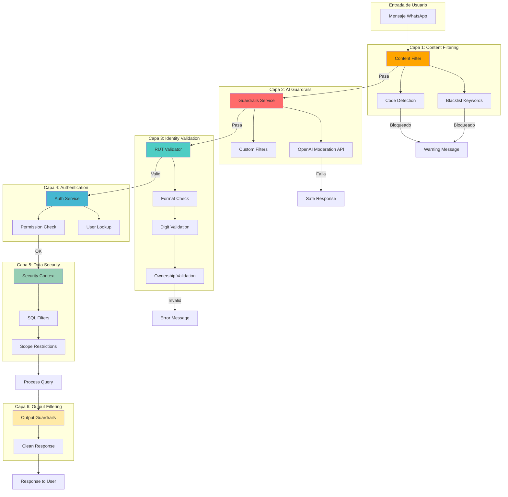
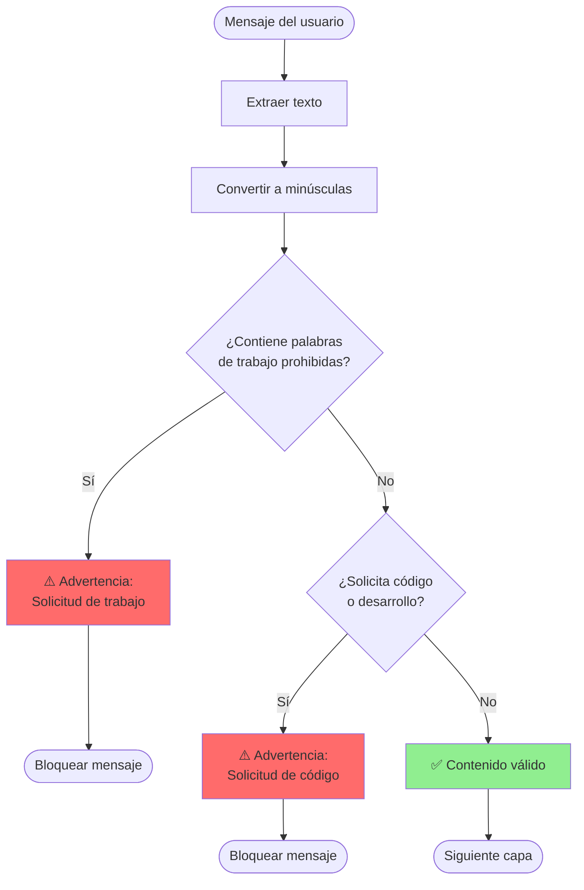
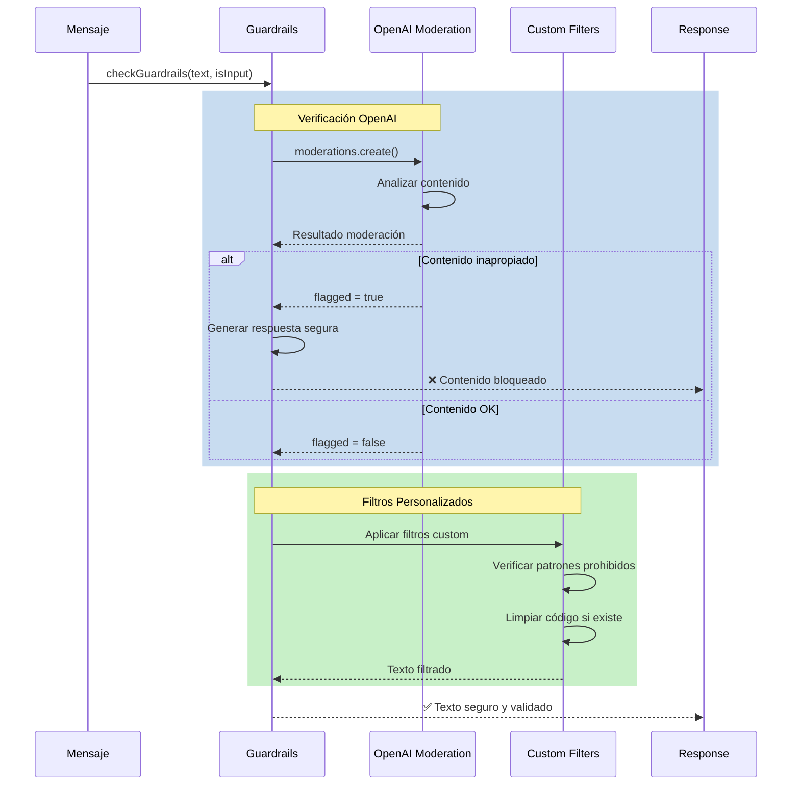
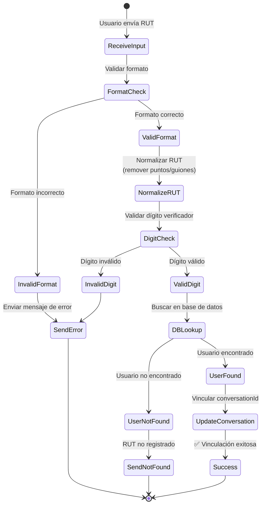
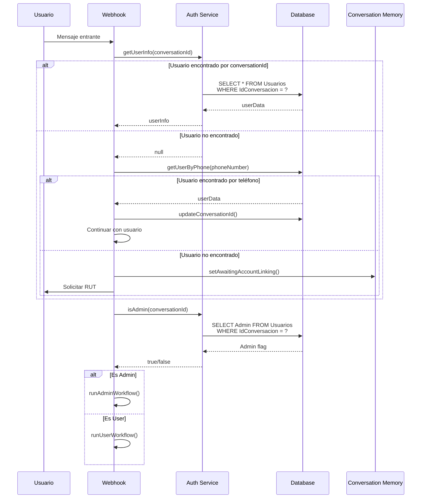
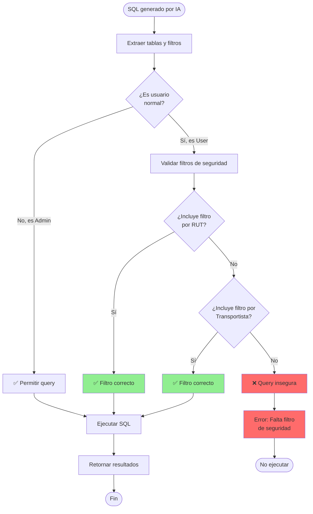

# Seguridad y Validación

## Arquitectura de Seguridad



## 1. Content Filter

### Filtro de Contenido Prohibido



### Implementación

```javascript
// Lista de palabras prohibidas relacionadas con trabajo
const workBlacklist = [
  'hacer un trabajo',
  'tarea para',
  'proyecto sobre',
  'hacer mi tarea',
  'resolver este ejercicio',
  'examen de',
  'ayudame con mi tarea'
];

// Detección de solicitudes de código
function containsCodeRequest(text) {
  const codePatterns = [
    /escribeme?\s+(un\s+)?codigo/i,
    /crea?\s+(un\s+)?(codigo|programa|script)/i,
    /genera?\s+(un\s+)?codigo/i,
    /programa\s+en\s+(python|java|javascript)/i
  ];
  
  return codePatterns.some(pattern => pattern.test(text));
}

function shouldBlockMessage(text) {
  const lowerText = text.toLowerCase();
  
  // Verificar blacklist
  if (workBlacklist.some(term => lowerText.includes(term))) {
    return { 
      blocked: true, 
      reason: 'work_request',
      message: WORK_WARNING_MESSAGE 
    };
  }
  
  // Verificar solicitudes de código
  if (containsCodeRequest(text)) {
    return { 
      blocked: true, 
      reason: 'code_request',
      message: CODE_WARNING_MESSAGE 
    };
  }
  
  return { blocked: false };
}
```

### Mensajes de Advertencia

```javascript
const WORK_WARNING_MESSAGE = `
⚠️ *Política de Uso*

Este sistema está diseñado para consultas relacionadas con operaciones de Tracmin.

❌ No está permitido:
- Solicitar ayuda con tareas escolares
- Solicitar trabajos o proyectos
- Resolver exámenes

✅ Puedes consultar sobre:
- Tus documentos y guías
- Operaciones de transporte
- Consumo de combustible
- Estado de vehículos
`;

const CODE_WARNING_MESSAGE = `
⚠️ *Política de Uso*

Este sistema no genera código de programación.

❌ No disponible:
- Crear scripts o programas
- Escribir código fuente
- Generar algoritmos

✅ Puedes consultar sobre:
- Información de tu cuenta
- Operaciones de transporte
- Datos de tu flota
`;
```

## 2. AI Guardrails

### Flujo de Verificación



### Implementación de Guardrails

```javascript
async function checkGuardrails(text, isInput = true) {
  try {
    // 1. Verificar con OpenAI Moderation API
    const moderation = await openai.moderations.create({
      input: text,
      model: "text-moderation-stable"
    });
    
    const result = moderation.results[0];
    
    // Si OpenAI detecta contenido inapropiado
    if (result.flagged) {
      console.log('[Guardrails] ❌ Contenido flagged por OpenAI:', result.categories);
      
      return {
        passed: false,
        safeText: generateSafeResponse(result.categories)
      };
    }
    
    // 2. Aplicar filtros personalizados
    let safeText = text;
    
    // Filtrar código si está en la salida
    if (!isInput) {
      safeText = filterCodeFromResponse(safeText);
    }
    
    // 3. Verificar longitud
    if (safeText.length > 4000) {
      safeText = safeText.substring(0, 3997) + '...';
      console.log('[Guardrails] ⚠️ Texto truncado por longitud');
    }
    
    return {
      passed: true,
      safeText: safeText
    };
    
  } catch (error) {
    console.error('[Guardrails] Error:', error);
    // En caso de error, ser conservador
    return {
      passed: true,
      safeText: text
    };
  }
}
```

### Categorías de Moderación

| Categoría | Descripción | Acción |
|-----------|-------------|--------|
| `hate` | Contenido de odio | Bloquear |
| `harassment` | Acoso | Bloquear |
| `self-harm` | Autolesión | Bloquear |
| `sexual` | Contenido sexual | Bloquear |
| `violence` | Violencia | Bloquear |
| `hate/threatening` | Odio con amenazas | Bloquear |
| `violence/graphic` | Violencia gráfica | Bloquear |

### Filtrado de Código

```javascript
function filterCodeFromResponse(text) {
  // Remover bloques de código
  let filtered = text.replace(/```[\s\S]*?```/g, '[Código removido por seguridad]');
  
  // Remover código inline
  filtered = filtered.replace(/`[^`]+`/g, '[Código removido]');
  
  // Remover patrones SQL peligrosos
  filtered = filtered.replace(/DROP\s+TABLE/gi, '[Operación no permitida]');
  filtered = filtered.replace(/DELETE\s+FROM/gi, '[Operación no permitida]');
  filtered = filtered.replace(/TRUNCATE/gi, '[Operación no permitida]');
  
  return filtered;
}
```

## 3. RUT Validator

### Flujo de Validación de RUT



### Validación de Formato

```javascript
function isValidRutFormat(rut) {
  // Formato: 12345678-9 o 12.345.678-9
  const rutPattern = /^(\d{1,2}\.?\d{3}\.?\d{3})-?[\dkK]$/;
  return rutPattern.test(rut);
}

function normalizeRut(rut) {
  // Remover puntos y guiones, convertir K a mayúscula
  return rut.replace(/\./g, '')
            .replace(/-/g, '')
            .toUpperCase();
}
```

### Algoritmo de Dígito Verificador

```javascript
function validateRutDigit(rut) {
  const normalized = normalizeRut(rut);
  const rutDigits = normalized.slice(0, -1);
  const verifierDigit = normalized.slice(-1);
  
  // Algoritmo módulo 11
  let sum = 0;
  let multiplier = 2;
  
  for (let i = rutDigits.length - 1; i >= 0; i--) {
    sum += parseInt(rutDigits[i]) * multiplier;
    multiplier = multiplier === 7 ? 2 : multiplier + 1;
  }
  
  const remainder = sum % 11;
  const calculatedDigit = 11 - remainder;
  
  let expectedDigit;
  if (calculatedDigit === 11) {
    expectedDigit = '0';
  } else if (calculatedDigit === 10) {
    expectedDigit = 'K';
  } else {
    expectedDigit = calculatedDigit.toString();
  }
  
  return verifierDigit === expectedDigit;
}
```

### Mensajes de Validación

```javascript
function generateRutRequestMessage() {
  return `
🔐 *Vinculación de Cuenta*

Para continuar, necesito validar tu identidad.

Por favor, envía tu RUT en el siguiente formato:
📝 Ejemplo: 12.345.678-9

ℹ️ *Importante*:
- Incluye el dígito verificador
- Puedes usar puntos y guión o solo números
- Tu RUT debe estar registrado en el sistema
`;
}

function generateValidationErrorMessage(reason) {
  const messages = {
    'invalid_format': `
❌ *Formato Inválido*

El RUT ingresado no tiene un formato válido.

Formato correcto: 12.345.678-9
Intenta nuevamente.
`,
    'invalid_digit': `
❌ *Dígito Verificador Incorrecto*

El dígito verificador del RUT no es válido.
Verifica que hayas ingresado correctamente tu RUT.
`,
    'not_found': `
❌ *Usuario No Encontrado*

El RUT no está registrado en nuestro sistema.
Contacta al administrador para registrar tu cuenta.
`,
    'database_error': `
❌ *Error del Sistema*

Ocurrió un error al validar tu RUT.
Por favor, intenta nuevamente en unos momentos.
`
  };
  
  return messages[reason] || messages['database_error'];
}
```

## 4. Authentication & Authorization

### Flujo de Autenticación



### Auth Service

```javascript
class AuthService {
  async getUserInfo(conversationId) {
    try {
      const dbClient = getDBClient();
      const user = await dbClient.getUserByConversationId(conversationId);
      return user;
    } catch (error) {
      console.error('[Auth] Error obteniendo usuario:', error);
      return null;
    }
  }
  
  async isAdmin(conversationId) {
    const user = await this.getUserInfo(conversationId);
    return user?.Admin === true;
  }
  
  async validateUser(rut) {
    try {
      const dbClient = getDBClient();
      const query = `
        SELECT 
          Rut, 
          Nombre, 
          Email, 
          CodigoTransportista,
          Admin
        FROM Usuarios
        WHERE Rut = @rut
        AND Activo = 1
      `;
      
      const result = await dbClient.executeSQL(query, { rut });
      return result.length > 0 ? result[0] : null;
    } catch (error) {
      console.error('[Auth] Error validando usuario:', error);
      return null;
    }
  }
}
```

## 5. Security Context & SQL Filters

### Context de Seguridad para Usuarios

```javascript
function buildSecurityContext(userInfo, isAdmin) {
  if (isAdmin) {
    return `
PRIVILEGIOS DE ADMINISTRADOR:
- Acceso completo a todos los datos
- Sin restricciones por RUT o Transportista
- Puede consultar cualquier información
`;
  }
  
  return `
RESTRICCIONES DE SEGURIDAD:
- RUT del usuario: ${userInfo.Rut}
- Código Transportista: ${userInfo.CodigoTransportista}

REGLAS OBLIGATORIAS:
1. TODAS las consultas SQL DEBEN incluir:
   - WHERE RutTransportista = '${userInfo.Rut}' O
   - WHERE CodigoTransportista = '${userInfo.CodigoTransportista}'

2. NO mostrar información de otros usuarios
3. NO acceder a datos de otros transportistas
4. Aplicar filtros en TODAS las tablas consultadas

EJEMPLO DE CONSULTA SEGURA:
SELECT * FROM Operaciones 
WHERE RutTransportista = '${userInfo.Rut}'
AND FechaOperacion >= '2025-01-01'
`;
}
```

### Validación de SQL



## 6. Conversation Memory

### Gestión de Estado

```javascript
class ConversationMemory {
  constructor() {
    this.memory = new Map();
    this.linkingProcess = new Map();
    this.rutValidations = new Map();
  }
  
  // Almacenar contexto de conversación
  setContext(conversationId, context) {
    this.memory.set(conversationId, {
      ...context,
      timestamp: Date.now()
    });
  }
  
  getContext(conversationId) {
    return this.memory.get(conversationId);
  }
  
  // Gestión de proceso de vinculación
  setAwaitingAccountLinking(conversationId, phone) {
    this.linkingProcess.set(conversationId, {
      phone,
      startedAt: Date.now(),
      step: 'waiting_rut'
    });
  }
  
  isAwaitingAccountLinking(conversationId) {
    return this.linkingProcess.has(conversationId);
  }
  
  clearLinkingProcess(conversationId) {
    this.linkingProcess.delete(conversationId);
  }
  
  // Validación de RUT
  markRutValidated(conversationId, rut) {
    this.rutValidations.set(conversationId, {
      rut,
      validatedAt: Date.now()
    });
  }
  
  isRutValidated(conversationId) {
    return this.rutValidations.has(conversationId);
  }
  
  // Limpieza de memoria (ejecutar periódicamente)
  cleanup(maxAge = 3600000) { // 1 hora
    const now = Date.now();
    
    for (const [key, value] of this.memory.entries()) {
      if (now - value.timestamp > maxAge) {
        this.memory.delete(key);
      }
    }
  }
}
```

## Mejores Prácticas de Seguridad

### ✅ Hacer

1. **Siempre validar entrada del usuario**
   - Usar Content Filter
   - Aplicar Guardrails
   - Validar formato de datos

2. **Aplicar principio de mínimo privilegio**
   - Filtrar por RUT/Transportista
   - Verificar permisos antes de ejecutar
   - Limitar alcance de consultas

3. **Logging de seguridad**
   - Registrar intentos de acceso
   - Log de queries ejecutadas
   - Alertas de comportamiento sospechoso

4. **Sanitizar salidas**
   - Filtrar código en respuestas
   - Remover información sensible
   - Verificar longitud de mensajes

### ❌ No Hacer

1. **No confiar en entrada del usuario**
   - Nunca ejecutar SQL sin validar
   - No asumir formato correcto
   - No saltarse validaciones

2. **No exponer información sensible**
   - Nunca mostrar queries SQL al usuario
   - No revelar estructura de DB
   - No mostrar errores técnicos detallados

3. **No reusar tokens o sesiones**
   - No compartir conversationId
   - No cachear información sensible
   - Limpiar memoria regularmente

## Próximos Pasos

- [MCP y Base de Datos](./mcp-database.md)
- [Configuración y Despliegue](./configuracion.md)
- [Troubleshooting](./troubleshooting.md)
