# Sistema de Agentes de IA

## Arquitectura de Agentes

```mermaid
graph TB
    subgraph "Capa de Orquestación"
        UO[User Orchestrator]
        AO[Admin Orchestrator]
    end
    
    subgraph "Agentes Conversacionales"
        UA[User Agent<br/>Conversacional seguro]
        AA[Admin Agent<br/>Privilegios elevados]
    end
    
    subgraph "Agentes Especializados - Factory Pattern"
        AF[Agent Factory<br/>Selector inteligente]
        
        subgraph "Database Agents"
            DA[Document Agent<br/>Guías y documentos]
            FA[Fuel Agent<br/>Combustible y consumos]
            OA[Operation Agent<br/>Operaciones y viajes]
            VA[Vehicle Agent<br/>Vehículos y flotas]
            TA[Transporter Agent<br/>Transportistas]
        end
    end
    
    subgraph "Capa de Datos"
        MCP[MCP Client]
        DB[(SQL Server)]
    end
    
    UO --> UA
    AO --> AA
    
    UO --> AF
    AO --> AF
    
    AF -.selecciona.-> DA
    AF -.selecciona.-> FA
    AF -.selecciona.-> OA
    AF -.selecciona.-> VA
    AF -.selecciona.-> TA
    
    DA --> MCP
    FA --> MCP
    OA --> MCP
    VA --> MCP
    TA --> MCP
    
    MCP --> DB
    
    style AF fill:#FFD700
    style UA fill:#4A90E2
    style AA fill:#E24A4A
```



## Factory Pattern - Selección de Agentes

### Agent Factory

El `DatabaseAgentFactory` selecciona automáticamente el agente más apropiado según el contenido del mensaje.

```mermaid
flowchart TD
    Start([Mensaje del usuario]) --> Factory[Agent Factory]
    
    Factory --> AnalyzeKeywords[Analizar keywords<br/>en mensaje]
    
    AnalyzeKeywords --> CheckDocument{¿Contiene:<br/>documento, guía,<br/>folio, tracmin?}
    CheckDocument -->|Sí| DocumentAgent[📄 Document Agent<br/>Especialista en guías]
    
    CheckDocument -->|No| CheckFuel{¿Contiene:<br/>combustible, consumo,<br/>litros, diesel?}
    CheckFuel -->|Sí| FuelAgent[⛽ Fuel Agent<br/>Especialista en combustible]
    
    CheckFuel -->|No| CheckOperation{¿Contiene:<br/>operación, viaje,<br/>ruta, transporte?}
    CheckOperation -->|Sí| OperationAgent[🚚 Operation Agent<br/>Especialista en operaciones]
    
    CheckOperation -->|No| CheckVehicle{¿Contiene:<br/>vehículo, camión,<br/>patente, flota?}
    CheckVehicle -->|Sí| VehicleAgent[🚛 Vehicle Agent<br/>Especialista en vehículos]
    
    CheckVehicle -->|No| CheckTransporter{¿Contiene:<br/>transportista,<br/>empresa, proveedor?}
    CheckTransporter -->|Sí| TransporterAgent[🏢 Transporter Agent<br/>Especialista en transportistas]
    
    CheckTransporter -->|No| DefaultAgent[📊 Operation Agent<br/>Agente por defecto]
    
    DocumentAgent --> Execute[Ejecutar agente seleccionado]
    FuelAgent --> Execute
    OperationAgent --> Execute
    VehicleAgent --> Execute
    TransporterAgent --> Execute
    DefaultAgent --> Execute
    
    Execute --> End([Respuesta al usuario])
    
    style Factory fill:#FFD700
    style DocumentAgent fill:#87CEEB
    style FuelAgent fill:#FFA500
    style OperationAgent fill:#90EE90
    style VehicleAgent fill:#DDA0DD
    style TransporterAgent fill:#F0E68C
```



### Código del Factory

```javascript
class DatabaseAgentFactory {
  static selectAgent(userMessage, isAdmin = false) {
    const lowerMessage = userMessage.toLowerCase();
    
    // Keywords para cada tipo de agente
    const documentKeywords = ['documento', 'guia', 'guía', 'folio', 'tracmin'];
    const fuelKeywords = ['combustible', 'consumo', 'litros', 'diesel', 'gasolina'];
    const operationKeywords = ['operacion', 'operación', 'viaje', 'ruta', 'transporte'];
    const vehicleKeywords = ['vehiculo', 'vehículo', 'camion', 'camión', 'patente', 'flota'];
    const transporterKeywords = ['transportista', 'empresa', 'proveedor'];
    
    // Selección por keywords
    if (documentKeywords.some(kw => lowerMessage.includes(kw))) {
      return documentAgent;
    }
    if (fuelKeywords.some(kw => lowerMessage.includes(kw))) {
      return fuelAgent;
    }
    if (vehicleKeywords.some(kw => lowerMessage.includes(kw))) {
      return vehicleAgent;
    }
    if (transporterKeywords.some(kw => lowerMessage.includes(kw))) {
      return transporterAgent;
    }
    if (operationKeywords.some(kw => lowerMessage.includes(kw))) {
      return operationAgent;
    }
    
    // Agente por defecto
    return operationAgent;
  }
}
```

## Flujo de Ejecución de Agentes

### Proceso de Dos Fases


## Agentes Especializados

### 1. Document Agent

**Especialidad**: Guías, documentos, folios, trazabilidad


**Tablas principales**:
- `GuiasDespacho`
- `DocumentosTransporte`
- `EstadosGuias`
- `TrazabilidadDocumentos`

**Queries típicas**:
```sql
-- Buscar guías por RUT
SELECT * FROM GuiasDespacho 
WHERE RutTransportista = @rut
AND FechaEmision >= @fechaInicio

-- Estado de guía específica
SELECT g.*, e.Estado, e.FechaActualizacion
FROM GuiasDespacho g
INNER JOIN EstadosGuias e ON g.IdGuia = e.IdGuia
WHERE g.NumeroFolio = @folio
```

### 2. Fuel Agent

**Especialidad**: Combustible, consumos, litros, rendimiento

```mermaid
graph LR
    A[Fuel Agent] --> B[Consumos]
    A --> C[Abastecimientos]
    A --> D[Rendimiento]
    A --> E[Costos]
    
    B --> F[Por vehículo]
    B --> G[Por período]
    B --> H[Por ruta]
    
    D --> I[Km/litro]
    D --> J[Eficiencia]
    
    E --> K[Gastos totales]
    E --> L[Proyecciones]
```



**Tablas principales**:
- `ConsumosCombustible`
- `AbastecimientosCombustible`
- `RendimientoVehiculos`

**Queries típicas**:
```sql
-- Consumo mensual por vehículo
SELECT 
    Patente,
    SUM(LitrosConsumidos) as TotalLitros,
    AVG(RendimientoKmLitro) as RendimientoPromedio
FROM ConsumosCombustible
WHERE RutTransportista = @rut
AND MONTH(Fecha) = @mes
GROUP BY Patente

-- Gasto total en combustible
SELECT 
    SUM(LitrosAbastecidos * PrecioPorLitro) as GastoTotal
FROM AbastecimientosCombustible
WHERE RutTransportista = @rut
AND Fecha BETWEEN @fechaInicio AND @fechaFin
```

### 3. Operation Agent

**Especialidad**: Operaciones, viajes, rutas, transportes

```mermaid
graph LR
    A[Operation Agent] --> B[Viajes]
    A --> C[Rutas]
    A --> D[Cargas]
    A --> E[Tiempos]
    
    B --> F[Programados]
    B --> G[En curso]
    B --> H[Completados]
    
    C --> I[Origen-Destino]
    C --> J[Distancias]
    
    E --> K[Duración]
    E --> L[Retrasos]
```



**Tablas principales**:
- `Operaciones`
- `Viajes`
- `Rutas`
- `CargasTransporte`

**Queries típicas**:
```sql
-- Viajes del día
SELECT 
    o.IdOperacion,
    v.Patente,
    r.Origen,
    r.Destino,
    o.Estado
FROM Operaciones o
INNER JOIN Viajes v ON o.IdViaje = v.IdViaje
INNER JOIN Rutas r ON v.IdRuta = r.IdRuta
WHERE o.FechaOperacion = @fecha
AND v.RutTransportista = @rut

-- Estadísticas de viajes
SELECT 
    COUNT(*) as TotalViajes,
    SUM(CASE WHEN Estado = 'Completado' THEN 1 ELSE 0 END) as Completados,
    AVG(DATEDIFF(hour, FechaInicio, FechaFin)) as DuracionPromedio
FROM Operaciones
WHERE RutTransportista = @rut
AND FechaOperacion >= @fechaInicio
```

### 4. Vehicle Agent

**Especialidad**: Vehículos, flotas, patentes, mantenciones


**Tablas principales**:
- `Vehiculos`
- `FlotaTransportista`
- `MantencionesVehiculos`
- `DocumentacionVehiculos`

**Queries típicas**:
```sql
-- Flota del transportista
SELECT 
    v.Patente,
    v.Marca,
    v.Modelo,
    v.Año,
    v.Estado,
    v.TipoVehiculo
FROM Vehiculos v
INNER JOIN FlotaTransportista f ON v.IdVehiculo = f.IdVehiculo
WHERE f.CodigoTransportista = @codigoTransportista

-- Mantenciones pendientes
SELECT 
    v.Patente,
    m.TipoMantencion,
    m.FechaProgramada,
    m.Estado
FROM MantencionesVehiculos m
INNER JOIN Vehiculos v ON m.IdVehiculo = v.IdVehiculo
WHERE v.RutPropietario = @rut
AND m.Estado = 'Pendiente'
ORDER BY m.FechaProgramada
```

### 5. Transporter Agent

**Especialidad**: Transportistas, empresas, proveedores

```mermaid
graph LR
    A[Transporter Agent] --> B[Información empresa]
    A --> C[Contratos]
    A --> D[Desempeño]
    A --> E[Contactos]
    
    B --> F[Datos legales]
    B --> G[Certificaciones]
    
    C --> H[Activos]
    C --> I[Históricos]
    
    D --> J[Métricas]
    D --> K[Evaluaciones]
```



**Tablas principales**:
- `Transportistas`
- `ContratosTransportistas`
- `DesempenoTransportistas`

**Queries típicas**:
```sql
-- Información del transportista
SELECT 
    t.RazonSocial,
    t.RUT,
    t.Direccion,
    t.Telefono,
    t.Email,
    t.Estado
FROM Transportistas t
WHERE t.CodigoTransportista = @codigo

-- Desempeño mensual
SELECT 
    COUNT(o.IdOperacion) as TotalOperaciones,
    SUM(CASE WHEN o.Estado = 'Completado' THEN 1 ELSE 0 END) as Completadas,
    AVG(o.CalificacionServicio) as CalificacionPromedio
FROM Operaciones o
WHERE o.CodigoTransportista = @codigo
AND MONTH(o.FechaOperacion) = @mes
```

## Context y Prompts de Agentes

### User Agent Context

```javascript
const userContext = `
INFORMACIÓN DEL USUARIO AUTENTICADO:
- RUT: ${userInfo.Rut}
- Nombre: ${userInfo.Nombre}
- Código Transportista: ${userInfo.CodigoTransportista}

RESTRICCIONES DE SEGURIDAD:
- SOLO puede ver información relacionada con su RUT: ${userInfo.Rut}
- SOLO puede ver información de su transportista: ${userInfo.CodigoTransportista}
- NO mostrar información de otros usuarios o transportistas
- Todas las consultas SQL deben incluir filtros de seguridad apropiados
`;
```

### Admin Agent Context

```javascript
const adminContext = `
INFORMACIÓN DEL ADMINISTRADOR:
- RUT: ${adminInfo.Rut}
- Nombre: ${adminInfo.Nombre}
- Rol: ADMINISTRADOR (acceso completo)

PERMISOS ADMINISTRATIVOS:
- Puede ver información de TODOS los usuarios
- Puede consultar TODOS los transportistas
- Puede acceder a TODAS las operaciones
- No hay restricciones por CodigoTransportista o RUT
`;
```

## Próximos Pasos

- [Seguridad y Validación](./seguridad.md)
- [MCP y Base de Datos](./mcp-database.md)
- [Configuración y Despliegue](./configuracion.md)
