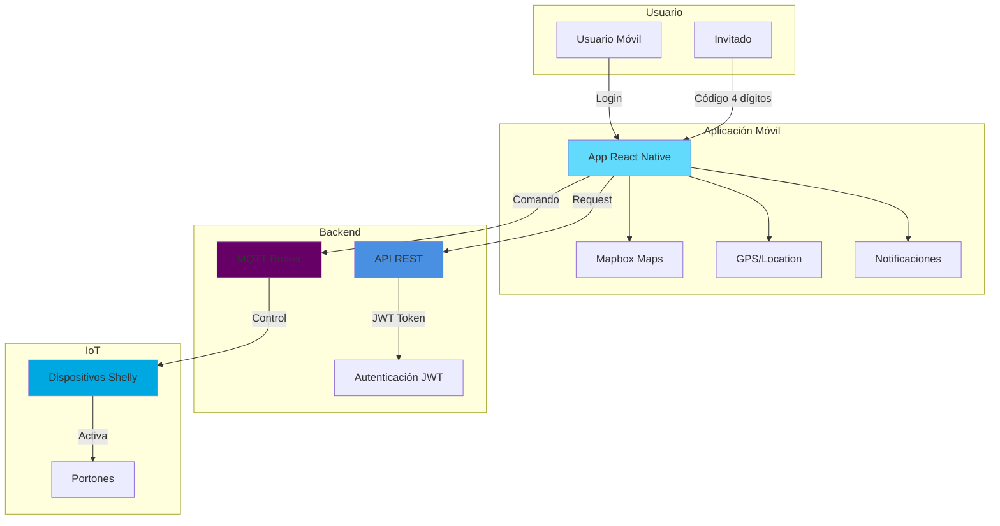
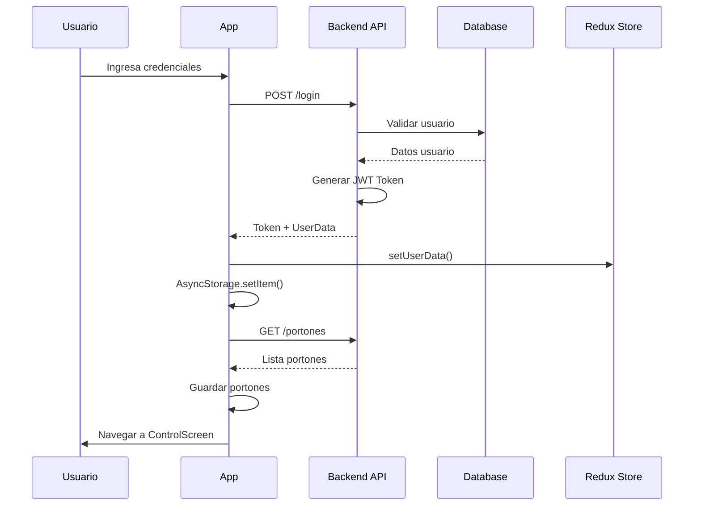
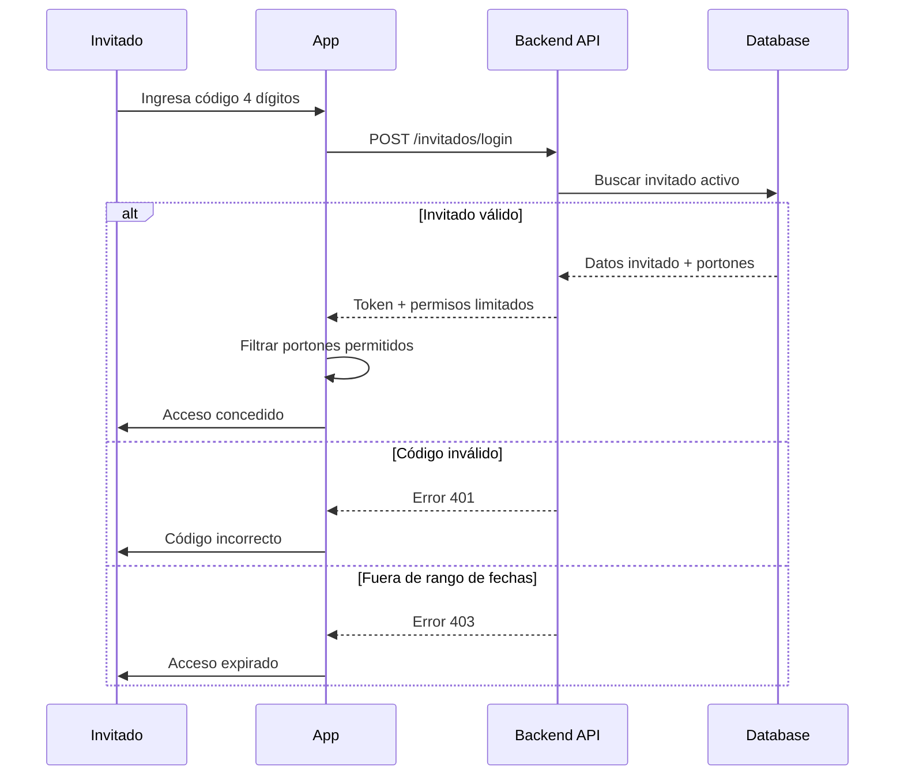
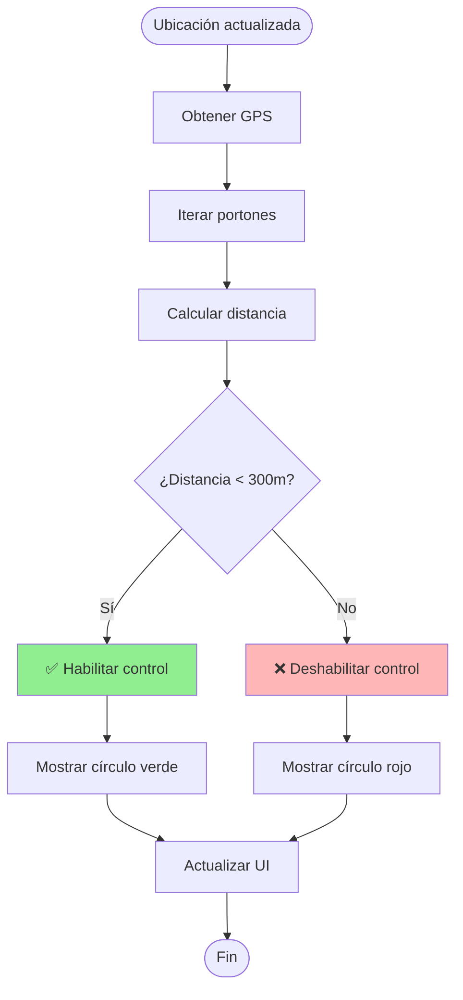
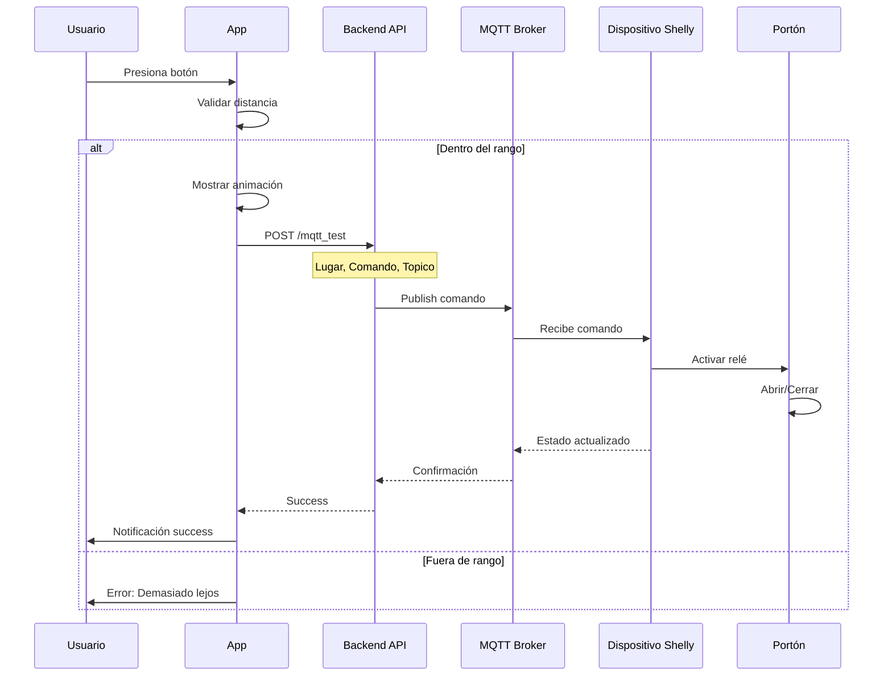
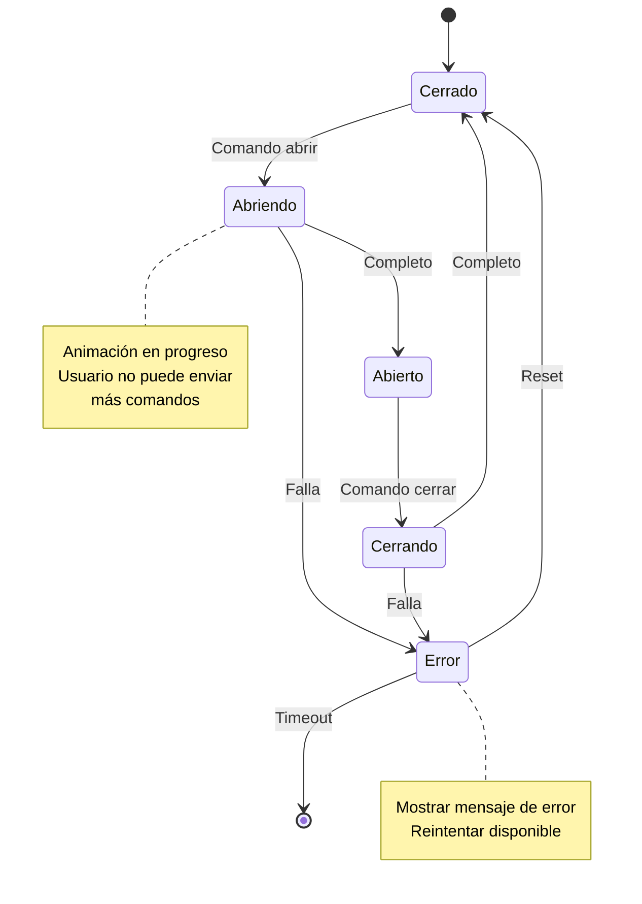
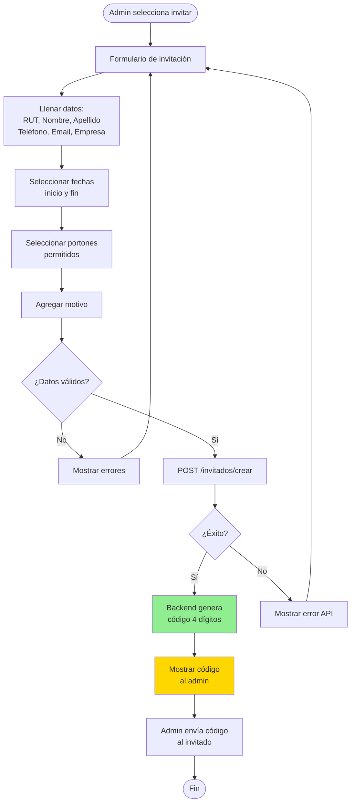
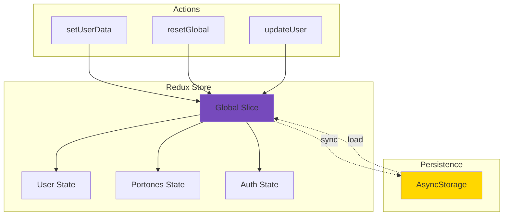

# 📱 Control de Acceso - Aplicación Móvil

## 📋 Descripción General

Aplicación móvil React Native desarrollada con Expo que permite el control remoto de portones inteligentes mediante geolocalización. Los usuarios pueden abrir y cerrar portones autorizados cuando se encuentran dentro del radio de alcance definido.



## 🎯 Características Principales

### ✅ Control de Acceso Basado en Ubicación

- **Geofencing** - Radio de 300 metros alrededor de cada portón
- **Mapa interactivo** - Visualización en tiempo real con Mapbox
- **Validación de distancia** - Control habilitado solo dentro del rango

### ✅ Gestión de Usuarios

- **Login tradicional** - RUT/Email + contraseña
- **Modo invitado** - Código de 4 dígitos temporal
- **Roles diferenciados** - Admin y usuarios regulares
- **Permisos por portón** - Control granular de accesos

### ✅ Sistema de Invitaciones

- **Crear invitados** - Formulario completo de registro
- **Acceso temporal** - Fechas de inicio y fin
- **Selección de portones** - Múltiples portones por invitado
- **Código único** - Generación automática de código de acceso

### ✅ Integración IoT

- **Dispositivos Shelly** - Control de portones inteligentes
- **Protocolo MQTT** - Comunicación en tiempo real
- **Estados de portón** - Abierto/Cerrado/Error
- **Feedback visual** - Animaciones de estado

## 🏗️ Arquitectura Técnica

### Stack Tecnológico

```mermaid
graph LR
    subgraph "Frontend"
        RN[React Native 0.81.5]
        EXPO[Expo 54]
        ER[Expo Router 6]
    end
    
    subgraph "UI/UX"
        NW[NativeWind 4.2]
        TW[Tailwind CSS]
        RNR[RN Reusables]
        LR[Lucide React Native]
    end
    
    subgraph "Mapa"
        MB[Mapbox Maps 10.2]
        LOC[Expo Location 19]
    end
    
    subgraph "Estado"
        RTK[Redux Toolkit 2.11]
        AS[AsyncStorage 2.2]
    end
    
    subgraph "Servicios"
        FB[Firebase 12.6]
        PN[Push Notifications]
    end
    
    RN --> EXPO
    EXPO --> ER
    NW --> TW
    RNR --> TW
    MB --> LOC
    RTK --> AS
    FB --> PN
    
    style RN fill:#61DAFB
    style EXPO fill:#000020
    style MB fill:#4264FB
    style RTK fill:#764ABC
```



### Dependencias Principales

| Librería | Versión | Uso |
|----------|---------|-----|
| React Native | 0.81.5 | Framework base |
| Expo | ~54.0.30 | Desarrollo y build |
| Expo Router | ~6.0.21 | Navegación basada en archivos |
| @rnmapbox/maps | ^10.2.7 | Mapas interactivos |
| Redux Toolkit | ^2.11.0 | Gestión de estado |
| NativeWind | ^4.2.1 | Estilos con Tailwind |
| Firebase | ^12.6.0 | Push notifications |
| expo-location | ~19.0.8 | Geolocalización |
| expo-notifications | ~0.32.15 | Notificaciones push |

## 📂 Estructura del Proyecto

```
control-acceso/
├── app/                          # Screens (Expo Router)
│   ├── _layout.tsx              # Layout principal
│   ├── _reduxLayout.tsx         # Redux Provider
│   ├── index.tsx                # Splash Screen
│   ├── LoginScreen.tsx          # Pantalla de login
│   ├── ControlScreen.tsx        # Pantalla principal (mapa)
│   ├── InvitarScreen.tsx        # Crear invitados
│   ├── store.ts                 # Redux Store
│   ├── services/                # Servicios externos
│   │   ├── authService.ts       # Autenticación
│   │   └── api/
│   │       └── client.ts        # API Client
│   └── slices/                  # Redux Slices
│       └── globalSlice.ts       # Estado global
├── components/                   # Componentes reutilizables
│   └── ui/                      # UI Components
│       ├── button.tsx
│       ├── card.tsx
│       ├── input.tsx
│       ├── select.tsx
│       └── ...
├── context/                     # React Context
│   └── NotificationContext.tsx  # Context de notificaciones
├── hooks/                       # Custom Hooks
│   └── useAuth.ts              # Hook de autenticación
├── utils/                       # Utilidades
│   ├── registerForPushNotificationAsync.ts
│   └── widgetSync.ts           # Sincronización con widgets
├── assets/                      # Recursos estáticos
│   ├── fonts/
│   └── images/
├── android/                     # Configuración Android
├── ios/                         # Configuración iOS
├── app.json                     # Configuración Expo
├── eas.json                     # EAS Build config
└── package.json
```

## 🔐 Autenticación y Seguridad

### Flujo de Login



### Flujo de Login Invitado



### Gestión de Tokens

```typescript
// Almacenamiento de token
await AsyncStorage.setItem('userToken', token);
await AsyncStorage.setItem('userData', JSON.stringify(userData));

// Headers de autenticación
const options = {
  method: 'POST',
  headers: {
    'Content-Type': 'application/json',
    Authorization: `Bearer ${token}`,
  },
  body: JSON.stringify(data),
};

// Validación de sesión
const token = await AsyncStorage.getItem('userToken');
if (!token) {
  router.replace('/LoginScreen');
}
```

## 🗺️ Sistema de Mapas y Geolocalización

### Configuración de Mapbox

```typescript
const MAPBOX_TOKEN = 'pk.eyJ1IjoiYXBpbm9jaGV0IiwiYSI6ImNsbWIyZHY2ZzB3N3AzY3JxNmVpNHBzYm8ifQ.u9-Qo5NdgUEK0ylbzUAqpg';
const MAPBOX_STYLE = 'mapbox://styles/apinochet/cmif0sp8b000y01s05hai5dp3';
const DEFAULT_CENTER = [-70.6483, -33.4569]; // Santiago, Chile
const DEFAULT_ZOOM = 15;

MapboxGL.setAccessToken(MAPBOX_TOKEN);
```

### Cálculo de Distancia (Haversine)

```typescript
const getDistanceMeters = (
  lat1: number,
  lon1: number,
  lat2: number,
  lon2: number
): number => {
  const R = 6371000; // Radio de la tierra en metros
  const dLat = ((lat2 - lat1) * Math.PI) / 180;
  const dLon = ((lon2 - lon1) * Math.PI) / 180;
  const a =
    Math.sin(dLat / 2) * Math.sin(dLat / 2) +
    Math.cos((lat1 * Math.PI) / 180) *
      Math.cos((lat2 * Math.PI) / 180) *
      Math.sin(dLon / 2) *
      Math.sin(dLon / 2);
  const c = 2 * Math.atan2(Math.sqrt(a), Math.sqrt(1 - a));
  return R * c;
};
```

### Geofencing



### Renderizado de Círculos

```typescript
const getCirclePolygon = (
  lon: number,
  lat: number,
  radiusMeters: number,
  points = 64
) => {
  const coords = [];
  const earthRadius = 6378137;
  
  for (let i = 0; i < points; i++) {
    const angle = (i * 360) / points;
    const radians = (angle * Math.PI) / 180;
    const dx = radiusMeters * Math.cos(radians);
    const dy = radiusMeters * Math.sin(radians);
    
    coords.push([
      lon + (dx / (earthRadius * Math.cos((Math.PI * lat) / 180))) * (180 / Math.PI),
      lat + (dy / earthRadius) * (180 / Math.PI),
    ]);
  }
  coords.push(coords[0]); // cerrar el polígono
  
  return { type: 'Polygon', coordinates: [coords] };
};
```

## 🚪 Control de Portones

### Flujo de Apertura/Cierre



### Comando MQTT

```typescript
const abrirPorton = async (porton: Porton) => {
  const mqttData = {
    Lugar: porton.IdShelly,
    Comando: 'toggle',  // o 'on' / 'off'
    Topico: 'shellies/command'
  };
  
  try {
    const response = await apiClient.mqttTest(mqttData, token);
    console.log('Portón activado:', response);
    Alert.alert('✅ Éxito', 'Comando enviado al portón');
  } catch (error) {
    console.error('Error:', error);
    Alert.alert('❌ Error', 'No se pudo controlar el portón');
  }
};
```

### Estados del Portón



## 👥 Sistema de Invitaciones

### Crear Invitado



### Estructura de Datos

```typescript
interface InvitadoData {
  Rut: string;
  Nombre: string;
  Apellido: string;
  Telefono: string;
  Mail: string;
  FechaInicial: string;      // YYYY-MM-DD
  FechaFinal: string;         // YYYY-MM-DD
  Empresa: string;
  Motivo: string;
  IdInvitante: number;        // ID del admin
  PortonesIds: (string | number)[]; // IDs de portones permitidos
}
```

### Calendario de Fechas

```typescript
// Configuración del calendario
<Calendar
  onDayPress={(day: DateData) => {
    setFechaInicial(day.dateString);
    setShowCalendarInicial(false);
  }}
  markedDates={{
    [fechaInicial]: {
      selected: true,
      selectedColor: '#3b82f6'
    }
  }}
  theme={{
    todayTextColor: '#3b82f6',
    selectedDayBackgroundColor: '#3b82f6',
    selectedDayTextColor: '#ffffff'
  }}
  minDate={new Date().toISOString().split('T')[0]}
/>
```

## 📊 Gestión de Estado (Redux)

### Global Slice



### State Structure

```typescript
interface GlobalState {
  id: number | null;
  nombre: string;
  apellido: string;
  mail: string;
  admin: boolean;
  token: string;
  invitar: boolean;
  isGuest: boolean;
  empresa?: string;
  fechaInicial?: string;
  fechaFinal?: string;
  portones?: Porton[];
  portonesIds?: (string | number)[];
}
```

### Acciones

```typescript
// Set user data
dispatch(setUserData({
  id: response.id,
  nombre: response.nombre,
  apellido: response.apellido,
  mail: response.mail,
  admin: response.admin,
  token: response.token,
  invitar: response.admin,
  isGuest: false
}));

// Reset (logout)
dispatch(resetGlobal());
await AsyncStorage.clear();
```

## 🔔 Push Notifications

### Configuración Firebase

```json
{
  "expo": {
    "android": {
      "googleServicesFile": "./google-services.json"
    },
    "plugins": [
      [
        "expo-notifications",
        {
          "icon": "./assets/images/notification-icon.png",
          "color": "#ffffff"
        }
      ]
    ]
  }
}
```

### Registro de Token

```typescript
const registerForPushNotificationsAsync = async () => {
  let token;
  
  if (Platform.OS === 'android') {
    await Notifications.setNotificationChannelAsync('default', {
      name: 'default',
      importance: Notifications.AndroidImportance.MAX,
      vibrationPattern: [0, 250, 250, 250],
      lightColor: '#FF231F7C',
    });
  }

  const { status: existingStatus } = await Notifications.getPermissionsAsync();
  let finalStatus = existingStatus;
  
  if (existingStatus !== 'granted') {
    const { status } = await Notifications.requestPermissionsAsync();
    finalStatus = status;
  }
  
  if (finalStatus !== 'granted') {
    alert('Failed to get push token for push notification!');
    return;
  }
  
  token = (await Notifications.getExpoPushTokenAsync()).data;
  console.log('Push token:', token);
  
  return token;
};
```

## 📱 Plataformas y Build

### iOS Configuration

```json
{
  "ios": {
    "supportsTablet": true,
    "bundleIdentifier": "com.desarrolloelalto.controlacceso",
    "infoPlist": {
      "NSLocationWhenInUseUsageDescription": "Esta aplicación utiliza la ubicación para mostrar tu posición en el mapa y calcular la distancia a los portones.",
      "NSLocationAlwaysAndWhenInUseUsageDescription": "Esta aplicación utiliza la ubicación para mostrar tu posición en el mapa y calcular la distancia a los portones."
    }
  }
}
```

### Android Configuration

```json
{
  "android": {
    "edgeToEdgeEnabled": true,
    "package": "com.desarrolloelalto.controlacceso",
    "googleServicesFile": "./google-services.json",
    "permissions": [
      "android.permission.ACCESS_COARSE_LOCATION",
      "android.permission.ACCESS_FINE_LOCATION",
      "android.permission.FOREGROUND_SERVICE",
      "android.permission.FOREGROUND_SERVICE_LOCATION"
    ]
  }
}
```

### EAS Build

```json
{
  "build": {
    "development": {
      "developmentClient": true,
      "distribution": "internal",
      "ios": {
        "simulator": true
      }
    },
    "preview": {
      "distribution": "internal",
      "android": {
        "buildType": "apk"
      }
    },
    "production": {
      "autoIncrement": true
    }
  }
}
```

## 🚀 Instalación y Desarrollo

### Requisitos Previos

- Node.js 18+
- npm o yarn
- Expo CLI
- Android Studio (para Android)
- Xcode (para iOS, solo macOS)

### Instalación

```bash
# Clonar repositorio
git clone <repo-url>
cd control-acceso

# Instalar dependencias
npm install

# Configurar variables de entorno
cp .env.example .env
```

### Desarrollo

```bash
# Iniciar desarrollo
npm run dev

# Android
npm run android

# iOS
npm run ios

# Web
npm run web
```

### Build de Producción

```bash
# Build Android APK
eas build -p android --profile preview

# Build iOS
eas build -p ios --profile production

# Submit a stores
eas submit -p android
eas submit -p ios
```

## 🧪 Testing

### Pruebas Manuales

1. **Login**
   - ✅ Login con RUT válido
   - ✅ Login con email válido
   - ✅ Login modo invitado
   - ❌ Credenciales inválidas

2. **Geolocalización**
   - ✅ Permiso de ubicación
   - ✅ Cálculo de distancia
   - ✅ Actualización en tiempo real

3. **Control de Portones**
   - ✅ Apertura dentro de rango
   - ❌ Apertura fuera de rango
   - ✅ Animación de estado
   - ✅ Feedback visual

4. **Invitaciones**
   - ✅ Crear invitado
   - ✅ Selección de portones
   - ✅ Validación de fechas
   - ✅ Generación de código

## 🔧 Troubleshooting

### Error de Mapbox

```bash
# Android: Configurar token
export MAPBOX_DOWNLOADS_TOKEN=<tu_token>
npm run android:build

# iOS: Pod install
npm run ios:pod-install
```

### Error de Permisos de Ubicación

```bash
# Android: Verificar AndroidManifest.xml
<uses-permission android:name="android.permission.ACCESS_FINE_LOCATION" />

# iOS: Verificar Info.plist
NSLocationWhenInUseUsageDescription
```

### Error de Build Android

```bash
# Limpiar cache
cd android
./gradlew clean
cd ..
npm run android:build
```

## 📄 Licencia

Este proyecto es privado y pertenece a El Alto.

## 👥 Contacto

Desarrollo El Alto - [https://www.gestionelalto.cl/](https://www.gestionelalto.cl/)
