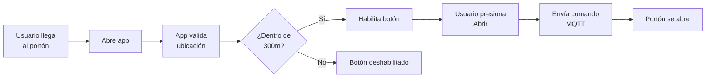
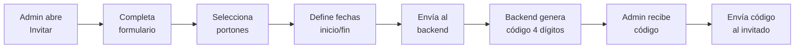
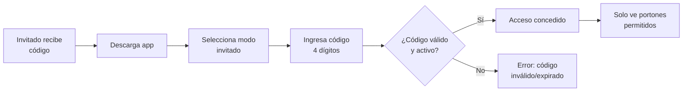

# 📱 Control de Acceso - React Native

Sistema de control remoto de portones inteligentes mediante geolocalización y dispositivos IoT Shelly.

## 🎯 ¿Qué es Control de Acceso?

Aplicación móvil que permite a usuarios autorizados abrir y cerrar portones mediante su smartphone cuando se encuentran dentro del rango de alcance definido (300 metros). Utiliza GPS para validar la ubicación y se comunica con dispositivos Shelly mediante MQTT para controlar los portones físicos.

### Características Destacadas

✅ **Control basado en ubicación** - Geofencing con radio de 300 metros  
✅ **Mapa interactivo** - Visualización en tiempo real con Mapbox  
✅ **Sistema de invitados** - Acceso temporal con códigos de 4 dígitos  
✅ **Múltiples portones** - Gestión de varios puntos de acceso  
✅ **IoT Integration** - Dispositivos Shelly con protocolo MQTT  
✅ **Cross-platform** - iOS y Android con React Native

## 📚 Documentación

### [Arquitectura General](./arquitectura.md)
- Stack tecnológico completo
- Estructura del proyecto
- Componentes principales
- Gestión de estado con Redux
- Sistema de mapas y geolocalización

### [Pantallas y Flujos](./pantallas.md)
- Splash Screen
- Login (normal e invitado)
- Control Screen (mapa y portones)
- Invitar Screen
- Navegación entre pantallas

### [Integraciones IoT y Backend](./integraciones-iot.md)
- API REST endpoints
- Autenticación JWT
- Dispositivos Shelly
- Protocolo MQTT
- Base de datos SQL Server

## 🚀 Quick Start

### Instalación

```bash
# Clonar repositorio
cd control-acceso

# Instalar dependencias
npm install

# Configurar Mapbox token
export MAPBOX_DOWNLOADS_TOKEN=your_token
```

### Desarrollo

```bash
# Iniciar metro bundler
npm run dev

# Android
npm run android

# iOS
npm run ios
```

### Build Producción

```bash
# Build Android
eas build -p android --profile production

# Build iOS
eas build -p ios --profile production
```

## 📊 Casos de Uso

### 1. Usuario Normal - Control de Portón



### 2. Admin - Crear Invitado



### 3. Invitado - Acceso Temporal



## 🏗️ Tecnologías Clave

| Tecnología | Versión | Propósito |
|------------|---------|-----------|
| React Native | 0.81.5 | Framework móvil |
| Expo | ~54.0 | Desarrollo y build |
| Mapbox Maps | ^10.2.7 | Mapas interactivos |
| Redux Toolkit | ^2.11.0 | Estado global |
| NativeWind | ^4.2.1 | Estilos Tailwind |
| Firebase | ^12.6.0 | Push notifications |
| Expo Location | ~19.0.8 | GPS/Geolocalización |

## 🔐 Seguridad

- **JWT Authentication** - Tokens con expiración
- **Geofencing** - Validación de distancia
- **HTTPS Only** - Comunicación encriptada
- **Códigos temporales** - Acceso limitado por fecha
- **Permisos granulares** - Control por portón
- **Logs de acceso** - Auditoría completa

## 📱 Plataformas Soportadas

- ✅ iOS 13.0+
- ✅ Android 8.0+ (API 26+)
- ✅ Expo Go (para desarrollo)

## 🤝 Equipo

Desarrollo El Alto  
[https://www.gestionelalto.cl/](https://www.gestionelalto.cl/)

## 📄 Licencia

Proyecto privado © El Alto 2025
