# Integraciones IoT y Backend

## � Arquitectura de Integración


> **Nota**: Para documentación completa del backend, ver [Backend Control de Acceso](../../backend/control-acceso/arquitectura.md)

## 📡 API REST

### Base URL

```typescript
const API_URLS = {
  primary: 'https://elaltodev-g7dmcff9djcgdyay.eastus-01.azurewebsites.net/appaccesocontrol',
  fallback: 'https://elaltodev.azurewebsites.net/appaccesocontrol',
};
```

### Endpoints

#### 1. Autenticación

**Login Usuario Normal**

```http
POST /login
Content-Type: application/json

{
  "rutOrMail": "12345678-9",
  "password": "mypassword"
}
```

**Response**

```json
{
  "id": 123,
  "nombre": "Juan",
  "apellido": "Pérez",
  "mail": "juan@example.com",
  "rut": "12345678-9",
  "admin": false,
  "invitar": false,
  "access_token": "eyJhbGciOiJIUzI1NiIsInR5cCI6IkpXVCJ9..."
}
```

**Login Invitado**

```http
POST /invitados/login
Content-Type: application/json

{
  "CodigoAcceso": "1234"
}
```

**Response**

```json
{
  "IdInvitante": 123,
  "Nombre": "Pedro",
  "Apellido": "González",
  "Mail": "pedro@empresa.com",
  "Empresa": "Empresa XYZ",
  "FechaInicial": "2025-12-26",
  "FechaFinal": "2025-12-31",
  "Portones": [1, 3, 5],
  "access_token": "eyJhbGciOiJIUzI1NiIsInR5cCI6IkpXVCJ9..."
}
```

#### 2. Portones

**Obtener Portones del Usuario**

```http
POST /portones
Authorization: Bearer {token}
Content-Type: application/json
```

**Response**

```json
{
  "portones": [
    {
      "IdPorton": 1,
      "NombrePorton": "Portón Principal",
      "LatitudPorton": -33.4569,
      "LongitudPorton": -70.6483,
      "Distancia": 0,
      "IdShelly": "shellyplus1-a8032ab12345"
    },
    {
      "IdPorton": 2,
      "NombrePorton": "Portón Estacionamiento",
      "LatitudPorton": -33.4570,
      "LongitudPorton": -70.6485,
      "Distancia": 0,
      "IdShelly": "shellyplus1-a8032ab12346"
    }
  ]
}
```

#### 3. Control MQTT

**Enviar Comando al Portón**

```http
POST /mqtt_test
Content-Type: application/json
key: {api_key}

{
  "Lugar": "shellyplus1-a8032ab12345",
  "Comando": "toggle",
  "Topico": "shellies/command"
}
```

**Comandos disponibles:**
- `toggle` - Alternar estado (abrir si está cerrado, cerrar si está abierto)
- `on` - Activar relé (abrir portón)
- `off` - Desactivar relé (cerrar portón)

**Response**

```json
{
  "status": "success",
  "message": "Comando enviado correctamente",
  "device": "shellyplus1-a8032ab12345",
  "command": "toggle"
}
```

#### 4. Invitados

**Crear Invitado (Solo Admin)**

```http
POST /invitados/crear
Authorization: Bearer {token}
Content-Type: application/json

{
  "Rut": "11111111-1",
  "Nombre": "Carlos",
  "Apellido": "Silva",
  "Telefono": "+56912345678",
  "Mail": "carlos@empresa.com",
  "FechaInicial": "2025-12-26",
  "FechaFinal": "2025-12-31",
  "Empresa": "Constructora ABC",
  "Motivo": "Visita de obra",
  "IdInvitante": 123,
  "PortonesIds": [1, 3]
}
```

**Response**

```json
{
  "status": "success",
  "message": "Invitado creado correctamente",
  "codigo": "5678",
  "invitado": {
    "id": 456,
    "rut": "11111111-1",
    "nombre": "Carlos",
    "apellido": "Silva",
    "codigo_acceso": "5678"
  }
}
```

### API Client Implementation

```typescript
class ApiClient {
  private baseURL: string;
  
  constructor() {
    this.baseURL = API_URLS.primary;
  }
  
  async makeRequest(
    endpoint: string, 
    options: RequestInit, 
    useBackup = false
  ) {
    try {
      const url = useBackup ? API_URLS.fallback : API_URLS.primary;
      const response = await fetch(`${url}${endpoint}`, options);
      
      if (!response.ok) {
        const errorText = await response.text();
        throw new Error(`HTTP ${response.status}: ${errorText}`);
      }
      
      return await response.json();
    } catch (error) {
      if (!useBackup) {
        return this.makeRequest(endpoint, options, true);
      }
      throw error;
    }
  }
  
  async login(rutOrMail: string, password: string) {
    return this.makeRequest('/login', {
      method: 'POST',
      headers: { 'Content-Type': 'application/json' },
      body: JSON.stringify({ rutOrMail, password })
    });
  }
  
  async guestLogin(code: string) {
    return this.makeRequest('/invitados/login', {
      method: 'POST',
      headers: { 'Content-Type': 'application/json' },
      body: JSON.stringify({ CodigoAcceso: code })
    });
  }
  
  async getPortones(token: string) {
    return this.makeRequest('/portones', {
      method: 'POST',
      headers: {
        'Content-Type': 'application/json',
        'Authorization': `Bearer ${token}`
      }
    });
  }
  
  async mqttTest(
    data: { Lugar: string; Comando: string; Topico: string }, 
    key: string
  ) {
    return this.makeRequest('/mqtt_test', {
      method: 'POST',
      headers: {
        'Content-Type': 'application/json',
        'key': key
      },
      body: JSON.stringify(data)
    });
  }
  
  async crearInvitado(data: any, token: string) {
    return this.makeRequest('/invitados/crear', {
      method: 'POST',
      headers: {
        'Content-Type': 'application/json',
        'Authorization': `Bearer ${token}`
      },
      body: JSON.stringify(data)
    });
  }
}

export const apiClient = new ApiClient();
```
## 🔐 Autenticación JWT

> **Nota**: Para documentación completa del backend, ver [Backend Control de Acceso](../../backend/control-acceso/arquitectura.md).

### Estructura del Token

```json
{
  "header": {
    "alg": "HS256",
    "typ": "JWT"
  },
  "payload": {
    "sub": "12345678-9",
    "id": 123,
    "nombre": "Juan Pérez",
    "admin": false,
    "exp": 1735257600,
    "iat": 1735171200
  },
  "signature": "..."
}
```

### Manejo de Token

```typescript
class AuthService {
  private static TOKEN_KEY = 'userToken';
  private static USER_KEY = 'userData';
  
  static async saveToken(token: string) {
    await AsyncStorage.setItem(this.TOKEN_KEY, token);
  }
  
  static async getToken(): Promise<string | null> {
    return await AsyncStorage.getItem(this.TOKEN_KEY);
  }
  
  static async saveUserData(userData: any) {
    await AsyncStorage.setItem(this.USER_KEY, JSON.stringify(userData));
  }
  
  static async getUserData(): Promise<any | null> {
    const data = await AsyncStorage.getItem(this.USER_KEY);
    return data ? JSON.parse(data) : null;
  }
  
  static async clearAuth() {
    await AsyncStorage.multiRemove([this.TOKEN_KEY, this.USER_KEY]);
  }
  
  static async isTokenValid(token: string): Promise<boolean> {
    try {
      // Decodificar JWT sin verificar (solo para obtener exp)
      const [, payload] = token.split('.');
      const decoded = JSON.parse(atob(payload));
      const now = Math.floor(Date.now() / 1000);
      return decoded.exp > now;
    } catch {
      return false;
    }
  }
}
```

### Refresh Token Strategy

```mermaid
sequenceDiagram
    participant APP as App
    participant AS as Auth Service
    participant API as Backend API
    participant STORE as AsyncStorage
    
    APP->>AS: Hacer request
    AS->>STORE: getToken()
    STORE-->>AS: token
    
    AS->>AS: isTokenValid()
    
    alt Token válido
        AS->>API: Request con token
        API-->>AS: Response
        AS-->>APP: Data
    else Token expirado
        AS->>API: POST /refresh
        
        alt Refresh exitoso
            API-->>AS: Nuevo token
            AS->>STORE: saveToken(newToken)
            AS->>API: Reintentar request
            API-->>AS: Response
            AS-->>APP: Data
        else Refresh falla
            AS->>STORE: clearAuth()
            AS-->>APP: Error: Sesión expirada
            APP->>APP: Navegar a Login
        end
    end
```



## 🔌 Dispositivos Shelly

### Características

- **Modelo**: Shelly Plus 1 / Shelly Plus 2PM
- **Protocolo**: MQTT / HTTP
- **Voltaje**: 110-240V AC
- **Conectividad**: WiFi 2.4GHz
- **Salidas**: 1 o 2 relés

### Configuración MQTT

```json
{
  "mqtt": {
    "enable": true,
    "server": "mqtt.elalto.cl:1883",
    "user": "shelly_user",
    "pass": "shelly_password",
    "id": "shellyplus1-a8032ab12345",
    "clean_session": true,
    "keep_alive": 60,
    "max_qos": 0,
    "retain": false,
    "update_period": 30
  }
}
```

### Topics MQTT

| Acción | Topic | Payload | Descripción |
|--------|-------|---------|-------------|
| Estado | `shellies/{device_id}/relay/0` | `on` / `off` | Lee estado actual |
| Comando | `shellies/{device_id}/relay/0/command` | `on` / `off` / `toggle` | Envía comando |
| Estado confirmación | `shellies/{device_id}/relay/0/status` | `{"ison":true,"has_timer":false}` | Confirmación estado |

### Flujo de Control

```mermaid
sequenceDiagram
    participant U as Usuario
    participant APP as App
    participant API as Backend API
    participant MQTT as MQTT Broker
    participant S as Shelly Device
    participant R as Relé Portón
    
    U->>APP: Presiona "Abrir Portón"
    APP->>APP: Validar distancia
    
    alt Dentro de rango (< 300m)
        APP->>API: POST /mqtt_test
        Note over APP,API: {Lugar, Comando, Topico}
        
        API->>MQTT: PUBLISH shellies/{id}/relay/0/command
        Note over MQTT: Payload: "toggle"
        
        MQTT->>S: Recibe comando
        S->>S: Procesar comando
        S->>R: Activar relé
        
        Note over R: Portón se abre<br/>(5-10 segundos)
        
        R-->>S: Estado cambiado
        S->>MQTT: PUBLISH shellies/{id}/relay/0/status
        MQTT->>API: Estado actualizado
        API-->>APP: Success response
        
        APP->>U: ✅ Portón activado
        APP->>APP: Animación completada
    else Fuera de rango
        APP->>U: ❌ Acércate más al portón
    end
```



### Manejo de Estados

```typescript
enum PortonEstado {
  CERRADO = 'cerrado',
  ABRIENDO = 'abriendo',
  ABIERTO = 'abierto',
  CERRANDO = 'cerrando',
  ERROR = 'error'
}

interface PortonControl {
  id: string;
  estado: PortonEstado;
  ultimaActivacion: Date | null;
  intentosReintento: number;
}

class PortonController {
  private estados: Map<string, PortonControl> = new Map();
  
  async activarPorton(porton: Porton, comando: 'toggle' | 'on' | 'off') {
    const control = this.getControl(porton.IdPorton);
    
    // Prevenir múltiples activaciones
    if (control.estado === PortonEstado.ABRIENDO) {
      throw new Error('El portón ya está en proceso de apertura');
    }
    
    // Actualizar estado
    control.estado = PortonEstado.ABRIENDO;
    this.estados.set(porton.IdPorton, control);
    
    try {
      const response = await apiClient.mqttTest({
        Lugar: porton.IdShelly,
        Comando: comando,
        Topico: 'shellies/command'
      }, token);
      
      control.ultimaActivacion = new Date();
      control.estado = PortonEstado.ABIERTO;
      control.intentosReintento = 0;
      
      // Auto-cerrar después de 10 segundos
      setTimeout(() => {
        control.estado = PortonEstado.CERRADO;
        this.estados.set(porton.IdPorton, control);
      }, 10000);
      
      return response;
    } catch (error) {
      control.estado = PortonEstado.ERROR;
      control.intentosReintento++;
      
      // Reintentar hasta 3 veces
      if (control.intentosReintento < 3) {
        await new Promise(resolve => setTimeout(resolve, 2000));
        return this.activarPorton(porton, comando);
      }
      
      throw error;
    }
  }
  
  private getControl(idPorton: string | number): PortonControl {
    if (!this.estados.has(String(idPorton))) {
      this.estados.set(String(idPorton), {
        id: String(idPorton),
        estado: PortonEstado.CERRADO,
        ultimaActivacion: null,
        intentosReintento: 0
      });
    }
    return this.estados.get(String(idPorton))!;
  }
}
```

### Timeout y Reintentos

```mermaid
flowchart TD
    Start([Enviar comando]) --> Send[POST /mqtt_test]
    Send --> Wait[Esperar respuesta<br/>Timeout: 10s]
    
    Wait --> CheckResponse{¿Respuesta<br/>recibida?}
    
    CheckResponse -->|Sí| Success[✅ Comando exitoso]
    Success --> UpdateUI[Actualizar UI]
    UpdateUI --> End([Fin])
    
    CheckResponse -->|No - Timeout| CheckRetries{¿Intentos < 3?}
    
    CheckRetries -->|Sí| Retry[Esperar 2s]
    Retry --> Send
    
    CheckRetries -->|No| Error[❌ Error: Timeout]
    Error --> ShowError[Mostrar error al usuario]
    ShowError --> ResetState[Resetear estado portón]
    ResetState --> End
    
    style Success fill:#90EE90
    style Error fill:#FFB6B6
```



## 📊 Base de Datos

### Tablas Principales

#### Usuarios

```sql
CREATE TABLE Usuarios (
    Id INT PRIMARY KEY IDENTITY(1,1),
    Rut VARCHAR(12) UNIQUE NOT NULL,
    Nombre NVARCHAR(100) NOT NULL,
    Apellido NVARCHAR(100) NOT NULL,
    Mail VARCHAR(200),
    Password NVARCHAR(255) NOT NULL,
    Admin BIT DEFAULT 0,
    Activo BIT DEFAULT 1,
    FechaCreacion DATETIME DEFAULT GETDATE()
);
```

#### Portones

```sql
CREATE TABLE Portones (
    IdPorton INT PRIMARY KEY IDENTITY(1,1),
    NombrePorton NVARCHAR(100) NOT NULL,
    LatitudPorton DECIMAL(10, 8) NOT NULL,
    LongitudPorton DECIMAL(11, 8) NOT NULL,
    IdShelly VARCHAR(100) UNIQUE NOT NULL,
    RadioMetros INT DEFAULT 300,
    Activo BIT DEFAULT 1,
    FechaCreacion DATETIME DEFAULT GETDATE()
);
```

#### Invitados

```sql
CREATE TABLE Invitados (
    Id INT PRIMARY KEY IDENTITY(1,1),
    Rut VARCHAR(12) NOT NULL,
    Nombre NVARCHAR(100) NOT,
    Apellido NVARCHAR(100) NOT NULL,
    Telefono VARCHAR(20),
    Mail VARCHAR(200),
    CodigoAcceso VARCHAR(4) UNIQUE NOT NULL,
    IdInvitante INT FOREIGN KEY REFERENCES Usuarios(Id),
    FechaInicial DATE NOT NULL,
    FechaFinal DATE NOT NULL,
    Empresa NVARCHAR(200),
    Motivo NVARCHAR(500),
    Activo BIT DEFAULT 1,
    FechaCreacion DATETIME DEFAULT GETDATE()
);
```

#### PortonesInvitados (Relación N:N)

```sql
CREATE TABLE PortonesInvitados (
    Id INT PRIMARY KEY IDENTITY(1,1),
    IdInvitado INT FOREIGN KEY REFERENCES Invitados(Id),
    IdPorton INT FOREIGN KEY REFERENCES Portones(IdPorton),
    FechaAsignacion DATETIME DEFAULT GETDATE()
);
```

#### UsuariosPortones (Relación N:N)

```sql
CREATE TABLE UsuariosPortones (
    Id INT PRIMARY KEY IDENTITY(1,1),
    IdUsuario INT FOREIGN KEY REFERENCES Usuarios(Id),
    IdPorton INT FOREIGN KEY REFERENCES Portones(IdPorton),
    FechaAsignacion DATETIME DEFAULT GETDATE()
);
```

#### Logs de Acceso

```sql
CREATE TABLE LogsAcceso (
    Id INT PRIMARY KEY IDENTITY(1,1),
    IdUsuario INT NULL FOREIGN KEY REFERENCES Usuarios(Id),
    IdInvitado INT NULL FOREIGN KEY REFERENCES Invitados(Id),
    IdPorton INT FOREIGN KEY REFERENCES Portones(IdPorton),
    Accion VARCHAR(50) NOT NULL, -- 'abrir', 'cerrar', 'toggle'
    Latitud DECIMAL(10, 8),
    Longitud DECIMAL(11, 8),
    Distancia DECIMAL(10, 2),
    Exitoso BIT NOT NULL,
    MensajeError NVARCHAR(500),
    FechaHora DATETIME DEFAULT GETDATE()
);
```

### Diagrama ER


## Próximos Pasos

- [Pantallas y Flujos](./pantallas.md)
- [Despliegue y Build](./despliegue.md)
- [Troubleshooting](./troubleshooting.md)
