# Pantallas y Flujos de Usuario

## 📱 Navegación Principal

```mermaid
graph TD
    Splash[Splash Screen] --> CheckAuth{¿Usuario<br/>autenticado?}
    
    CheckAuth -->|No| Login[Login Screen]
    CheckAuth -->|Sí| Control[Control Screen]
    
    Login --> ModoLogin{Modo de login}
    ModoLogin -->|Normal| FormLogin[Formulario RUT/Email]
    ModoLogin -->|Invitado| FormGuest[Código 4 dígitos]
    
    FormLogin --> ValidateLogin{¿Credenciales<br/>válidas?}
    FormGuest --> ValidateGuest{¿Código<br/>válido?}
    
    ValidateLogin -->|No| ErrorLogin[Error: Credenciales<br/>incorrectas]
    ValidateLogin -->|Sí| LoadPortones[Cargar portones]
    
    ValidateGuest -->|No| ErrorGuest[Error: Código<br/>inválido/expirado]
    ValidateGuest -->|Sí| LoadPortonesGuest[Cargar portones<br/>permitidos]
    
    ErrorLogin --> FormLogin
    ErrorGuest --> FormGuest
    
    LoadPortones --> Control
    LoadPortonesGuest --> Control
    
    Control --> CheckAdmin{¿Es admin?}
    CheckAdmin -->|Sí| ShowInvitar[Mostrar botón<br/>Invitar]
    CheckAdmin -->|No| HideInvitar[Ocultar botón]
    
    ShowInvitar --> CanInvite[Puede navegar<br/>a InvitarScreen]
    CanInvite --> Invitar[Invitar Screen]
    
    style Splash fill:#000020
    style Login fill:#4A90E2
    style Control fill:#61DAFB
    style Invitar fill:#90EE90
```



## 1. Splash Screen

### Descripción

Pantalla inicial que se muestra mientras la aplicación valida la sesión del usuario.

### Flujo

```mermaid
sequenceDiagram
    participant U as Usuario
    participant S as Splash Screen
    participant AS as AsyncStorage
    participant API as Backend API
    participant R as Router
    
    U->>S: Abre aplicación
    S->>AS: getItem('userToken')
    
    alt Token existe
        AS-->>S: token
        S->>AS: getItem('userData')
        AS-->>S: userData
        S->>API: Validar token
        
        alt Token válido
            API-->>S: Token OK
            S->>R: navigate('/ControlScreen')
        else Token inválido/expirado
            API-->>S: Error 401
            S->>AS: clear()
            S->>R: navigate('/LoginScreen')
        end
    else No hay token
        AS-->>S: null
        S->>R: navigate('/LoginScreen')
    end
```



### Implementación

```typescript
useEffect(() => {
  const checkAuth = async () => {
    try {
      const token = await AsyncStorage.getItem('userToken');
      const userData = await AsyncStorage.getItem('userData');
      
      if (token && userData) {
        const user = JSON.parse(userData);
        dispatch(setUserData(user));
        
        // Cargar portones
        const portones = await AsyncStorage.getItem('portones');
        if (portones) {
          // Validar sesión con backend
          router.replace('/ControlScreen');
        } else {
          router.replace('/LoginScreen');
        }
      } else {
        router.replace('/LoginScreen');
      }
    } catch (error) {
      console.error('Error checking auth:', error);
      router.replace('/LoginScreen');
    }
  };
  
  setTimeout(checkAuth, 1500); // Mostrar splash por 1.5s
}, []);
```

## 2. Login Screen

### Descripción

Pantalla de autenticación con dos modos: usuario normal e invitado.

### UI Components

```mermaid
graph TB
    subgraph "Login Screen"
        Logo[Logo El Alto]
        Title[Título: Control de Acceso]
        Toggle[Toggle: Normal/Invitado]
        
        subgraph "Modo Normal"
            InputRUT[Input: RUT o Email]
            InputPass[Input: Password]
            ShowPass[Botón: Ver/Ocultar]
            BtnLogin[Botón: Iniciar Sesión]
        end
        
        subgraph "Modo Invitado"
            InputCode[Input: Código 4 dígitos]
            BtnGuest[Botón: Acceder]
        end
        
        Loading[Spinner de carga]
        Error[Mensaje de error]
    end
    
    Logo --> Title
    Title --> Toggle
    Toggle -.switch.-> InputRUT
    Toggle -.switch.-> InputCode
    
    InputRUT --> InputPass
    InputPass --> ShowPass
    ShowPass --> BtnLogin
    
    InputCode --> BtnGuest
    
    BtnLogin -.loading.-> Loading
    BtnGuest -.loading.-> Loading
    
    BtnLogin -.error.-> Error
    BtnGuest -.error.-> Error
```



### Validaciones

```typescript
// Validación RUT
const validarRUT = (rut: string): boolean => {
  // Formato: 12345678-9
  const rutPattern = /^(\d{7,8})-?[\dkK]$/;
  return rutPattern.test(rut);
};

// Validación Email
const validarEmail = (email: string): boolean => {
  const emailPattern = /^[^\s@]+@[^\s@]+\.[^\s@]+$/;
  return emailPattern.test(email);
};

// Validación código invitado
const validarCodigo = (codigo: string): boolean => {
  return codigo.length === 4 && /^\d{4}$/.test(codigo);
};
```

### Estados de UI

| Estado | Descripción | UI |
|--------|-------------|-----|
| `idle` | Estado inicial | Formulario vacío |
| `loading` | Enviando request | Spinner + deshabilitar inputs |
| `error` | Error en login | Mensaje de error en rojo |
| `success` | Login exitoso | Navegar a ControlScreen |

### Flujo de Login Normal

```mermaid
sequenceDiagram
    participant U as Usuario
    participant UI as Login UI
    participant V as Validador
    participant API as API Client
    participant S as AsyncStorage
    participant R as Redux
    
    U->>UI: Ingresa RUT/Email
    U->>UI: Ingresa password
    U->>UI: Click "Iniciar Sesión"
    
    UI->>V: Validar formato
    
    alt Formato inválido
        V-->>UI: Error de formato
        UI->>U: Mostrar error
    else Formato válido
        UI->>UI: setIsLoading(true)
        UI->>API: POST /login
        
        alt Credenciales correctas
            API-->>UI: Token + UserData
            UI->>S: Guardar token
            UI->>S: Guardar userData
            UI->>R: setUserData()
            
            UI->>API: GET /portones
            API-->>UI: Lista portones
            UI->>S: Guardar portones
            
            UI->>U: Navegar a Control
        else Credenciales incorrectas
            API-->>UI: Error 401
            UI->>U: Error: Usuario/contraseña incorrectos
        else Error de red
            API-->>UI: Error conexión
            UI->>U: Error: No se pudo conectar
        end
        
        UI->>UI: setIsLoading(false)
    end
```



### Flujo de Login Invitado

```mermaid
sequenceDiagram
    participant I as Invitado
    participant UI as Login UI
    participant API as API Client
    participant DB as Database
    participant S as AsyncStorage
    
    I->>UI: Ingresa código 4 dígitos
    I->>UI: Click "Acceder"
    
    UI->>UI: Validar formato (4 dígitos)
    
    alt Formato inválido
        UI->>I: Error: Código debe ser 4 dígitos
    else Formato válido
        UI->>API: POST /invitados/login
        API->>DB: Buscar invitado
        
        alt Invitado encontrado y activo
            DB->>DB: Validar fechas
            
            alt Dentro de rango de fechas
                DB-->>API: Datos + portones permitidos
                API-->>UI: Token + permisos
                UI->>S: Guardar sesión invitado
                UI->>API: GET /portones (filtrados)
                API-->>UI: Portones permitidos
                UI->>I: ✅ Acceso concedido
            else Fuera de rango
                DB-->>API: Error 403
                API-->>UI: Acceso expirado
                UI->>I: ❌ Tu acceso ha expirado
            end
        else Código no existe
            DB-->>API: Error 401
            API-->>UI: Código inválido
            UI->>I: ❌ Código incorrecto
        end
    end
```



## 3. Control Screen (Pantalla Principal)

### Descripción

Pantalla principal con mapa interactivo que muestra la ubicación del usuario y los portones disponibles.

### Layout

```mermaid
graph TB
    subgraph "Control Screen"
        Header[Header]
        Map[Mapa Mapbox]
        PortonList[Lista de Portones]
        Footer[Footer/Acciones]
    end
    
    subgraph "Header"
        Welcome[Bienvenido Usuario]
        LogoutBtn[Botón Logout]
    end
    
    subgraph "Mapa"
        UserMarker[📍 Usuario]
        PortonMarkers[🚪 Portones]
        GeofenceCircles[⭕ Círculos 300m]
        MapControls[Controles zoom]
    end
    
    subgraph "Lista Portones"
        PortonCard1[Card Portón 1]
        PortonCard2[Card Portón 2]
        PortonCardN[Card Portón N]
    end
    
    subgraph "Portón Card"
        Name[Nombre Portón]
        Distance[📏 Distancia]
        Status[Estado: Dentro/Fuera]
        ActionBtn[Botón Abrir/Cerrar]
    end
    
    Header --> Map
    Map --> PortonList
    PortonList --> Footer
    
    PortonCard1 --> Name
    PortonCard1 --> Distance
    PortonCard1 --> Status
    PortonCard1 --> ActionBtn
```



### Estados del Mapa

```typescript
interface MapState {
  userLocation: {
    latitude: number;
    longitude: number;
  } | null;
  portones: Porton[];
  selectedPorton: Porton | null;
  isLoadingLocation: boolean;
  locationPermission: 'granted' | 'denied' | 'undetermined';
}
```

### Actualización de Ubicación

```mermaid
sequenceDiagram
    participant GPS as GPS Device
    participant L as Location Service
    participant C as Control Screen
    participant M as Mapa
    participant P as Portones
    
    loop Cada 5 segundos
        GPS->>L: Nueva ubicación
        L->>C: onLocationUpdate()
        C->>C: Guardar nueva ubicación
        C->>M: Actualizar marcador usuario
        
        C->>P: Calcular distancias
        loop Para cada portón
            P->>P: getDistanceMeters()
            P->>P: Actualizar estado
            
            alt Distancia < 300m
                P->>P: Habilitar control
                P->>M: Mostrar círculo verde
            else Distancia >= 300m
                P->>P: Deshabilitar control
                P->>M: Mostrar círculo rojo
            end
        end
        
        C->>C: Actualizar UI portones
    end
```



### Card de Portón

```typescript
interface PortonCardProps {
  porton: Porton;
  distance: number;
  onPress: () => void;
}

const PortonCard = ({ porton, distance, onPress }: PortonCardProps) => {
  const dentroRango = distance <= 300;
  const distanceText = distance < 1000 
    ? `${distance.toFixed(0)}m` 
    : `${(distance / 1000).toFixed(2)}km`;
  
  return (
    <Card>
      <CardHeader>
        <CardTitle>{porton.NombrePorton}</CardTitle>
        <CardDescription>
          {distanceText} {dentroRango ? '✅' : '🚫'}
        </CardDescription>
      </CardHeader>
      <CardContent>
        {dentroRango ? (
          <Button onPress={onPress}>
            <DoorOpen /> Abrir Portón
          </Button>
        ) : (
          <Text>Acércate más para habilitar</Text>
        )}
      </CardContent>
    </Card>
  );
};
```

### Animación de Apertura

```typescript
const [isOpening, setIsOpening] = useState(false);
const rotateAnim = useRef(new Animated.Value(0)).current;

const animateOpen = () => {
  setIsOpening(true);
  
  Animated.sequence([
    Animated.timing(rotateAnim, {
      toValue: 1,
      duration: 500,
      easing: Easing.bezier(0.4, 0, 0.2, 1),
      useNativeDriver: true,
    }),
    Animated.timing(rotateAnim, {
      toValue: 0,
      duration: 500,
      easing: Easing.bezier(0.4, 0, 0.2, 1),
      useNativeDriver: true,
    }),
  ]).start(() => setIsOpening(false));
};

const rotation = rotateAnim.interpolate({
  inputRange: [0, 1],
  outputRange: ['0deg', '90deg'],
});
```

### Permisos de Ubicación

```mermaid
stateDiagram-v2
    [*] --> Undetermined
    
    Undetermined --> Requesting: App solicita permiso
    Requesting --> Granted: Usuario acepta
    Requesting --> Denied: Usuario rechaza
    
    Granted --> Active: Obtener ubicación
    Active --> Tracking: Actualizar cada 5s
    
    Denied --> ShowError: Mostrar mensaje
    ShowError --> Settings: Abrir configuración
    Settings --> [*]
    
    note right of Granted
        Permisos:
        - ACCESS_FINE_LOCATION
        - NSLocationWhenInUseUsageDescription
    end note
```



## 4. Invitar Screen

### Descripción

Pantalla para crear nuevos invitados (solo accesible para administradores).

### Formulario Completo

```mermaid
graph TB
    subgraph "Invitar Screen"
        T[Título: Crear Invitado]
        
        subgraph "Datos Personales"
            RUT[Input: RUT]
            Nombre[Input: Nombre]
            Apellido[Input: Apellido]
            Tel[Input: Teléfono]
            Email[Input: Email]
        end
        
        subgraph "Datos Empresa"
            Empresa[Input: Empresa]
            Motivo[TextArea: Motivo visita]
        end
        
        subgraph "Fechas"
            FI[Selector: Fecha Inicial]
            FF[Selector: Fecha Final]
            CalI[Calendario Inicial]
            CalF[Calendario Final]
        end
        
        subgraph "Portones"
            Title[Portones Disponibles:]
            P1[Checkbox: Portón 1]
            P2[Checkbox: Portón 2]
            PN[Checkbox: Portón N]
        end
        
        Submit[Botón: Crear Invitado]
        Cancel[Botón: Cancelar]
    end
    
    T --> RUT
    RUT --> Nombre --> Apellido --> Tel --> Email
    Email --> Empresa --> Motivo
    Motivo --> FI
    FI -.click.-> CalI
    CalI --> FF
    FF -.click.-> CalF
    CalF --> Title
    Title --> P1 --> P2 --> PN
    PN --> Submit
    Submit --> Cancel
```



### Validaciones

```typescript
const validateForm = (): string[] => {
  const errors: string[] = [];
  
  if (!rut || !validarRUT(rut)) {
    errors.push('RUT inválido');
  }
  if (!nombre || nombre.length < 2) {
    errors.push('Nombre es requerido');
  }
  if (!apellido || apellido.length < 2) {
    errors.push('Apellido es requerido');
  }
  if (!telefono || telefono.length < 9) {
    errors.push('Teléfono inválido');
  }
  if (!mail || !validarEmail(mail)) {
    errors.push('Email inválido');
  }
  if (!fechaInicial) {
    errors.push('Fecha inicial requerida');
  }
  if (!fechaFinal) {
    errors.push('Fecha final requerida');
  }
  if (fechaInicial && fechaFinal && fechaInicial >= fechaFinal) {
    errors.push('Fecha final debe ser posterior a inicial');
  }
  if (!empresa || empresa.length < 2) {
    errors.push('Empresa es requerida');
  }
  if (portonesSeleccionados.length === 0) {
    errors.push('Selecciona al menos un portón');
  }
  
  return errors;
};
```

### Flujo de Creación

```mermaid
sequenceDiagram
    participant A as Admin
    participant UI as Invitar UI
    participant V as Validador
    participant API as Backend API
    participant DB as Database
    participant N as Notification
    
    A->>UI: Completa formulario
    A->>UI: Selecciona fechas
    A->>UI: Selecciona portones
    A->>UI: Click "Crear Invitado"
    
    UI->>V: Validar formulario
    
    alt Errores de validación
        V-->>UI: Lista de errores
        UI->>A: Mostrar errores
    else Formulario válido
        UI->>UI: setIsLoading(true)
        UI->>API: POST /invitados/crear
        
        API->>DB: Insertar invitado
        DB->>DB: Generar código 4 dígitos
        DB-->>API: Código generado
        
        API->>N: Enviar notificación (opcional)
        
        API-->>UI: Success + código
        
        UI->>A: Modal con código
        rect rgb(200, 255, 200)
            Note over A,UI: Código: 1234<br/>Envía este código al invitado
        end
        
        UI->>UI: Limpiar formulario
        UI->>UI: setIsLoading(false)
    end
```



### Selección de Portones

```typescript
const PortonSelector = ({ portones, selected, onToggle }) => {
  return (
    <View>
      <Text>Selecciona los portones permitidos:</Text>
      {portones.map((porton) => (
        <TouchableOpacity
          key={porton.IdPorton}
          onPress={() => onToggle(porton.IdPorton)}
          className={`p-4 mb-2 rounded-lg ${
            selected.includes(porton.IdPorton)
              ? 'bg-blue-100 border-blue-500'
              : 'bg-gray-100 border-gray-300'
          }`}
        >
          <View className="flex-row items-center">
            {selected.includes(porton.IdPorton) && (
              <Check className="text-blue-500 mr-2" />
            )}
            <Text className="font-semibold">{porton.NombrePorton}</Text>
          </View>
          <Text className="text-sm text-gray-600">
            {porton.LatitudPorton}, {porton.LongitudPorton}
          </Text>
        </TouchableOpacity>
      ))}
    </View>
  );
};
```

### Modal de Código Generado

```typescript
const CodigoModal = ({ visible, codigo, onClose }) => {
  return (
    <AlertDialog open={visible} onOpenChange={onClose}>
      <AlertDialogContent>
        <AlertDialogHeader>
          <AlertDialogTitle>✅ Invitado Creado</AlertDialogTitle>
          <AlertDialogDescription>
            Código de acceso generado:
          </AlertDialogDescription>
        </AlertDialogHeader>
        
        <View className="items-center py-6">
          <Text className="text-4xl font-bold text-blue-600">
            {codigo}
          </Text>
          <Text className="text-sm text-gray-600 mt-2">
            Envía este código al invitado
          </Text>
        </View>
        
        <AlertDialogFooter>
          <Button onPress={() => {
            // Copiar al portapapeles
            Clipboard.setString(codigo);
          }}>
            Copiar Código
          </Button>
          <Button variant="outline" onPress={onClose}>
            Cerrar
          </Button>
        </AlertDialogFooter>
      </AlertDialogContent>
    </AlertDialog>
  );
};
```

## Navegación entre Pantallas

### Router Configuration

```typescript
// app/_layout.tsx
export default function Layout() {
  return (
    <Stack>
      <Stack.Screen 
        name="index" 
        options={{ headerShown: false }} 
      />
      <Stack.Screen 
        name="LoginScreen" 
        options={{ headerShown: false }} 
      />
      <Stack.Screen 
        name="ControlScreen" 
        options={{ 
          title: 'Control de Acceso',
          headerLeft: () => <LogoutButton />
        }} 
      />
      <Stack.Screen 
        name="InvitarScreen" 
        options={{ 
          title: 'Crear Invitado',
          headerLeft: () => <BackButton />
        }} 
      />
    </Stack>
  );
}
```

## Próximos Pasos

- [Integraciones IoT](./integraciones-iot.md)
- [API y Backend](./api-backend.md)
- [Despliegue](./despliegue.md)
