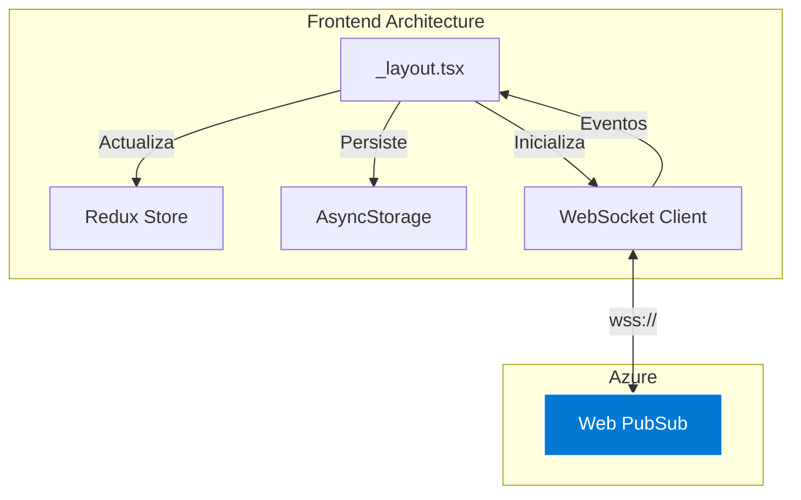

# 🔄 WebSocket Camión-Excavadora (Frontend)

## 📱 Descripción General

Implementación del cliente WebSocket en React Native (Expo) para comunicación en tiempo real entre camiones y excavadoras en operaciones de extracción minera.



## 🏗️ Arquitectura

### Ubicación de Archivos

??? info "Estructura de Proyecto"
    ```
    app/
    ├── (pantallas)/
    │   └── Main/
    │       ├── maquinariaV2/          # Camiones
    │       │   ├── _layout.tsx        ⭐ WebSocket Camión
    │       │   ├── index.tsx          # UI Camión
    │       │   └── excavadora/
    │       │       └── index.tsx      ⭐ UI Excavadora
    │       └── minacentro/            # Excavadoras
    │           └── _layout.tsx        ⭐ WebSocket Excavadora
    ```

## 🔌 Inicialización WebSocket

### Layout Principal (Excavadora)

??? example "maquinariaV2/_layout.tsx"
    ```typescript
    export default function Layout() {
      const [wsConnection, setWsConnection] = useState<WebSocket | null>(null);
      const [isConnected, setIsConnected] = useState(false);
      const Equipo = useSelector((state: RootState) => state.global.Equipo);
      
      // Sistema de deduplicación
      const processedMessagesRef = React.useRef(new Set<string>());

      const initializeWebSocket = async () => {
        if (!Equipo) {
          console.log('[MAQUINARIA] No hay Equipo disponible');
          return;
        }

        try {
          // 1. Obtener URL de negociación
          const response = await fetch(
            `https://elaltodev.azurewebsites.net/ws/negotiate?user_id=${Equipo}`,
            {
              method: 'GET',
              headers: { 'Content-Type': 'application/json' }
            }
          );

          const responseData = await response.json();
          const url = responseData.url;

          // 2. Crear conexión WebSocket
          const ws = new WebSocket(url, 'json.webpubsub.azure.v1');

          ws.onopen = () => {
            console.log(`[MAQUINARIA] WebSocket conectado: ${Equipo}`);
            setWsConnection(ws);
            setIsConnected(true);
          };

          ws.onmessage = (event) => {
            handleMessage(event);
          };

          ws.onerror = (error) => {
            console.error('[MAQUINARIA] WebSocket error:', error);
            setIsConnected(false);
          };

          ws.onclose = () => {
            console.log('[MAQUINARIA] WebSocket cerrado, reconectando...');
            setIsConnected(false);
            setTimeout(initializeWebSocket, 3000);
          };
        } catch (error) {
          console.error('[MAQUINARIA] Failed to initialize:', error);
        }
      };

      // Inicializar al tener Equipo
      useEffect(() => {
        if (Equipo) {
          initializeWebSocket();
        }
        
        return () => {
          wsConnection?.close();
        };
      }, [Equipo]);

      return (
        <BackgroundHeader>
          <View className="flex-1">
            <Slot />
          </View>
        </BackgroundHeader>
      );
    }
    ```

## 📨 Manejo de Eventos

### Procesamiento de Mensajes

??? example "Sistema de Deduplicación"
    ```typescript
    ws.onmessage = (event) => {
      try {
        const json_data = JSON.parse(event.data);

        // Ignorar mensajes de sistema
        if (json_data.type === 'system') return;
        if (json_data.type !== 'message' || !json_data.data) return;

        const messageData = json_data.data;
        const messageType = messageData?.data || messageData?.message;
        
        if (!messageType) return;
        
        // CREAR ID ÚNICO PARA DEDUPLICACIÓN
        const idMovimiento = messageData?.IdMovimiento || 
                             messageData?.trip_data?.IdMovimiento;
        const equipoMsg = messageData?.equipo || 
                          messageData?.trip_data?.Equipo || '';
        const timestamp = messageData?.timestamp || 
                          json_data?.timestamp || '';
        const messageId = `${messageType}-${idMovimiento}-${equipoMsg}-${timestamp}`;
        
        // Verificar si ya procesamos este mensaje
        if (processedMessagesRef.current.has(messageId)) {
          return; // Duplicado, ignorar
        }
        
        // Marcar como procesado
        processedMessagesRef.current.add(messageId);
        
        // Limpiar después de 5 segundos
        setTimeout(() => {
          processedMessagesRef.current.delete(messageId);
        }, 5000);
        
        // Procesar evento
        handleEvent(messageType, messageData);
      } catch (error) {
        console.error('[MAQUINARIA] Error al procesar:', error);
      }
    };
    ```

### Handlers por Tipo de Evento

=== "ViajeCreado"
    ```typescript
    case 'ViajeCreado':
      const tripData = messageData?.trip_data;
      if (tripData) {
        console.log('[EXCAVADORA] Nuevo viaje:', tripData.IdMovimiento);
        
        // Guardar en AsyncStorage
        AsyncStorage.getItem('websocket_trips').then(existing => {
          const trips = existing ? JSON.parse(existing) : [];
          const newTrips = [...trips, {
            ...tripData,
            receivedAt: new Date().toISOString()
          }];
          AsyncStorage.setItem('websocket_trips', JSON.stringify(newTrips));
        });

        // Mostrar notificación
        showNotification({
          title: 'Nuevo Viaje',
          message: `Camión ${tripData.Patente} disponible`,
          type: 'info'
        });
      }
      break;
    ```

=== "ViajeActualizado"
    ```typescript
    case 'ViajeActualizado':
      const idMovimiento = messageData?.IdMovimiento;
      const horaFinCarga = messageData?.HoraFinCarga;
      
      // Validar si es finalización de carga
      const tieneHoraFinCarga = horaFinCarga && 
                                horaFinCarga !== null && 
                                horaFinCarga !== 'null' && 
                                horaFinCarga !== 'none' && 
                                horaFinCarga !== '' && 
                                String(horaFinCarga).trim() !== '';
      
      if (tieneHoraFinCarga) {
        console.log('[EXCAVADORA] Carga finalizada:', idMovimiento);
        
        // Actualizar viaje en storage
        AsyncStorage.getItem('websocket_trips').then(existing => {
          if (existing) {
            const trips = JSON.parse(existing);
            const updatedTrips = trips.map(trip =>
              trip.IdMovimiento === idMovimiento
                ? { ...trip, HoraFinCarga: horaFinCarga, estado: 'cargado' }
                : trip
            );
            AsyncStorage.setItem('websocket_trips', JSON.stringify(updatedTrips));
          }
        });

        showNotification({
          title: 'Carga Completa',
          message: `Viaje ${idMovimiento} cargado exitosamente`,
          type: 'success'
        });
      } else {
        console.log('[EXCAVADORA] Actualización de viaje:', idMovimiento);
      }
      break;
    ```

=== "CargaFinalizada"
    ```typescript
    case 'CargaFinalizada':
      const idMovimientoCarga = messageData?.IdMovimiento;
      console.log('[EXCAVADORA] CargaFinalizada:', idMovimientoCarga);
      
      // Guardar señal para auto-finalización
      AsyncStorage.setItem(
        `carga_finalizada_${idMovimientoCarga}`,
        new Date().toISOString()
      );
      
      // Remover de lista activa
      AsyncStorage.getItem('websocket_trips').then(existing => {
        if (existing) {
          const trips = JSON.parse(existing);
          const filteredTrips = trips.filter(
            trip => trip.IdMovimiento !== idMovimientoCarga
          );
          AsyncStorage.setItem('websocket_trips', JSON.stringify(filteredTrips));
        }
      });
      break;
    ```

=== "ViajeFinalizado"
    ```typescript
    case 'ViajeFinalizado':
      const idMovimientoFin = messageData?.IdMovimiento;
      console.log('[EXCAVADORA] ViajeFinalizado:', idMovimientoFin);
      
      // Limpiar completamente
      AsyncStorage.multiRemove([
        `carga_finalizada_${idMovimientoFin}`,
        `viaje_activo_${idMovimientoFin}`
      ]);
      
      // Actualizar contador de viajes completados
      AsyncStorage.getItem('viajes_completados_hoy').then(count => {
        const newCount = (parseInt(count || '0') + 1).toString();
        AsyncStorage.setItem('viajes_completados_hoy', newCount);
      });

      showNotification({
        title: 'Viaje Finalizado',
        message: `Viaje ${idMovimientoFin} completado`,
        type: 'success'
      });
      break;
    ```

=== "ViajeCancelado"
    ```typescript
    case 'ViajeCancelado':
      const idMovimientoCancelado = messageData?.IdMovimiento;
      console.log('[EXCAVADORA] ViajeCancelado:', idMovimientoCancelado);
      
      // Remover de storage
      AsyncStorage.getItem('websocket_trips').then(existing => {
        if (existing) {
          const trips = JSON.parse(existing);
          const filteredTrips = trips.filter(
            trip => trip.IdMovimiento !== idMovimientoCancelado
          );
          AsyncStorage.setItem('websocket_trips', JSON.stringify(filteredTrips));
        }
      });

      showNotification({
        title: 'Viaje Cancelado',
        message: `Viaje ${idMovimientoCancelado} ha sido cancelado`,
        type: 'warning'
      });
      break;
    ```

## 🎨 UI: Lista de Viajes Disponibles

### Componente Excavadora

??? example "excavadora/index.tsx - Viajes WebSocket"
    ```typescript
    export default function PantallaExcavadora() {
      const [viajesDisponibles, setViajesDisponibles] = useState<ViajeAPI[]>([]);
      const [viajeSeleccionado, setViajeSeleccionado] = useState<ViajeAPI | null>(null);
      const [currentViajeIndex, setCurrentViajeIndex] = useState(0);

      // Cargar viajes desde AsyncStorage
      useEffect(() => {
        const loadTrips = async () => {
          try {
            const stored = await AsyncStorage.getItem('websocket_trips');
            if (stored) {
              const trips = JSON.parse(stored);
              setViajesDisponibles(trips);
              
              if (trips.length > 0 && !viajeSeleccionado) {
                setViajeSeleccionado(trips[0]);
                setCurrentViajeIndex(0);
              }
            }
          } catch (error) {
            console.error('Error loading trips:', error);
          }
        };

        loadTrips();
        
        // Recargar cada 2 segundos
        const interval = setInterval(loadTrips, 2000);
        return () => clearInterval(interval);
      }, []);

      // Navegación entre viajes
      const handleNextTrip = () => {
        if (currentViajeIndex < viajesDisponibles.length - 1) {
          const nextIndex = currentViajeIndex + 1;
          setCurrentViajeIndex(nextIndex);
          setViajeSeleccionado(viajesDisponibles[nextIndex]);
        }
      };

      const handlePrevTrip = () => {
        if (currentViajeIndex > 0) {
          const prevIndex = currentViajeIndex - 1;
          setCurrentViajeIndex(prevIndex);
          setViajeSeleccionado(viajesDisponibles[prevIndex]);
        }
      };

      return (
        <View>
          {viajesDisponibles.length > 0 ? (
            <View>
              {/* Indicador de posición */}
              <Text>
                Viaje {currentViajeIndex + 1} de {viajesDisponibles.length}
              </Text>

              {/* Datos del viaje actual */}
              <ViajeCard viaje={viajeSeleccionado} />

              {/* Navegación */}
              <View style={styles.navigation}>
                <Button 
                  onPress={handlePrevTrip}
                  disabled={currentViajeIndex === 0}
                >
                  Anterior
                </Button>
                
                <Button 
                  onPress={handleNextTrip}
                  disabled={currentViajeIndex === viajesDisponibles.length - 1}
                >
                  Siguiente
                </Button>
              </View>

              {/* Botón de iniciar carga */}
              <Button 
                onPress={() => iniciarCarga(viajeSeleccionado.IdMovimiento)}
              >
                Iniciar Carga
              </Button>
            </View>
          ) : (
            <EmptyState message="No hay viajes disponibles" />
          )}
        </View>
      );
    }
    ```

## 🔄 Reconexión Automática

??? example "Sistema de Reconexión"
    ```typescript
    ws.onclose = () => {
      console.log('[MAQUINARIA] WebSocket cerrado, reconectando en 3s...');
      setIsConnected(false);
      setWsConnection(null);
      
      // Intentar reconectar
      const reconnectTimeout = setTimeout(() => {
        initializeWebSocket();
      }, 3000);
      
      return () => clearTimeout(reconnectTimeout);
    };
    ```

??? tip "Estrategia de Reconexión"
    - ⏱️ Delay fijo: 3 segundos
    - ♾️ Intentos ilimitados
    - 🔄 Reinicia automáticamente
    - 📝 Logs detallados de cada intento
    - ✅ Preserva estado de la aplicación

## 💾 Persistencia de Datos

### AsyncStorage Schema

??? info "Estructura de Datos"
    ```typescript
    interface WebSocketTrip {
      IdMovimiento: number;
      IdJornada: number;
      Usuario: string;
      Equipo: string;
      Patente: string;
      IdProducto: number;
      DescripcionProducto: string;
      Conductor: string;
      HoraInicio: string;
      HoraCarga?: string;
      HoraFinCarga?: string;
      LatitudCarga: string;
      LongitudCarga: string;
      receivedAt: string; // Timestamp de recepción
      estado?: 'pendiente' | 'en_carga' | 'cargado' | 'finalizado';
    }

    // Keys de AsyncStorage
    const STORAGE_KEYS = {
      TRIPS: 'websocket_trips',
      CARGA_FINALIZADA: (id) => `carga_finalizada_${id}`,
      VIAJE_ACTIVO: (id) => `viaje_activo_${id}`,
      VIAJES_COMPLETADOS: 'viajes_completados_hoy'
    };
    ```

### Limpieza de Datos

??? example "Limpieza al Iniciar Jornada"
    ```typescript
    useEffect(() => {
      if (Equipo) {
        // Limpiar viajes antiguos
        AsyncStorage.getItem('websocket_trips').then(existing => {
          if (existing) {
            console.log('[MAQUINARIA] Limpiando viajes antiguos');
            AsyncStorage.removeItem('websocket_trips');
          }
        });
        
        initializeWebSocket();
      }
    }, [Equipo]);
    ```

## 🔔 Notificaciones

??? example "Sistema de Notificaciones"
    ```typescript
    import * as Notifications from 'expo-notifications';

    // Configuración
    Notifications.setNotificationHandler({
      handleNotification: async () => ({
        shouldShowAlert: true,
        shouldPlaySound: true,
        shouldSetBadge: false,
      }),
    });

    // Mostrar notificación
    async function showNotification(data: {
      title: string;
      message: string;
      type: 'info' | 'success' | 'warning' | 'error';
    }) {
      await Notifications.scheduleNotificationAsync({
        content: {
          title: data.title,
          body: data.message,
          data: { type: data.type }
        },
        trigger: null // Inmediato
      });
    }
    ```

## 🐛 Debugging

??? tip "Herramientas de Debug"
    ```typescript
    // Consola de eventos
    const [debugLogs, setDebugLogs] = useState<string[]>([]);

    const addDebugLog = (message: string) => {
      const timestamp = new Date().toISOString();
      setDebugLogs(prev => [
        `[${timestamp}] ${message}`,
        ...prev.slice(0, 49) // Mantener últimos 50
      ]);
    };

    // En cada evento
    ws.onmessage = (event) => {
      addDebugLog(`Received: ${event.data}`);
      // ...resto del código
    };

    // UI de debug
    <ScrollView style={styles.debugConsole}>
      {debugLogs.map((log, i) => (
        <Text key={i} style={styles.logText}>{log}</Text>
      ))}
    </ScrollView>
    ```

## ⚠️ Manejo de Errores

??? warning "Errores Comunes"
    | Error | Causa | Solución |
    |-------|-------|----------|
    | `Connection refused` | Backend caído | Verificar endpoint |
    | `Token expired` | Sesión > 1 hora | Renovar en negotiate |
    | `Duplicate message` | Retry del servidor | Sistema de deduplicación |
    | `Parse error` | JSON malformado | Validar estructura |
    | `AsyncStorage full` | Demasiados viajes | Limpiar periódicamente |

## 📊 Estados de Conexión

??? example "Indicador Visual"
    ```typescript
    function ConnectionIndicator() {
      const [isConnected, setIsConnected] = useState(false);

      return (
        <View style={styles.indicator}>
          <View 
            style={[
              styles.dot, 
              { backgroundColor: isConnected ? '#10b981' : '#ef4444' }
            ]} 
          />
          <Text>
            {isConnected ? 'Conectado' : 'Desconectado'}
          </Text>
        </View>
      );
    }
    ```

## 🧪 Testing

??? example "Pruebas del Cliente"
    ```typescript
    import { renderHook, act } from '@testing-library/react-hooks';
    import WS from 'jest-websocket-mock';

    describe('WebSocket Client', () => {
      let server: WS;

      beforeEach(async () => {
        server = new WS('ws://localhost:1234');
      });

      afterEach(() => {
        WS.clean();
      });

      it('should connect successfully', async () => {
        const { result } = renderHook(() => useWebSocket());
        
        await act(async () => {
          await server.connected;
        });

        expect(result.current.isConnected).toBe(true);
      });

      it('should handle ViajeCreado event', async () => {
        const { result } = renderHook(() => useWebSocket());
        
        await server.connected;
        
        act(() => {
          server.send(JSON.stringify({
            type: 'message',
            data: {
              data: 'ViajeCreado',
              trip_data: { IdMovimiento: 123 }
            }
          }));
        });

        expect(result.current.trips).toHaveLength(1);
      });
    });
    ```

## 📱 Compatibilidad

??? info "Requisitos"
    - React Native / Expo SDK 49+
    - AsyncStorage
    - WebSocket API nativa
    - Permisos de notificaciones (opcional)
    - Android 8.0+ / iOS 13.0+

## 🔗 Referencias

??? info "Enlaces Útiles"
    - [React Native WebSocket](https://reactnative.dev/docs/network#websocket-support)
    - [Expo AsyncStorage](https://docs.expo.dev/versions/latest/sdk/async-storage/)
    - [Azure Web PubSub Client Protocol](https://learn.microsoft.com/en-us/azure/azure-web-pubsub/reference-json-webpubsub-subprotocol)
    - [Backend: API WebSocket](../../backend/extraccion/websocket-excavadora.md)
