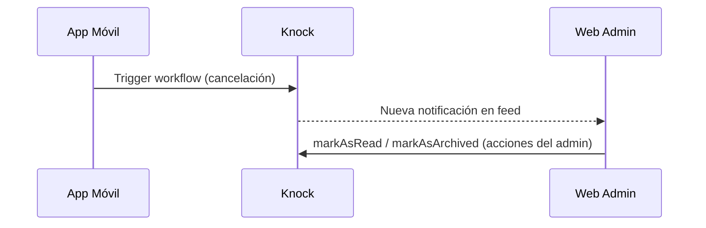

# Integración Knock (Next.js / React) 🔔

## Resumen
Guía para integrar Knock en la web (Next.js). Describe los providers, el componente `NotificationBell` y manejo de acciones (leer, archivar, marcar todo leído). Incluye notas sobre manejo del feed y de errores observados en el repositorio.

??? info "Archivos clave"
    - `components/knock/KnockProvider.tsx` (provider wrapper)
    - `components/knock/NotificationBell.tsx` (campana y lógica de feed)
    - `app/(LogiPath)/.../layout.tsx` (uso de `KnockProviderWrapper` desde el layout de admin)

---

## Instalación y setup
- Paquetes: `@knocklabs/react` (web)
- Configura `NEXT_PUBLIC_KNOCK_API_KEY` en variables de entorno para el cliente.

> ⚠️ Igual que en móvil: **no** exponer `KNOCK_API_SECRET` en el cliente. Los triggers que requieren la secret deberían ejecutarse desde un backend seguro.

---

## Providers y uso
El repo tiene un `KnockProviderWrapper` que lee la `apiKey` desde `process.env.NEXT_PUBLIC_KNOCK_API_KEY` y envuelve la app con `KnockProvider` y `KnockFeedProvider`.

```tsx
<KnockProvider apiKey={apiKey} userId={userId} userToken={userToken}>
  <KnockFeedProvider feedId={feedId}>{children}</KnockFeedProvider>
</KnockProvider>
```

### `NotificationBell`
- Usa `useKnockFeed()` para obtener `feedClient`.
- Ejecuta `feed.fetch()` e intenta `feed.listenForUpdates()` para real-time.
- Provee acciones: marcar como leído, marcar todo como leído, archivar.

**Comportamientos observados en el código:**
- `handleArchiveNotification` intenta `feedClient.feedClient.markAsArchived([item])`. Si falla, intenta otros enfoques (p.ej. `messages.batchUpdateStatuses`). Se registran errores para mostrar al usuario.
- `unreadCount` y `items` se obtienen de `feedClient.useFeedStore().metadata.unread_count` y `.items`.

---

## Ejemplo de flujo (Cancelación de viaje)
Aunque la cancelación se hace desde la app móvil en el repo, en web la notificación llegará al feed/usuarios cuando el workflow sea disparado. El flujo:



---

## API y triggers (recap)
Si tu servicio backend debe disparar workflows en Knock:

```bash
curl -X POST "https://api.knock.app/v1/workflows/YOUR_WORKFLOW_KEY/trigger" \
  -H "Content-Type: application/json" \
  -H "Authorization: Bearer $KNOCK_API_SECRET" \
  -d '{"data": {...}, "recipients": [{"id":"diegoKnock"}] }'
```

---

## Manejo de errores y debugging
- Si `feed.fetch()` falla, revisar consola y permisos de la `apiKey`/`feedId`.
- Para archivado: revisar `item.message_id`, `item.message?.id` o `item.data?.message_id` — el código del repo trata de varios candidatos antes de reclamar error al usuario.

---

## Buenas prácticas
- Almacenar `NEXT_PUBLIC_*` para claves públicas y `KNOCK_API_SECRET` **únicamente** en servidor.
- Manejar y mostrar errores de archivado para que los administradores sepan si la acción no se ejecutó correctamente.

---

## Referencias en el repo
- `components/knock/KnockProvider.tsx`
- `components/knock/NotificationBell.tsx`
- `app/(LogiPath)/.../layout.tsx` (donde se usa `KnockProviderWrapper`)

Si quieres, agrego una sección con ejemplos de payloads concretos que creemos en los workflows (bloques, templates, recipients) o screenshots de la UI de la campana. ✅
