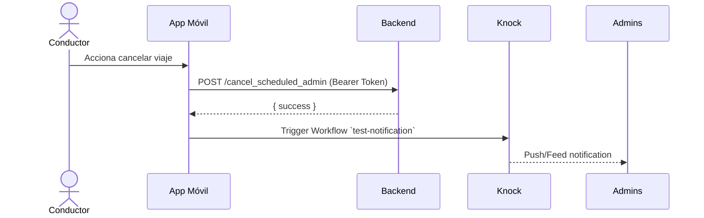

# Integración Knock (React Native / Expo) 🔔

## Resumen
Documentación de la integración de Knock en la aplicación móvil (Expo + React Native). Aquí se muestran los ficheros relevantes del repositorio, flujos concretos (ej. cancelación de viaje) y ejemplos de uso sin exponer credenciales.

??? info "Archivos clave"
    - `app/services/knock.ts` (cliente y utilidades)
    - `app/(main)/v2Admin/_layout.tsx` (registro de token con `KnockPushRegistrar`)
    - `components/viajes_card.tsx` (ejemplo de uso: `notificarSistema` en cancelación)

---

## Paquetes y configuración 🔧
- Paquete principal (móvil): `@knocklabs/react-native`

Variables de entorno (no subir secretos al repo):
- `NEXT_PUBLIC_KNOCK_API_KEY` o `KNOCK_PUBLIC_API_KEY` (clave pública)
- `KNOCK_API_SECRET` (clave secreta — **no** usar en clientes móviles en producción)
- `KNOCK_FEED_ID`
- `KNOCK_EXPO_CHANNEL_ID`

## Puntos importantes de conexión con Knock 🔗

- `KNOCK_FEED_ID`: Identificador del *feed in-app* (feedId / channel del feed que se muestra dentro de la app). Usado por `KnockFeedProvider` para mostrar notificaciones en la UI.
- `KNOCK_EXPO_CHANNEL_ID`: Channel ID del canal de *push* para Expo (usado por `user.setChannelData` para registrar tokens y enviar push a dispositivos).
- Campos dinámicos en payloads:
  - `titulo`: Permite personalizar el título de la notificación desde el código (ej. `titulo: '❌ Conductor canceló viaje'`).
  - `descripcion`: El texto como `` `El conductor ${Nombre} ha cancelado el viaje #${viaje.Id}` `` se mapea a `descripcion` en el dashboard de Knock y se muestra en el feed; así personalizas el contenido sin crear channels nuevos.
- `recipients`: Lista de destinatarios (p. ej. `{ id: 'oruebaKnock' }`) para direccionar la notificación a usuarios o roles sin crear un channel por evento.

> ⚠️ En el código del repo se usa un `fetch` directo a la API de Knock desde el cliente (`app/services/knock.ts`). Esto funciona, pero como buena práctica se recomienda ejecutar triggers de workflows que requieren `KNOCK_API_SECRET` desde un backend para **no exponer** secretos en la app.

---

## Cómo se registra el dispositivo (push)
1. En `_layout.tsx` se obtiene el `userId` (por ejemplo `Usuario`, `CodigoTransportista` o `RutConductor`).
2. `registerForPushNotificationsAsync()` obtiene el token de Expo (o de la plataforma).
3. `KnockPushRegistrar` (componente) usa `useKnockClient(userId)` y llama a `registrarTokenPush(knockClient, pushToken)`.

Ejemplo (resumen):

```ts
// _layout.tsx (KnockPushRegistrar)
const knockClient = useKnockClient(userId);
React.useEffect(() => {
  const registerPush = async () => {
    const pushToken = await registerForPushNotificationsAsync();
    await registrarTokenPush(knockClient, pushToken);
  };
  registerPush();
}, [userId, knockClient]);
```

---

## Ejemplo de trigger (cancelación de viaje)
En `components/viajes_card.tsx` existe la función `handleCancelarViaje` que realiza el flujo:

1. Llama al endpoint de backend para marcar el viaje como cancelado.
2. Llama a `notificarSistema(...)` para notificar via Knock al feed o a usuarios específicos.

Snippet (uso dentro de `handleCancelarViaje`):

```ts
await notificarSistema(
  'test-notification', // workflowKey
  'logi-path', // sistema
  `El conductor ${Nombre} ha cancelado el viaje #${viaje.Id}`,
  {
    titulo: '❌ Conductor canceló viaje',
    viajeId: viaje.Id,
    conductor: Nombre,
    motivo: 'Cancelado por conductor',
    fecha_cancelacion: new Date().toISOString(),
  },
  [{ id: 'pruebaKnock', name: 'Admin Principal' }]
);
```

### Diagrama de secuencia (Cancelación)



> 💡 Nota: en el repo actual el `trigger` se hace en la app (fetch a `https://api.knock.app/v1/workflows/{workflowKey}/trigger`). Si decides ejecutar ese `trigger` desde tu backend, reemplaza la llamada desde el cliente por un endpoint seguro en server.

---

## Ejemplos de petición (no publicar claves)

cURL (server-side):

```bash
curl -X POST "https://api.knock.app/v1/workflows/YOUR_WORKFLOW_KEY/trigger" \
  -H "Content-Type: application/json" \
  -H "Authorization: Bearer $KNOCK_API_SECRET" \
  -d '{"data": {"titulo":"Conductor canceló viaje","viajeId":123}, "recipients":[{"id":"pruebaKnock"}]}'
```

Fetch (desde backend Node):

```js
await fetch(`https://api.knock.app/v1/workflows/${workflowKey}/trigger`, {
  method: 'POST',
  headers: {
    'Content-Type': 'application/json',
    'Authorization': `Bearer ${process.env.KNOCK_API_SECRET}`,
  },
  body: JSON.stringify({ data, recipients }),
});
```

---

## Buenas prácticas y seguridad 🔐
- **Nunca** incluir `KNOCK_API_SECRET` en código cliente (apps móviles o web). Guardarlo en variables de entorno del servidor.
- Registrar tokens del dispositivo con el `Knock` client desde componentes que tengan acceso al userId.
- Validar y sanear los payloads enviados a Knock (evitar inyección de HTML si generas bloques personalizados).

---

## Referencias en el repo
- `app/services/knock.ts` — implementación de `useKnockClient`, `registrarTokenPush`, `enviarNotificacion`, `notificarSistema`.
- `app/(main)/v2Admin/_layout.tsx` — provider y registro del push para administradores.
- `components/viajes_card.tsx` — flujo de cancelación y ejemplo de `notificarSistema`.

---


