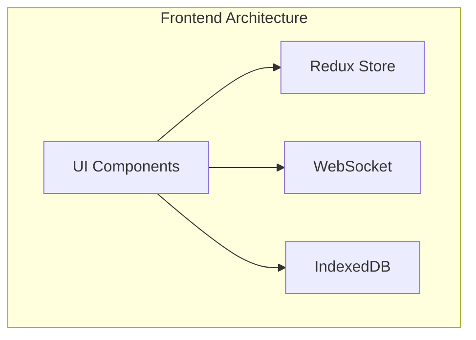

# 🚛 TRACMIN - Documentación Frontend

## 📱 Descripción General

Tracmin es una aplicación de gestión de transporte minero que opera en dos plataformas:
- 🌐 Aplicación Web (PWA)
- 📱 Aplicación Móvil (Android)

### Tecnologías Principales

??? info "Stack Tecnológico"
    | Tecnología | Uso | Versión |
    |------------|-----|----------|
    | Next.js + TypeScript | Framework principal | 14.x |
    | Shadcn UI | Componentes UI | Latest |
    | Tailwind CSS | Estilos | 3.x |
    | Redux | Estado global | Latest |
    | IndexedDB | Almacenamiento local | - |
    | WebSocket | Tiempo real | - |
    | React Native (Expo) | App móvil | Latest |

## 🌐 Aplicación Web (PWA)

### Ambientes

??? example "URLs de Acceso"
    | Ambiente | URL | Descripción |
    |----------|-----|-------------|
    | 🚀 Producción | [tracmin.cl](https://tracmin.cl) | Ambiente productivo |
    | 🧪 QA | [qa.azure](https://ambitious-rock-01e80b912340.3.azurestaticapps.net/) | Pruebas |
    | 🛠️ Desarrollo | [dev.azure](https://ambitious-rock-01e80b910.3.azurestaticapps.net/) | Desarrollo |

### Arquitectura



### Roles de Usuario

??? tip "Perfiles de Acceso"
    | Rol | Descripción | Accesos |
    |-----|-------------|---------|
    | 🚚 Conductor | Operador de vehículo | Viajes, rutas |
    | 👥 Admin Transportista | Gestión de flota | Dashboard, reportes |
    | 🏢 Cliente | Usuario final | Seguimiento |
    | ⚖️ Admin Romana | Control de peso | Pesajes, registros |

## 📱 Aplicación Móvil

??? info "Detalles Play Store"
    - 📥 [Descargar App](https://play.google.com/store/apps/details?id=com.desarrolloelalto.LogipathNative)
    - 📦 100+ Descargas
    - 🔒 Datos encriptados
    - 📱 Compatible: Android

### Características PWA

??? example "Capacidades PWA"
    - ✅ Instalable
    - ✅ Offline-first
    - ✅ Push notifications
    - ✅ Responsive design
    - ✅ App-like experience

## 💾 Gestión de Datos

### Redux Store

??? example "Estado Global"
    ```typescript
    interface RootState {
      user: UserState;
      trips: TripState;
      notifications: NotificationState;
      // ...otros estados
    }
    ```

### IndexedDB

??? tip "Estructura de Datos"
    ```typescript
    interface DBSchema {
      trips: TripRecord[];
      userPrefs: UserPreferences;
      offlineData: OfflineStorage;
    }
    ```

## 🔄 Tiempo Real

??? info "WebSocket Events"
    ```typescript
    // Eventos principales
    enum WSEvents {
      TRIP_UPDATE = 'trip:update',
      LOCATION_CHANGE = 'location:change',
      NEW_NOTIFICATION = 'notification:new'
    }
    ```

## 🛠️ Desarrollo

### Configuración Local

```bash
# Instalar dependencias
npm install

# Desarrollo
npm run dev

# Build
npm run build
```

### Variables de Entorno

??? example "Configuración"
    ```env
    NEXT_PUBLIC_API_URL=
    NEXT_PUBLIC_WS_URL=
    NEXT_PUBLIC_MAPS_KEY=
    ```

## 📊 Monitoreo

??? tip "Herramientas"
    - Azure Application Insights
    - Google Analytics
    - Error tracking
    - Performance monitoring

## 🔐 Seguridad

??? warning "Consideraciones"
    - Autenticación JWT
    - Datos encriptados
    - HTTPS
    - Validación de roles
    - Sanitización de datos

## 📚 Recursos

??? info "Enlaces Útiles"
    - [Documentación API](/backend/tracmin/estructura)
    - [Guía Actualizar Native](/frontend/react/actualizar_native)
