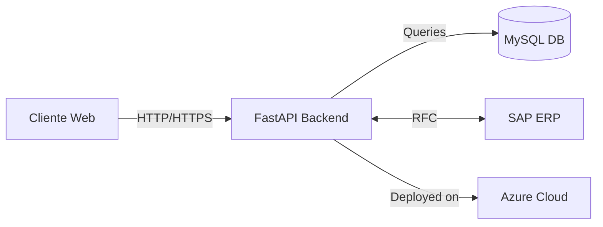
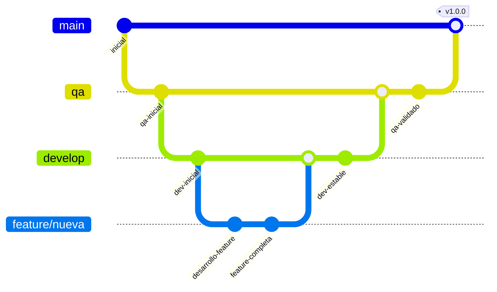

<div id="header" align="center">
    <h1>Documentación de Equipo de Desarrollo El Alto 🚀</h1>
    <h3>Aquí podrás encontrar la documentación de todas las apps disponibles: frontend, backend y guías de cómo se fueron levantando los distintos servicios.</h3>
    
</div>

<div align="center">
    <h2>📊 Arquitectura del Sistema</h2>
</div>



<div align="center">
    <h2>🔄 Flujo de Trabajo Git</h2>
</div>




<div align="center">
    <h2>🛠️ Tecnologías Implementadas</h2>
</div>

<div align="center">
    <h3>Cloud y Backend:</h3>
    &nbsp;
    &nbsp;
    &nbsp;
    &nbsp;
</div>

<div align="center">
    <h3>Frontend:</h3>
    &nbsp;
    &nbsp;
    &nbsp;
    &nbsp;
    &nbsp;
</div>

<!-- <div align="center">
    <h2>⚡ Comandos Útiles</h2>
</div>

### Backend

=== "Windows"
	```bash
	func start --functions NombreApp --useHttps --cert certificate.pfx --password 'password'
	```

=== "Linux"
	```bash
	func start --functions NombreApp --useHttps
	```

### Frontend

```bash
npm run dev # Iniciar servidor de desarrollo
npm run build # Construir aplicación
npm run start # Iniciar aplicación en producción
```
<div align="center">
    <h2>🚀 Comenzando</h2>
    <p>Para comenzar a trabajar con el proyecto, dirígete a las siguientes secciones:</p>
</div>

- [📘 Guía de inicio Backend](/backend/levantamiento/windows_linux)
- [📗 Guía de inicio Frontend](/frontend/react/levantar.md)

<div align="center">
    <h2>🎩 Versiones y Análisis</h2>
    <p>Si quieres ver las versiones y análisis de las apps, dirígete a la siguiente Página:</p>
    <a href="https://desarrollo.streamlit.app/">Desarrollo El Alto</a>
</div> -->