# 📡 Conexión de Dispositivos a Azure IoT Hub

## 📟 Requisitos Previos

- Azure IoT Hub configurado y en funcionamiento.
- Dispositivo registrado en el IoT Hub con autenticación mediante **certificado X.509** o **SAS token**.
- Certificados necesarios:
  - CA (Autoridad Certificadora)
  - Certificado del dispositivo
  - Clave privada del dispositivo
- Herramientas instaladas:
  - Azure IoT Explorer
  - MQTTX
  - Python 3.x con las bibliotecas `paho-mqtt` y `ssl`

---

## 🔐 Autenticación con Certificado X.509

### 📁 Estructura de Certificados

```mermaid
graph TD
    A[Certificado Raíz (CA)] --> B[Certificado del Dispositivo]
    B --> C[Clave Privada del Dispositivo]
```

### 📅 Descarga de Certificados (ejemplos)
  [Descargar Ejemplos](https://drive.google.com/drive/folders/1dqjN2vE8xHMTmwprQjFBx7_g3bp6pATX?usp=sharing){ .md-button .md-button--primary }

- **CA:** `DigiCertGlobalRootG2.crt.pem`  
- **Certificado del dispositivo:** `UC-300-primary.crt`  
- **Clave privada del dispositivo:** `UC-300-primary.key`  

> _Asegúrate de almacenar estos archivos en un directorio seguro y accesible para tu aplicación._

---

### 🧪 Código de Ejemplo en Python

```python
import ssl
import paho.mqtt.client as mqtt

# Parámetros de conexión
broker = "elaltoiot.azure-devices.net"
port = 8883
device_id = "UC-300"
username = f"{broker}/{device_id}/?api-version=2018-06-30"
password = ""
topic = f"devices/{device_id}/messages/events/"

# Rutas a los certificados
ca_cert = "DigiCertGlobalRootG2.crt.pem"
client_cert = "UC-300-primary.crt"
client_key = "UC-300-primary.key"

def on_connect(client, userdata, flags, rc):
    if rc == 0:
        print("✅ Conectado exitosamente a Azure IoT Hub.")
        payload = '{"message": "Hola desde Python MQTT"}'
        client.publish(topic, payload)
        print("🚀 Mensaje de prueba enviado.")
    else:
        print(f"❌ Error de conexión. Código de retorno: {rc}")

def on_publish(client, userdata, mid):
    print("✅ Mensaje publicado exitosamente.")

def on_disconnect(client, userdata, rc):
    print("🔌 Desconectado del servidor.")

# Crear cliente MQTT
client = mqtt.Client(client_id=device_id, protocol=mqtt.MQTTv311)
client.username_pw_set(username=username, password=password)

# Configurar TLS
client.tls_set(
    ca_certs=ca_cert,
    certfile=client_cert,
    keyfile=client_key,
    tls_version=ssl.PROTOCOL_TLSv1_2,
    cert_reqs=ssl.CERT_REQUIRED
)

client.on_connect = on_connect
client.on_publish = on_publish
client.on_disconnect = on_disconnect

client.connect(broker, port)
client.loop_forever()
```

---

## 🔑 Autenticación con SAS Token

### 🧪 Código de Ejemplo en Python

```python
import paho.mqtt.client as mqtt
import ssl

# Configuración
broker = "elaltoiot.azure-devices.net"
port = 8883
device_id = "UC300"
sas_token = "SharedAccessSignature sr=elaltoiot.azure-devices.net%2Fdevices%2FUC300&sig=5jLjkvegnXWmLkPd%2F79OhmrrRqS0UMehS9LYifeJdzI%3D&se=1747747216"
username = f"{broker}/{device_id}/?api-version=2018-06-30"
ca_cert = "DigiCertGlobalRootG2.crt.pem"

def on_connect(client, userdata, flags, rc):
    if rc == 0:
        print("✅ Conectado exitosamente a Azure IoT Hub.")
        client.publish(f"devices/{device_id}/messages/events/", payload="Prueba desde Python", qos=1)
    else:
        print(f"❌ Error al conectar. Código de retorno: {rc}")

def on_publish(client, userdata, mid):
    print("📨 Mensaje publicado exitosamente.")

client = mqtt.Client(client_id=device_id, protocol=mqtt.MQTTv311)
client.username_pw_set(username=username, password=sas_token)
client.tls_set(
    ca_certs=ca_cert,
    certfile=None,
    keyfile=None,
    cert_reqs=ssl.CERT_REQUIRED,
    tls_version=ssl.PROTOCOL_TLSv1_2,
    ciphers=None
)

client.on_connect = on_connect
client.on_publish = on_publish

client.connect(broker, port=port)
client.loop_forever()
```

---

## 🕽️ Verificación de Conexión con Azure IoT Explorer

1. Abrir **Azure IoT Explorer** y conectarse al IoT Hub.
2. Ir a **Devices** y seleccionar el dispositivo `UC-300`.
3. Revisar el **Device Twin**:
   - `connectionState`: Connected o Disconnected
   - `lastActivityTime`: Fecha y hora de la última actividad
4. Enviar mensajes desde la pestaña **Telemetry** para confirmar la comunicación.

---

## 🛠️ Pruebas con MQTTX

1. Crear nueva conexión en MQTTX:
   - **Broker Address:** `elaltoiot.azure-devices.net`
   - **Port:** `8883`
   - **Client ID:** `UC-300`
   - **Username:** `elaltoiot.azure-devices.net/UC-300/?api-version=2018-06-30`
   - **Password:** (SAS Token o vacío si es certificado)
2. TLS Activado:
   - **CA File:** `DigiCertGlobalRootG2.crt.pem`
   - **Client Certificate:** `UC-300-primary.crt`
   - **Client Key:** `UC-300-primary.key`
3. Conectar y observar el estado.
4. Publicar en `devices/UC-300/messages/events/`.
5. Suscribirse para verificar la recepción.

---

## 🧹 Diagrama de Flujo de Conexión

```mermaid
graph LR
    A[Inicio] --> B{Tipo de Autenticación}
    B -->|Certificado X.509| C[Configurar certificados]
    B -->|SAS Token| D[Generar SAS token]
    C --> E[Configurar cliente MQTT]
    D --> E
    E --> F[Conectar al IoT Hub]
    F --> G{Conexión exitosa?}
    G -->|Sí| H[Enviar mensaje de prueba]
    G -->|No| I[Revisar configuración]
    H --> J[Verificar en Azure IoT Explorer]
    I --> E
```



---

## 📚 Recursos Adicionales

- [Documentación de Azure IoT Hub](https://learn.microsoft.com/es-es/azure/iot-hub/)
- [Guía de Azure IoT Explorer](https://github.com/Azure/azure-iot-explorer)
- [MQTTX - Herramienta de Pruebas MQTT](https://mqttx.app/)

---

## 🛡️ Generación y Firma de Certificados con OpenSSL

A continuación se describen los pasos para crear una CA, generar un certificado de dispositivo, firmarlo y obtener el thumbprint (huella digital) en el formato requerido por Azure.

### 1. Generar la clave privada de la CA y su certificado

```sh
openssl genrsa -out ca.key 2048
openssl req -x509 -new -nodes -key ca.key -sha256 -days 3650 -out ca.crt
```
- **ca.key**: Clave privada de la CA  
- **ca.crt**: Certificado de la CA (válido por 10 años)

---

### 2. Generar la clave privada y CSR (solicitud de firma) del dispositivo

```sh
openssl genrsa -out device.key 2048
openssl req -new -key device.key -out device.csr
```
- **device.key**: Clave privada del dispositivo  
- **device.csr**: Solicitud de firma de certificado

---

### 3. Firmar el certificado del dispositivo con la CA

```sh
openssl x509 -req -in device.csr -CA ca.crt -CAkey ca.key -CAcreateserial -out device.crt -days 365 -sha256
```
- **device.crt**: Certificado del dispositivo firmado por la CA

---

### 4. Verificar el certificado generado

```sh
openssl x509 -in device.crt -text -noout
```

---

### 5. Obtener el thumbprint (huella digital SHA1) del certificado

```sh
openssl x509 -in device.crt -noout -fingerprint -sha1
```
El resultado será algo como:
```
SHA1 Fingerprint=AA:BB:CC:DD:EE:FF:11:22:33:44:55:66:77:88:99:AA:BB:CC:DD:EE
```

### 6. Quitar los dos puntos (:) del thumbprint para Azure

**En Windows CMD:**
```bat
FOR /F "tokens=2 delims==" %A IN ('openssl x509 -in device.crt -noout -fingerprint -sha1') DO @SET thumb=%A
SET thumb=%thumb::=%
ECHO %thumb%
```

**En PowerShell:**
```powershell
( openssl x509 -in device.crt -noout -fingerprint -sha1 ) -replace 'SHA1 Fingerprint=','' -replace ':',''
```

**En Linux/Mac:**
```sh
openssl x509 -in device.crt -noout -fingerprint -sha1 | sed 's/://g' | sed 's/SHA1 Fingerprint=//'
```

### 7. Usa el thumbprint sin los dos puntos para registrar el certificado en Azure IoT Hub

> **Importante:**  
> El thumbprint debe estar en mayúsculas y sin los dos puntos (`:`).  
> Ejemplo: `AABBCCDDEEFF112233445566778899AABBCCDDEE`

### 📦 Archivos generados

- `ca.key` y `ca.crt`: Clave y certificado de la CA
- `device.key`: Clave privada del dispositivo
- `device.csr`: Solicitud de firma del dispositivo
- `device.crt`: Certificado del dispositivo firmado

Guarda estos archivos en un lugar seguro.

---

