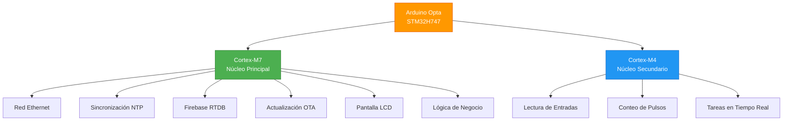
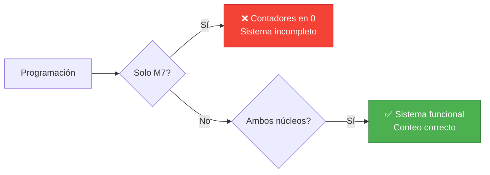
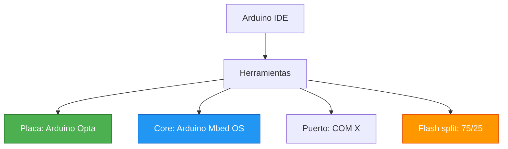
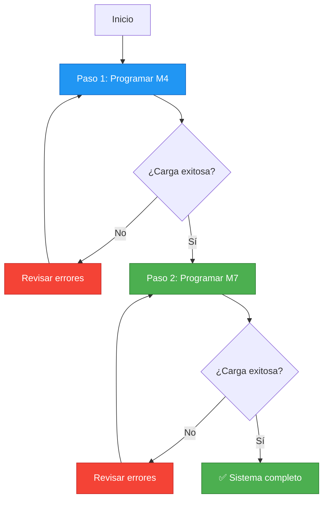
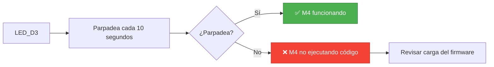
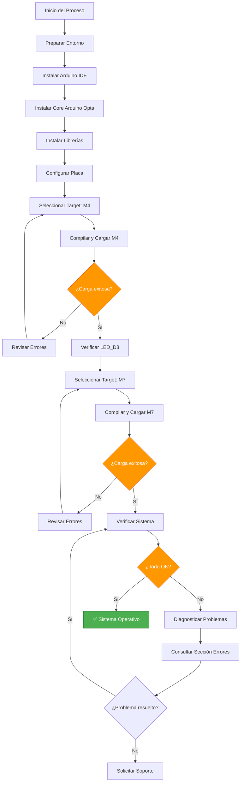

# 🐣 Programación de Contadores de Huevos - Arduino Opta

## 📋 Objetivo del Documento

Este documento tiene como objetivo formalizar y documentar el procedimiento correcto para compilar, cargar y mantener el firmware de los dispositivos **Arduino Opta** utilizados como contadores de huevos en los pabellones de la avícola.

### 🎯 Propósitos

- ✅ Evitar dependencia de memoria individual
- ✅ Reducir errores típicos asociados a la arquitectura dual‑core (M7 / M4) del equipo
- ✅ Establecer un procedimiento estándar y reproducible

> **Nota:** Los códigos fuente se mantienen como archivos independientes y están disponibles para descarga en la sección de [Archivos del Proyecto](#-archivos-del-proyecto).

---

## 🏗️ Arquitectura del Arduino Opta

El Arduino Opta está basado en el microcontrolador **STM32H747**, que posee dos núcleos físicos independientes que trabajan en paralelo:



### 📊 Tabla de Responsabilidades por Núcleo

| Núcleo | Nombre | Función Principal | Responsabilidades |
|--------|--------|-------------------|-------------------|
| **Core Principal** | Cortex‑M7 | Control y Comunicación | Red Ethernet, NTP, Firebase, OTA, LCD, lógica de negocio |
| **Core Secundario** | Cortex‑M4 | Adquisición de Datos | Lectura de entradas, conteo de pulsos, tareas en tiempo real |

### ⚠️ Importante: Ambos Núcleos Son Necesarios



**Si solo se programa el M7:**
- ✅ El equipo puede conectarse a la red
- ✅ Puede enviar datos a Firebase
- ❌ Los contadores permanecerán en **0** porque el M4 no está ejecutando su lógica

**Si solo se programa el M4:**
- ✅ Los contadores funcionan
- ❌ No hay comunicación con Firebase
- ❌ No hay sincronización de tiempo

---

## 📁 Estructura del Código

El proyecto utiliza un único archivo `.ino` que contiene el código de ambos núcleos, separado mediante directivas de precompilación:

```cpp
#ifdef CORE_CM7
    // Código que se compila para el Cortex‑M7
    // Red, Firebase, NTP, LCD, etc.
#else
    // Código que se compila para el Cortex‑M4
    // Lectura de entradas, conteo, etc.
#endif
```

### 📦 Archivos del Proyecto

Los siguientes archivos son necesarios para compilar el proyecto:

[Descargar Pabellon5.ino](../../../public/Pabellon5.ino){ .md-button .md-button--primary }

[Descargar FlashIAPLimits.h](../../../public/FlashIAPLimits.h){ .md-button .md-button--primary }

### 🔧 Archivos Auxiliares

- **`Pabellon5.ino`**: Archivo principal con el código de ambos núcleos
- **`FlashIAPLimits.h`**: Helper para el manejo de memoria Flash IAP

> **Importante:** Aunque exista un solo archivo `.ino`, el firmware debe cargarse **dos veces**, una por cada núcleo.

---

## 🛠️ Preparación del Entorno

### 📟 Software Requerido

#### 1. Arduino IDE

- **Versión recomendada:** Arduino IDE 2.x
- **Descarga:** [Arduino IDE Official](https://www.arduino.cc/en/software)

#### 2. Core de Placa

- **Nombre:** Arduino Mbed OS – Arduino Opta
- **Instalación:** 
  1. Abrir Arduino IDE
  2. Ir a `Herramientas` → `Placa` → `Administrador de Placas`
  3. Buscar "Arduino Opta"
  4. Instalar la versión estable

### 📚 Librerías Necesarias

Las siguientes librerías deben instalarse desde el Administrador de Librerías de Arduino IDE:

| Librería | Versión | Uso |
|----------|---------|-----|
| **FirebaseClient** | Estable | Comunicación con Firebase RTDB |
| **ESP_SSLClient** | Compatible | Cliente SSL para conexiones seguras |
| **ArduinoJson** | Estable | Manejo de JSON |
| **Arduino_Portenta_OTA** | Estable | Actualizaciones Over-The-Air |
| **LiquidCrystal_I2C** | Estable | Control de pantalla LCD |
| **Adafruit_MCP23017** | Estable | Control de expansor I2C |
| **Adafruit_BusIO** | Estable | Soporte I2C/SPI |

> ⚠️ **Advertencia:** Se recomienda **NO actualizar librerías** sin validar primero en un equipo de prueba. Las versiones estables probadas garantizan compatibilidad.

### 📥 Instalación de Librerías

1. Abrir Arduino IDE
2. Ir a `Herramientas` → `Administrar Librerías`
3. Buscar cada librería por nombre
4. Instalar la versión estable recomendada
5. Verificar que no haya conflictos de versiones

---

## ⚙️ Configuración de Placa y Opciones

### 🔧 Configuración en Arduino IDE

Antes de compilar, configurar las siguientes opciones:



### 📋 Valores Recomendados

| Opción | Valor | Descripción |
|--------|-------|-------------|
| **Placa** | Arduino Opta | Modelo de hardware |
| **Core** | Arduino Mbed OS | Sistema operativo embebido |
| **Puerto** | COM X (Windows) / /dev/ttyACM0 (Linux) | Puerto serie del dispositivo |
| **Flash split** | 75/25 | Distribución de memoria (75% M7, 25% M4) |

> **Importante:** El valor de **Flash split** afecta la distribución de memoria entre M7 y M4. Usar **siempre el mismo valor** en todos los pabellones para mantener consistencia.

---

## 📤 Procedimiento de Carga del Firmware

### 🎯 Orden Obligatorio



> ⚠️ **CRÍTICO:** Siempre se debe programar **primero el M4** y **luego el M7**. Este orden es obligatorio.

---

### 🔵 Paso 1 – Programar el Núcleo Cortex‑M4

Este paso graba la lógica de conteo y lectura de entradas.

#### 📝 Pasos Detallados

1. **Abrir el proyecto** en Arduino IDE
   - Abrir el archivo `Pabellon5.ino`

2. **Seleccionar el núcleo M4**
   - Ir a: `Herramientas` → `Target core` → **`Cortex‑M4`**

3. **Verificar configuración**
   - ✅ Placa: Arduino Opta
   - ✅ Core: Arduino Mbed OS
   - ✅ Puerto COM: Seleccionar el correcto

4. **Compilar y cargar**
   - Presionar el botón **Upload** (flecha hacia la derecha)
   - O usar el atajo: `Ctrl + U` (Windows/Linux) o `Cmd + U` (Mac)

5. **Esperar finalización**
   - Observar la barra de progreso en la parte inferior
   - Verificar mensaje: `"Done uploading"` o `"Carga completada"`

#### ✅ Verificación del Paso 1

- El monitor serial mostrará mensajes de inicialización del M4
- El LED `LED_D3` comenzará a parpadear periódicamente (cada 10 segundos)

---

### 🟢 Paso 2 – Programar el Núcleo Cortex‑M7

Este paso graba la lógica de red, sincronización horaria, Firebase, OTA y visualización.

#### 📝 Pasos Detallados

1. **Sin cerrar el proyecto**, cambiar el núcleo objetivo
   - Ir a: `Herramientas` → `Target core` → **`Cortex‑M7`**

2. **Verificar nuevamente el puerto COM**
   - Asegurarse de que sigue siendo el mismo puerto

3. **Compilar y cargar**
   - Presionar el botón **Upload**
   - O usar el atajo: `Ctrl + U` (Windows/Linux) o `Cmd + U` (Mac)

4. **Esperar finalización**
   - Observar la barra de progreso
   - Verificar mensaje de éxito

#### ✅ Verificación del Paso 2

- El monitor serial mostrará:
  - `"Conectando Ethernet (DHCP)"`
  - `"IP asignada: XXX.XXX.XXX.XXX"`
  - `"syncNTP: hora inicial"`
  - `"Initializing app..."`
  - `"El equipo se ha Re-Iniciado"`

---

### 🔄 Casos Especiales

#### Cambios en Red, IP o Firebase

> **Importante:** Cambios en configuración de red, IP, Firebase o lógica general **NO eximen** la necesidad de volver a cargar ambos núcleos.

Si solo cambiaste:
- Credenciales de Firebase
- Configuración de red
- Lógica de negocio en el M7

**Aún así debes:**
1. ✅ Cargar el M4 (aunque no haya cambios)
2. ✅ Cargar el M7 (con los cambios)

---

## ✅ Verificación Posterior a la Carga

### 🔵 Verificación del M4

El firmware del M4 incluye una señal visual de diagnóstico:



**Si el LED no parpadea:**
- ❌ El M4 no está ejecutando código
- 🔍 Revisar que el `Target core` haya sido correctamente seleccionado
- 🔍 Verificar que la carga se completó sin errores
- 🔍 Intentar cargar nuevamente el M4

---

### 🟢 Verificación del Sistema Completo

Después de cargar ambos núcleos, verificar los siguientes puntos:

#### ✅ Checklist de Verificación

- [ ] **Conexión Ethernet**
  - El equipo obtiene IP por DHCP
  - Mensaje en serial: `"IP asignada: XXX.XXX.XXX.XXX"`

- [ ] **Sincronización NTP**
  - La hora se sincroniza correctamente
  - Mensaje en serial: `"syncNTP: hora inicial"`

- [ ] **Contadores Funcionales**
  - Los contadores aumentan al pasar huevos por los sensores
  - Verificar en la pantalla LCD o en Firebase

- [ ] **Comunicación Firebase**
  - Los datos se reflejan en Firebase RTDB
  - Verificar en la consola de Firebase

- [ ] **Pantalla LCD**
  - Muestra el nombre del pabellón
  - Muestra el nivel (LVL)
  - Muestra el conteo de huevos (H:XXXXXX)

---

## 🐛 Errores Comunes y Diagnóstico

### ❌ Contadores Siempre en 0

**Síntomas:**
- Los contadores no aumentan
- Los valores en Firebase son siempre 0
- La pantalla LCD muestra `H:000000`

**Causas posibles:**
- M4 no programado o firmware incorrecto
- Carga realizada solo en M7
- Sensores desconectados o dañados

**Solución:**
1. Verificar que el M4 fue cargado correctamente
2. Verificar el parpadeo del LED_D3
3. Cargar nuevamente el M4 si es necesario
4. Revisar conexiones físicas de los sensores

---

### ❌ Error de Compilación: `br_ssl_*`

**Síntomas:**
```
Error: undefined reference to 'br_ssl_*'
```

**Causas posibles:**
- Incompatibilidad de versión de `ESP_SSLClient`
- Diferencia de versión del core Arduino Opta
- Conflictos entre librerías

**Solución:**
1. Usar versiones validadas de las librerías
2. No actualizar librerías sin pruebas previas
3. Verificar compatibilidad entre:
   - Versión de Arduino IDE
   - Versión del core Arduino Opta
   - Versión de ESP_SSLClient

---

### ❌ Error de Puerto COM

**Síntomas:**
```
Error: No se puede abrir el puerto COM X
Error: Port busy
```

**Causas posibles:**
- Puerto bloqueado por el monitor serial
- Cambio de puerto al reiniciar el Opta
- Dispositivo desconectado

**Solución:**
1. Cerrar el monitor serial de Arduino IDE
2. Desconectar y reconectar el cable USB
3. Esperar a que Windows/Linux detecte el dispositivo
4. Seleccionar nuevamente el puerto COM correcto
5. Intentar cargar nuevamente

---

### ❌ Error de Memoria Flash

**Síntomas:**
```
Error: Flash memory full
Error: Not enough space
```

**Causas posibles:**
- Flash split incorrecto
- Firmware demasiado grande

**Solución:**
1. Verificar configuración de Flash split (75/25)
2. Optimizar el código si es necesario
3. Verificar que no haya librerías innecesarias

---

## 📊 Diagrama de Flujo Completo



---

## 💡 Recomendaciones Operativas

### 📋 Buenas Prácticas

1. **Mantener este instructivo junto al repositorio del proyecto**
   - Facilita el acceso rápido a la información
   - Permite actualizaciones centralizadas

2. **Documentar versiones de librerías**
   - Crear un archivo `requirements.txt` o similar
   - Registrar versiones probadas y estables

3. **Probar siempre en un Opta de laboratorio**
   - Antes de desplegar en pabellón
   - Validar cambios en entorno controlado

4. **No asumir funcionamiento completo**
   - No asumir que "si conecta a internet, está funcionando"
   - Verificar siempre los contadores físicamente

5. **Mantener backups del firmware**
   - Guardar versiones estables del código
   - Documentar cambios y versiones

---

### 🔒 Seguridad y Mantenimiento

- **No compartir credenciales** en el código fuente
- **Usar variables de entorno** para información sensible
- **Documentar cambios** en el código
- **Realizar pruebas** antes de desplegar en producción

---

## 📚 Recursos Adicionales

### 🔗 Enlaces Útiles

- [Documentación Oficial Arduino Opta](https://docs.arduino.cc/hardware/opta)
- [Arduino Mbed OS Documentation](https://os.mbed.com/docs/mbed-os/latest/)
- [Firebase Realtime Database](https://firebase.google.com/docs/database)
- [STM32H747 Reference Manual](https://www.st.com/resource/en/reference_manual/rm0399-stm32h747xx-and-stm32h757xx-advanced-armbased-32bit-mcus-stmicroelectronics.pdf)

### 📖 Documentación Relacionada

- [Configuración Azure IoT](../iot/configuracion/azure.md)
- [Estructura del Proyecto](../../backend/tracmin/estructura.md)

---

## 🎯 Resumen Ejecutivo

### ✅ Procedimiento Obligatorio

Este procedimiento es **obligatorio** para cualquier intervención en los contadores de huevos basados en Arduino Opta.

### 🎯 Cumplimiento de Pasos

El cumplimiento de estos pasos asegura:

- ✅ **Conteo confiable** de huevos
- ✅ **Operación estable** del sistema
- ✅ **Continuidad operativa** independiente de personas específicas
- ✅ **Reducción de errores** comunes

### 📝 Recordatorio Final

> **IMPORTANTE:** Siempre programar **primero el M4** y **luego el M7**. Este orden es crítico para el funcionamiento correcto del sistema.

