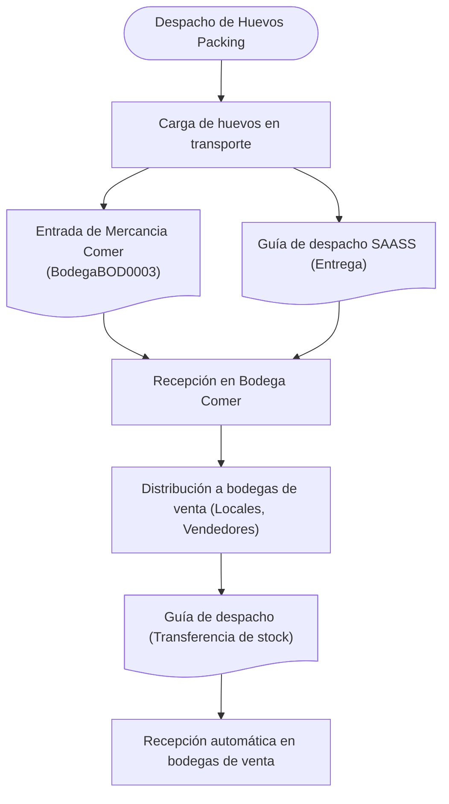

# API Packaging y Distribución - Documentación (Admin)

## Descripción General
Sistema de gestión de packaging y distribución que permite controlar el proceso desde el packaging hasta los puntos de venta. Integración con SAP Business Layer para gestión de inventario y documentos.

## Ejemplos de Documentos

### Guía de transferencia de stock

Puedes descargar un ejemplo de guía de transferencia de stock generada por el sistema:

[:fontawesome-solid-file-pdf: Descargar ejemplo de Guía de transferencia de stock (PDF)](https://drive.google.com/file/d/1CkRp7IkW-nzSHxo_Y58Cqk0mdmifkK-O/view?usp=sharing){ .md-button }

!!! info "Nota sobre el documento"
    Este documento es un ejemplo de una guía de despacho generada por el sistema. Contiene todos los campos relevantes como información del cliente, conductor, vehículo, producto, cantidades y valores.

## Video Demostración
<iframe width="560" height="315" src="https://www.youtube.com/embed/_wigjMO6KW0" title="YouTube video player" frameborder="0" allow="accelerometer; autoplay; clipboard-write; encrypted-media; gyroscope; picture-in-picture" allowfullscreen></iframe>

??? info "Notas Importantes"
    - Sistema integrado con SAP Business Layer
    - Control de documentos de transferencia
    - Acceso vía huevosdehoy.tracmin.cl

??? warning "Consideraciones de Seguridad"
    - Validación de permisos SAP
    - Control de acceso por rol
    - Validación de documentos de transferencia
    - Trazabilidad de movimientos

??? tip "Mejores Prácticas"
    - Verificar stock antes de transferencias
    - Mantener registro de movimientos
    - Monitorear niveles de inventario
    - Documentar ajustes de stock
    - Notificar eventos críticos

??? note "Integraciones"
    - **SAP Business Layer**:
        - Gestión de inventario
        - Generación de documentos
        - Control de stock
    - **Web App**:
        - Interfaz de usuario (huevosdehoy.tracmin.cl)
        - Operaciones de packaging
        - Gestión de transferencias

## Flujo Operacional: Packaging, Despacho y Distribución

Este documento describe el proceso paso a paso de la gestión desde la etrada hasta la distribución de stock hacia las distintas bodegas, utilizando la integración con SAP Business Layer y la aplicación web huevosdehoy.tracmin.cl.

### Descripción de Pasos

??? note "**1. Despacho desde Packaging**"
    - Se inicia el proceso de carga de huevos en el transporte
    - El sistema genera automáticamente la Guía de Despacho SAASS
    - Se registra la Entrada de Mercancía en SAP (BodegaBOD0003)
    - El operador confirma la carga en huevosdehoy.tracmin.cl

??? note "2. **Recepción en Bodega Central**"
    - El transporte llega a la bodega central
    - Se confirma la recepción en SAP
    - El sistema actualiza el inventario automáticamente
    - Se registra la ubicación física del producto

??? note "3. **Distribución a Puntos de Venta**"
    - Se planifica la distribución a bodegas de venta
    - El sistema genera Guías de Transferencia
    - Se asigna stock a cada punto de venta
    - Se actualiza el inventario en tiempo real

??? note "4. **Transferencia de Stock**"
    - Se procesa la transferencia en SAP
    - Se genera documentación de movimiento
    - Se actualiza inventario en origen y destino
    - Se confirma la recepción en destino

??? note "5. **Recepción en Puntos de Venta**"
    - Se confirma la recepción en destino
    - El sistema actualiza el inventario final
    - Se genera documentación de cierre
    - Se registra la disponibilidad para venta

### Diagrama de Flujo

### Integración Técnica

??? info "**SAP Business Layer**"
    - Gestión de documentos: `{ GuíaDespacho, TransferenciaStock, EntradaMercancía }`
    - Control de inventario: `{ ActualizaciónStock, ValidaciónDisponibilidad }`
    - Procesos automáticos: `{ GeneraciónDocumentos, ActualizaciónInventario }`

??? info "**Requisitos de Infraestructura**"
    - Conexión estable con SAP Business Layer
    - Acceso a huevosdehoy.tracmin.cl

