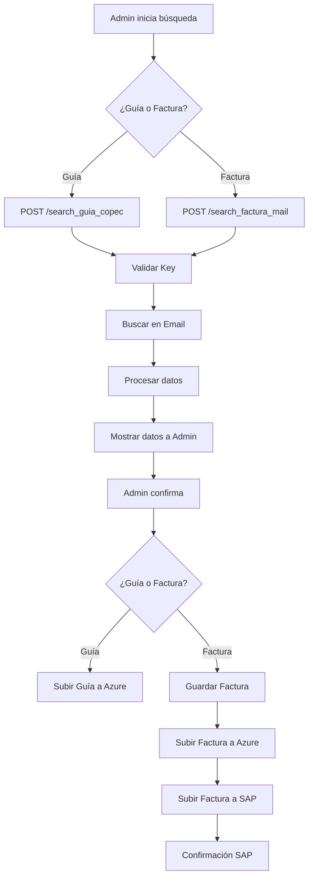

# API Combustible - Documentación (Admin)

## Diagrama de Flujo


## Descripción General
Sistema de gestión de documentos relacionados a combustible que permite ingresar aquellas guías o facturas no fueron ingresadas al sistema. Acceso exclusivo para administradores.

??? info "Notas Importantes"
    - Sistema CRUD para gestión de documentos
    - Acceso restringido a administradores
    - Modelos principales:
        ```python title="modelos"
        class reqSessionSearchDoc(BaseModel):
            numero_doc: str
            confirmar: bool = False
        ```
??? warning "Consideraciones de Seguridad"
    - Validación de key de autorización
    - Acceso restringido a administradores
    - Validación de documentos
    - Protección de datos sensibles
    - Control de acceso a bodegas

??? tip "Mejores Prácticas"
    - Validar documentos antes de procesar
    - Mantener registro de transacciones

??? note "Integraciones"
    - **Azure**:
        - Almacenamiento de documentos
        - Gestión de archivos
    - **Email**:
        - Obtención de documentos
    - **SAP**
        - Subir documentos encontrados

## Endpoints Combustible

=== "Endpoints"
    ??? success "Buscar Guía de Combustible"
        ```python title="POST /api/logipath/search_guia_copec"
            @router.post(f"{APP_PATH}/search_guia_copec")
            async def search_guia_copec(sec: Request, req: reqSessionSearchDoc):
            """
            Busca una guía de despacho de COPEC por folio
            
            Args:
                res (Request): Request con key de autorización
                req (reqSessionSearchDoc): Folio documento y estado de confirmación
                
                return {
                    "message": str,
                    "email": str,
                    "copec_link": str,
                    "numero_guia": int,
                    "folio": int,
                    "patente": str,
                    "litros": int,
                    "planta": str,
                    "destino": str,
                    "hora_entrada": date,
                    "pdf_link": str,
                    "xml_link": str,
                    "database_created": bool,
                    "sap_updated": str,
                    "sap_docentry": str,
                    "email_info": {
                        "subject": str,
                        "received_date": date,
                        "from": str
                    }
                }
                
            Raises:
                HTTPException: 
                    - 401: Si la key es inválida
                    - 500: Error en la consulta
            """
        ```
    ??? success "Buscar factura de combustible"
        ```python title="POST /api/logipath/search_factura_mail"
            @router.post(f"{APP_PATH}/search_factura_mail")
            async def search_factura_mail(sec: Request, req: reqSessionSearchDoc):
            """
            Busca una factura de COPEC por folio
            
            Args:
                res (Request): Request con key de autorización
                req (reqSession): Folio de la factura
                
            return {
                "message": str,
                "email": str,
                "copec_link": str,
                "numero_guia": int,
                "folio": int,
                "patente": str,
                "litros": int,
                "planta": str,
                "destino": str,
                "hora_entrada": date,
                "pdf_link": str,
                "xml_link": str,
                "database_created": bool,
                "sap_updated": str,
                "sap_docentry": str,
                "email_info": {
                    "subject": str,
                    "received_date": date,
                    "from": str
                }
            }
                
            Raises:
                HTTPException: 
                    - 401: Si la key es inválida
                    - 500: Error en la consulta
            """
        ```
=== "Sequence Diagram"
    ```mermaid
    sequenceDiagram
        participant Admin
        participant API
        participant Email
        participant Azure
        participant SAP
        
        alt Buscar Guía
            Admin->>API: POST /search_guia_copec
            API->>API: Validar Key
            API->>Email: Buscar Guía
            Email-->>API: Guía y datos
            API->>API: Procesar datos
            API-->>Admin: Datos Guía
            Admin->>API: Confirmar guía
            API->>API:Subir Guía
            API->>Azure: Subir documento
            
        else Buscar Factura
            Admin->>API: POST /search_factura_mail
            API->>API: Validar Key
            API->>Email: Buscar Factura
            Email-->>API: Factura y datos
            API->>API: Procesar datos
            API-->>Admin: Datos Factura
            Admin->>API: Confirmar Factura
            API->>API:Guardar Factura
            API->>Azure: Subir documento
            API->>SAP:Subir Factura
            SAP-->>API: Confirmación Factura
            
        end
    ```

=== "Ejemplos de Respuesta"
    ??? example "Buscar Guía o Factura"
        ```json
        {
            "message":"preview",    
            "data":
                {
                    "copec_link":"http://copec2510.acepta.com/v01/C0849616120FDD85B5DDF62445F0DA37D7391439?k=4fe0c3d4b0963c0dfee2e137087661c7",
                    "folio":"18496166",
                    "litros":"15000.000",
                    "comuna":"EMPEDRADO",
                    "patente":"KBVX73",
                    "pdf_url":"https://copec2505.acepta.com/ca4webv3/PdfViewMedia?url=http%3A%2F%2Fcopec2510.acepta.com%2Fv01%2FC0849616120FDD85B5DDF62445F0DA37D7391439%3Fk%3D4fe0c3d4b0963c0dfee2e137087661c7",
                    "xml_url":"https://copec2505.acepta.com/ca4webv3/XmlView?url=http%3A%2F%2Fcopec2510.acepta.com%2Fv01%2FC0849616120FDD85B5DDF62445F0DA37D7391439%3Fk%3D4fe0c3d4b0963c0dfee2e137087661c7"
                }
        }
        
        ```
    
=== "Códigos de Estado"
    | Código | Descripción |
    |--------|-------------|
    | 200 | Operación exitosa |
    | 401 | No autorizado |
    | 404 | Documento no encontrado |
    | 500 | Error interno |

=== "Validaciones"
    | Campo | Regla |
    |-------|-------|
    | Folio | Formato válido |
    | Documento | No ingresado |