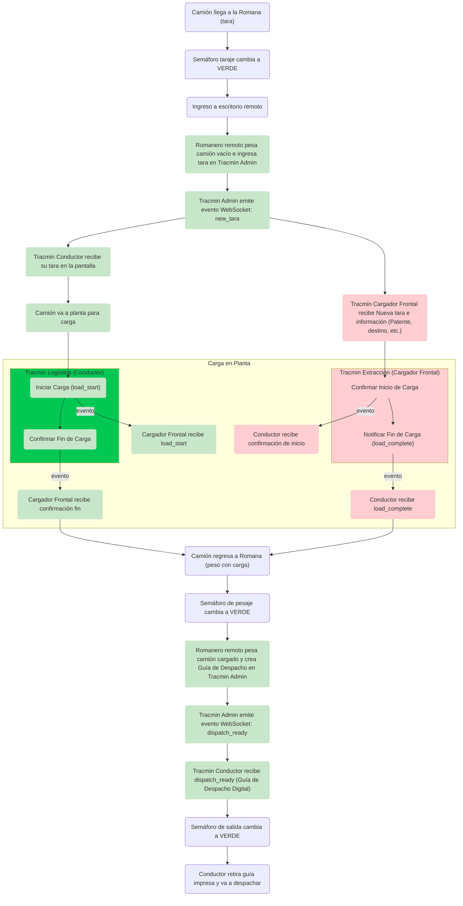

# API Romana Remota - Documentación (Admin)

## Descripción General
Sistema de gestión de pesaje y despacho que permite registrar y controlar el proceso de taraje, carga y despacho de camiones. Acceso exclusivo para administradores y operadores de romana.

## Video Demostración

<iframe width="560" height="315" src="https://www.youtube.com/embed/Z_ixNnSS9D4" title="YouTube video player" frameborder="0" allow="accelerometer; autoplay; clipboard-write; encrypted-media; gyroscope; picture-in-picture" allowfullscreen></iframe>

??? info "Notas Importantes"
    - Sistema CRUD para gestión de pesaje y despacho
    - Acceso restringido a administradores y operadores
    
??? warning "Consideraciones de Seguridad"
    - Validación de key de autorización
    - Acceso restringido a administradores y operadores
    - Validación de documentos
    - Control de acceso a romana

??? tip "Mejores Prácticas"
    - Validar pesajes antes de procesar
    - Mantener registro de transacciones
    - Monitorear estado de semáforos
    - Documentar cambios de estado
    - Notificar eventos importantes

??? note "Integraciones"
    - **WebSocket**:
        - Comunicación en tiempo real
        - Notificaciones de estado
    - **RDP**:
        - Conexión a romana
        - Control de pesaje
        - Generación de guías
    - **Impresora**:
        - Impresión de documentos
    - **Email**:
        - Notificaciones automáticas
        - Alertas de estado

## Flujo Operacional: Pesaje, Carga y Despacho de Camiones

Este documento describe el proceso paso a paso de la sub-feature que gestiona el pesaje de camiones (tara y carga), la comunicación en tiempo real vía WebSocket entre las aplicaciones de Tracmin (Conductor y Cargador Frontal) y la generación de la guía de despacho.

### Descripción de Pasos

??? note "**1. Llegada y Tara**"
    - El camión llega a la Romana
    - El semáforo de taraje se pone en VERDE
    - La Romana establece conexión RDP con el escritorio remoto donde el operador de Tracmin Admin realiza el pesaje sin carga
    - El operador registra el valor de tara en la aplicación Tracmin Admin

??? note "2. **Notificación de Nueva Tara**"
    - Al registrar la tara, Tracmin Admin emite un mensaje WebSocket (`NuevaTara`) con el valor y el ID de camión
    - Las aplicaciones Tracmin Conductor y Tracmin Cargador Frontal, suscritas al canal de WebSocket, reciben el evento y actualizan su interfaz para mostrar la nueva tara

??? note "3. **Proceso de Carga**"
    - El camión se dirige a la planta de carga e inicia conexión bidireccional
    - El flujo conecta directamente con la confirmación de inicio de carga por parte del cargador frontal y conductor
    - El conductor o cargador pueden pulsar "Iniciar Carga" en Tracmin, emitiendo un evento WebSocket
    - Una vez completada la carga, el cargador frontal o conductor emite un evento WebSocket para finalizar la carga
    - El conductor y cargador reciben la señal de fin de carga, cerrando el ciclo de carga

??? note "4. **Pesaje con Carga**"
    - El camión regresa a la Romana para el pesaje con carga
    - El semáforo de pesaje cambia a VERDE
    - El operador pesa el camión y registra el peso bruto en Tracmin Admin

??? note "5. **Generación de Guía de Despacho**"
    - Tras el registro del peso con carga, Tracmin Admin calcula el peso neto (peso bruto – tara) y genera la Guía de Despacho
    - Tracmin Admin emite un evento WebSocket (`dispatch_ready`)
    - Tracmin Conductor recibe la notificación y muestra la opción para imprimir la guía
    - El semáforo de salida se pone en VERDE, indicando que el camión puede retirar la guía y dirigirse al cliente


### Diagrama de Flujo




### Integración Técnica

??? info "**WebSocket Channels**"
    - `post_trip`: Emite `{ InicioCarga, FinCarga }`
    - `post_trip_tracmin`: Emite `{ PantallaFinCarga, PantallaGuias }`
    - `sap_guides`: Emite `{ PantallaGuias }`

??? info "**Roles y Permisos**"
    - **Romanero remoto Admin**: Puede pesar camión y registrar datos en Tracmin Admin
    - **Conductor**: Visualiza eventos y controla inicio/fin de carga
    - **Cargador Frontal**: Supervisa y confirma procesos de carga

??? info "**Requisitos de Infraestructura**"
    - Servidor de WebSocket con alta disponibilidad
    - Escritorio remoto con cliente RDP habilitado conectado a la Romana
    - Impresora de guías en el punto de salida

### Manejo de Fallas y Reconexión WebSocket

En caso de que se pierda la conexión WebSocket en alguna de las aplicaciones (Tracmin Conductor o Cargador Frontal), se implementan los siguientes mecanismos de resiliencia:

??? warning "1. **Reconexión Automática**"
    - Cada cliente WebSocket intenta reconectarse de forma automática usando un backoff exponencial
    - Durante la reconexión, se muestra en la interfaz un mensaje de estado como "Reconectando con servidor…"

??? warning "2. **Re-sincronización de Estado**"
    - Una vez restablecida la conexión, la aplicación emite automáticamente un evento `resync_state` con su `IdViaje`
    - Tracmin Admin responde con el estado actual del camión, incluyendo:
        ```json
        {
        "Id": "123",
        "Tara": 18500,
        "HoraInicioCarga": "",
        "HoraFinCarga": ""
        }
        ```
    - La aplicación cliente actualiza su interfaz para reflejar correctamente el estado del flujo

??? warning "3. **Caso Fallo Websocket**"
    - Los operadores pueden continuar el flujo de forma manual desde Tracmin Admin si es necesario

??? warning "4. **Registro de Errores**"
    - Todas las fallas de conexión se registran con timestamp y detalle del error en un log central accesible para monitoreo y análisis de incidencias

> Este mecanismo asegura que ninguna aplicación se quede en un estado inconsistente ante fallas de red temporales, y permite continuar el flujo operativo una vez restaurada la conectividad. 
